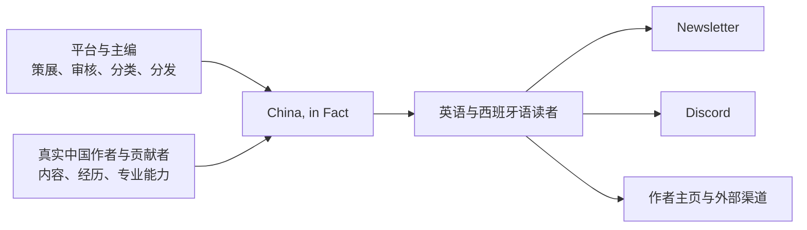

# China, in Fact

一个由真实中国人共同构成、由编辑机制组织和把关，面向英语区和西班牙语区用户的中国信息与人物网络。

平台把来自中国作者的故事、指南、地点知识和专业经验编辑成可信入口。读者既能获得专业、系统的信息，也能认识内容背后具体的人，并继续订阅 Newsletter、加入 Discord，或从作者主页进入作者自己的渠道。

## 产品结构



稳定内容入口为：

`Stories / Guides / Places / People`

`Understand / Visit / Live / Study / Work / Business` 是目的入口，不承担文章的唯一归属。`Topics / Geography / Situation` 提供横向发现；Language 与 Freshness 分别属于出版和维护维度。

## 仓库入口

```text
chinaknowledge/
├── AGENTS.md              # 协作边界与真相源顺序
├── DESIGN.md              # 产品界面与可见文案真相
├── apps/                  # 可部署产品
├── packages/              # 出现真实复用后再抽共享代码
├── scripts/               # 仓库治理检查
├── docs/
│   ├── START-HERE.md      # 按任务恢复的最短入口
│   ├── current-state.md   # 当前事实
│   ├── product-brief.md   # 产品定义
│   ├── architecture/      # 长期开发合同
│   ├── roadmap/           # 当前执行与清单
│   ├── decisions/         # 已接受决定
│   ├── reference/         # 证据
│   └── archive/           # 完成历史
└── .github/               # Issue 与 PR 模板
```

开始任务时依次阅读：

1. [`AGENTS.md`](AGENTS.md)
2. [`docs/START-HERE.md`](docs/START-HERE.md)
3. 按任务打开它指向的最小材料

当前事实见 [`docs/current-state.md`](docs/current-state.md)，当前执行见 [`docs/roadmap/README.md`](docs/roadmap/README.md)。

技术选型仍是待确认建议，见
[`docs/reference/technical-stack-proposal.md`](docs/reference/technical-stack-proposal.md)。

## 协作方式

每个任务需要说明：

```text
任务：
任务类型：设计 / 文档 / 前端 / CMS / 内容 / 发布
成功标准：
允许改动的路径：
不要做：
```

一次任务只推进一个明确切片。事实性内容需要来源与人工复查；产品实现、账号接入、数据库变更和生产发布分别处理。

代码或配置实现开始前，需要先在 active checklist 中登记 `ChangeContractV1`。改动完成后运行：

```bash
npm run governance:check
git diff --check
```

完整合同见 [`docs/architecture/README.md`](docs/architecture/README.md)。

## 许可证

待定。代码许可、内容许可和作者协议需要分别决定。
