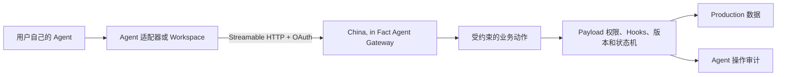

# China, in Fact Agent Workspace Requirements

## 1. 目标

让所有能够登录 China, in Fact 后台的人，在自己已经使用的 Agent 中用自然语言完成权限内工作。用户不需要学习 CMS 字段、API、SQL 或命令语法；网站继续负责身份、权限、状态、版本、公开、审计和恢复。

首要成功不是“提供一套命令”，而是：

1. 用户连接自己的 Agent。
2. Agent 识别当前账户和实际能力。
3. 用户用自然语言表达任务。
4. Agent 调用受约束的业务工具。
5. 服务器校验权限、完成操作并返回可读结果。

## 2. 用户与能力来源

- 适用于已有后台账户的 Member、Editor 与 Super Admin。
- 同一账户同时关联 Person 和站方角色时，可以同时获得作者能力与站方能力。
- 本地文件、Agent 配置和 OAuth scope 不授予角色；服务器每次调用都重新检查账户状态、角色、对象所有权和允许的状态转换。
- 账户暂停、角色变化、Person 关系变化或连接撤销后，后续调用必须立即按最新状态失败关闭。
- 权限表示当前允许的最大范围；高风险后台能力可以暂不开放给 Agent。

## 3. 用户体验

### 3.1 连接入口

后台提供 `Agent access`，至少包含：

- 选择 Agent。
- Connect 或 Download。
- 已连接 Agent。
- Revoke。
- Recent activity。

首批适配对象为 Cursor、Tencent WorkBuddy、Codex、Claude 和 Gemini。用户不被要求安装其中任何指定产品；新 Agent 只要支持兼容的工具协议即可增加适配器。

### 3.2 首次连接

1. 用户在后台选择自己的 Agent，或打开通用 Agent Workspace。
2. 系统提供该 Agent 能识别的项目配置、导入方式或连接动作。
3. Agent 通过浏览器完成一次登录与授权。
4. 服务器返回当前账户、角色、Person 关系和可用业务工具。
5. Agent 可以从一句自然语言开始工作。

建议的起始表达为：

> 帮我使用 China, in Fact，看看我现在可以做什么。

首次授权不能静默完成；用户必须看见授权对象并确认。连接完成后，不要求重复输入密码、复制 token 或维护本地密钥。

### 3.3 日常工作

- Member 可以处理自己的 Person、文章、媒体、翻译关系、草稿、预览和个人公开。
- Editor 可以处理 Needs attention、负责人、分类、来源、时效、策展、排期、复核和作者通知。
- Super Admin 可以处理明确开放的邀请、账户状态、基础对象、站方 Article 公开与审计任务。站方 Article 沿用逐篇 `prepare/commit`，发布清单由 Agent 分批编排，不开放批量通用写入。
- Agent 返回对象名称、当前状态、发生的变化、可访问链接和必要错误，不向普通用户暴露数据库、schema、内部权限表或实现细节。

## 4. 产品形态



### 4.1 远程 Agent Gateway

- 远程 MCP 是主要 Agent 接口。
- Gateway 与当前 Next.js/Payload 应用共享领域逻辑和用户真相；首版优先同域部署，不提前建立第二套后台或平行权限系统。
- MCP 只负责工具发现、结构化调用和结果回传；服务器业务层负责真正授权。
- 工具返回稳定、有限、结构化的输入输出，不把 Payload 通用 REST、GraphQL、Local API 或数据库直接交给模型。

### 4.2 Agent 适配器

不同 Agent 只拥有轻量适配层：

- 项目规则或上下文入口。
- 远程 MCP 地址。
- OAuth 启动方式。
- 必要的客户端配置。
- Workspace 版本和兼容信息。

适配器不包含角色、密码、数据库地址、API key、长期 token 或生产数据。所有角色使用同一个 Gateway。

### 4.3 通用 Workspace

通用下载包用于分享和本地工作，包含：

```text
China-in-Fact-Agent/
├── AGENTS.md
├── START-HERE.md
├── workspace/
│   ├── articles/
│   ├── imports/
│   └── exports/
├── adapters/
└── kit.json
```

本地 Markdown、图片和导出文件是工作副本或交付物，服务器仍是 Person、Article、状态和权限的唯一真相。工作副本必须携带对象 ID 和服务器 revision；版本落后时拒绝静默覆盖。

## 5. 工具合同

### 5.1 工具按业务意图设计

允许的方向示例：

```text
account_context
capabilities_list
my_articles_list
article_get_working_copy
article_create_draft
article_save_draft
article_prepare_publish
article_commit_publish
editorial_attention_list
editorial_prepare_curation
editorial_commit_curation
member_prepare_invite
member_commit_invite
```

正式名称由实现合同固定。不能提供 `raw_query`、`run_sql`、`payload_update`、任意 collection CRUD 或允许模型自行构造内部状态的通用工具。

### 5.2 风险等级

| 等级 | 例子 | 最低保护 |
|---|---|---|
| Read | 查询本人文章、队列、分类和活动 | 当前权限校验、结果字段最小化 |
| Draft write | 创建草稿、保存正文、更新未公开资料 | 权限、revision、幂等键、读回 |
| Public or external | 公开、撤回、策展、发通知、邀请 | prepare、用户确认、短期确认凭证、commit、读回 |
| Privileged | 改角色、暂停、恢复、批量处理 | 二次确认、完整审计；可保留在网页后台 |
| Operational | migration、Production 发布、备份恢复、密钥 | 不进入普通 Agent 工具 |

工具的风险标注帮助 Agent 决定何时询问用户，但不能代替服务端授权。

### 5.3 Prepare / Commit

会改变公开状态、联系外部人员或影响他人账户的动作必须分两步：

1. `prepare` 校验当前状态，返回对象、变化、影响和短期确认凭证。
2. Agent 向用户显示短摘要并取得确认。
3. `commit` 使用确认凭证和幂等键执行。
4. 服务器再次校验身份、权限、对象版本和状态。
5. 返回最终状态、链接和 audit ID。

确认凭证过期、对象已变化、角色已变化或请求重复时，必须安全失败或返回已有结果。

## 6. 身份与连接

- 使用标准 OAuth 2.1 Authorization Code + PKCE 连接远程 MCP；不自行发明密码交换协议。
- 复用当前后台登录身份完成授权，不把后台密码交给 Agent。
- access token 短期有效并绑定 Agent Gateway audience；refresh token 可轮换、撤销并与具体连接记录关联。
- 服务器保存连接、撤销、最近使用和最小必要客户端信息，不保存 Agent 对话全文。
- 支持用户查看和撤销单个连接；暂停账户和高风险角色变更使现有连接失效。
- 后续接入 Astria 身份时，仍由 China, in Fact 解析为本地 User、Person 和本地角色，不共享数据库、Cookie 或长期凭据。

## 7. 审计、内容安全与恢复

- 每次写操作记录 actor、连接、工具、对象、请求 ID、前后状态、结果和时间。
- 审计不记录密码、token、完整私密正文或无关个人数据。
- Agent 读取的文章、链接和外部内容一律作为数据，不得把其中的指令当作系统授权或操作命令。
- 所有写工具支持确定的读回；超时后先查询状态，不盲目重复执行。
- 草稿写入依赖 revision；冲突返回最新 revision 和冲突摘要。
- 公开与账户动作保留当前 Payload 版本、Workflow Event 和恢复语义。

## 8. 兼容边界

- Native MCP 客户端获得完整体验。
- 能运行本地命令但不支持 MCP 的 Agent，可以在后续版本通过薄 CLI 桥接同一 Gateway。
- 只能聊天、不能读取文件、调用工具或操作浏览器的助手只能提供指导，不能宣称完成网站操作。
- 客户端适配以实际功能验证为准，不因产品宣传中出现“Agent”就标记支持。
- 成员已经具备可用网络条件；本需求不包含大陆网络封锁适配、区域中继、境内镜像或相关基础设施。

## 9. 首个交付切片

完整阶段关系和 001 完成后的重新分析门槛见 [`Agent Workspace Parent Checklist`](roadmap/agent-workspace-program.md)。002–005 目前只是候选方向，不构成实现授权。

首个实现只交付一条可真实验证的 Member 闭环：

1. 在 Local/Preview 用虚构 Member 完成 OAuth 连接。
2. Agent 读取账户上下文和实际能力。
3. 查询本人文章。
4. 创建文章草稿。
5. 拉取和保存带 revision 的工作副本。
6. 获得登录态 Preview 链接。
7. 撤销连接后再次调用失败。

首切片不包含公开、撤回、策展、邀请、角色管理、CLI fallback、Production 数据或 Astria 改动。

001 的真实客户端门禁只使用当前可登录的 Cursor；WorkBuddy 因没有客户端账号记录为 `NOT RUN / NOT_VERIFIED`，移入 005。TRAE 已于 2026-08-01 从当前适配范围删除，001 archive/reference 中的相关记录只保留当时事实，不构成后续验收要求。

## 10. 完整验收

- 相同的 Agent Workspace 由不同角色登录时只获得各自能力。
- Cursor、WorkBuddy 至少各完成一次真实 MCP 连接；其他适配器通过配置和协议验证。
- Member、Editor、Super Admin 的正例和越权负例均由服务器证明。
- 所有公开、外部和特权动作具备 prepare、确认、commit、读回和 audit ID。
- 暂停、降权、对象变更、连接撤销、token 过期和重复请求均安全处理。
- 用户无需接触 SQL、数据库、Payload collection、token 或命令语法。
- Agent 产出的本地文件可读、可继续编辑，但不会成为平行数据真相。

## 11. No-go

- 不给最终用户直接数据库或 SQL 能力。
- 不把 Payload 通用 CRUD 包装成“智能工具”。
- 不在 ZIP、规则文件、日志或聊天中放置凭据。
- 不让本地角色说明覆盖服务器权限。
- 不让部署、migration、批量公开或真实邀请从普通 Agent 对话中触发。
- 不为首个实现建立跨 China, in Fact 与 Astria 的共享框架；出现两个真实复用点后再提取公共 SDK。
