# Agent Workspace Compatibility And Release

目标：用真实客户端和可运营保护把 001–004 已完成的 Agent capability 收口为可恢复的 Production release。005 不新增 Member、Editor 或 Super Admin 业务动作；它验证客户端、连接寿命、callback、分发、限流、可观测性、支持、migration 与 staged release。

当前 `allowed_paths` 除 intake、证据与 release 文档外，只包含 Gate 1 的 adapter 下载实现、Gate 2 定位的 callback validator 和共同 Agent HTTP 测试。任何其他代码、配置、workflow 或 provider 修复都要先把最小路径和验收 amendment 提交到 HEAD，再请求相应授权；本 checklist 不能用宽目录提前授权未知修复。

## Scope

- 首个新客户端只验证本机 WorkBuddy 5.3.5；Cursor 3.13.25 作为已知客户端 regression。
- TRAE 不在当前适配、验收或 release 范围；001 archive/reference 中的 `NOT RUN / NOT_VERIFIED` 只保留历史事实。
- 客户端门使用受保护 Preview、虚构 `.test` Member 和私有 draft；publication prepare 只验证停止和确认呈现，不 commit，不改变公共状态。
- 运营门覆盖 Agent metadata/DCR/authorize/token/revoke/MCP 的最低限流、结构化无敏感日志、告警/支持、撤权、清理和关闭态恢复。
- release 门只应用既有第 13 条 Agent migration，不新增 schema；先 staged Production、Gateway off readback，再单独批准 public enable 与真实成员接入。
- 005 最终 closure 需要真实客户端、Preview、运营保护、migration/recovery、Production readback 和未主持实现者独立复审全部满足；任一外部门未批准时保持 active，不把 `NOT RUN` 写成 PASS。

## Call and release chain

```mermaid
flowchart LR
    C["WorkBuddy / Cursor"] --> M["Protected Preview MCP"]
    M --> O["Metadata + DCR + PKCE"]
    O --> A["Browser login + consent"]
    A --> T["10m access + rotating refresh"]
    T --> S["Existing 001-004 tools"]
    S --> P["Payload permissions + audit"]
    P --> X["Revoke + exact cleanup"]
    X --> R["Operational gates"]
    R --> D["Staged Production, Gateway off"]
    D --> E["Separately approved public enable"]
```

## Upgraded boundaries

- `data_truth`：兼容阶段只用 Preview 虚构 `.test` User/Person/Article/connection/client/event；Production 运行只读、migration、真实账号与真实数据分别批准。Preview 与 Production 不共享 fixture、token、dump 或 secret。
- `read_path`：client metadata → DCR → login/consent → token verification → current connection/User/Person/client → existing service permissions → minimal result/audit。运行观测不读取正文、email、token 或对话。
- `write_path`：首个客户端门只创建私有 fixture 与既有 Agent connection/audit；publication prepare 不改领域状态。后续唯一 schema write 是已存在 `20260730_181300` migration 的单独 apply；Production public enable 只改经过批准的 Gateway/provider 状态。
- `permission_boundary`：005 不改变 001–004 capability matrix。Member、Editor、Super Admin 仍由服务器当前状态决定；测试客户端、配置、OAuth scope 或 release 身份不增加角色。
- `audit_boundary`：保留现有 domain audit；运行事件最多记录 route class、outcome、HTTP status、client family、request correlation 和时间，不记录 token/code/cookie/email/title/body/confirmation/DB URL/Agent conversation。
- `recovery`：客户端门撤销 connection、删除精确 fixture/client/event、恢复 SSO/Gateway；运营保护可回退 provider rule 或代码提交；Production 先 staged deployment，Gateway flag 可立即关闭，代码可 rollback。Agent migration 默认保留空兼容表，不对有数据 Production 执行 down。
- `independent_review`：未主持实现者在每个 upgraded 外部批次后只读判定 `PASS/BLOCK`；最终 reviewer 必须核对真实 client evidence、rate-limit/log privacy、migration/recovery、关闭/开启态、公共站回归和清理。
- `key_invariants`：不新增业务工具；不跨 connection 复用 confirmation；不把配置加载或产品宣传算作真实兼容；不在仓库存 token/secret/个人数据；不让 deployment 隐式 migration；不因 Gateway 开启削弱公共站、CMS、SSO、Payload 权限或默认关闭恢复。
- `finding_route`：WorkBuddy/Cursor 特有格式或 callback 问题留在 005 compatibility；通用 server 修复先做合同 amendment；新业务 capability 回到独立 006+ checklist；账户/身份高风险动作回到独立 Super Admin checklist；provider incident 进入独立 incident；TRAE、Astria、CLI 和大陆网络不进入 005。

## No-go

- 不新增或扩张 Member、Editor、Super Admin 工具，不做邀请、角色、暂停/恢复、删除、批量公开或任意 CRUD/SQL/CLI。
- 不重新引入 TRAE 适配，不为缺 MCP/OAuth 的客户端降级静态 API key。
- 不使用 Production 真实内容做兼容 fixture，不发送真实邮件，不复制 Preview/Production token、Cookie、secret、dump 或个人数据。
- 不在没有 durable/provider 证据时实现 serverless 内存限流；不把 DCR 总量阈值宣称为完整公网防护。
- 不新增 schema/migration/依赖；若运营保护必须新增依赖或数据结构，停止并另报门禁。
- 不部署 Preview/Production、不改 SSO/env/firewall、不登录真实客户端、不执行 migration、不开放 public MCP，除非对应 gate 单独批准。
- 不 merge、不 push，不触碰 `outputs/**`。

## Work

### Gate 0 — Intake baseline

- [x] 001–004 已完成归档；Preview SSO 恢复，Gateway 默认关闭，Production 没有 Agent schema 或入口。
- [x] 核对当前 Cursor 3.13.25、WorkBuddy 5.3.5 与官方兼容资料；TRAE 已从当前适配要求删除。
- [x] 核对 Gateway、DCR、OAuth lifetime/rotation、audit、默认关闭、现有 rate/monitor gap 与 Production 第 13 条 migration门。
- [x] 用户于 2026-08-01 批准启动 005 intake；当前授权只覆盖 docs-only baseline 与窄提交。

### Gate 1 — Real-client preflight

- [x] 用户以“继续推进”批准 `real-client-login + preview-read`；只读核对 WorkBuddy 当前登录可用性、Preview project/SSO/Gateway/env、数据库与 callback，没有改变外部状态。
- [x] 固定 WorkBuddy/Cursor 实际配置格式、callback、DCR client family 和清理 locator；发现 Preview 有 4 条无 connection/event 的既有 Cursor DCR client，保持原状并登记为下一门精确清理候选。
- [x] 发现 adapter 下载实现仍暴露 TRAE，且 Cursor/WorkBuddy JSON 未显式声明 `type: "http"`；已写诊断和以下精确 product amendment，本门不改代码。

### Product amendment A — Client config correction

- `scope`：从 Agent access adapter/download 移除 TRAE；Cursor 与 WorkBuddy 下载配置固定为顶层 `mcpServers` 下的 `{ type: "http", url }`。
- `allowed_paths`：仅 `apps/web/src/agent/access-route.ts` 与 `apps/web/tests/agent-http.ts`；不改注册、OAuth、Gateway、UI、schema、migration 或依赖。
- `acceptance`：开启态 adapter 列表不含 TRAE，`download=trae` 返回 404；Cursor/WorkBuddy fixture 精确断言 `type=http`、正确 URL 且无 header/token；其他四个 adapter 和关闭态 404 不回归。
- `validation`：`npm --prefix apps/web run test:agent`（包含 `tests/agent-http.ts`）、`npm --prefix apps/web run typecheck`、`npm --prefix apps/web run lint`、feature registry、治理检查与 `git diff --check`。
- `recovery`：回退该单一实现提交即可恢复旧下载形状；本 amendment 不写数据库或外部环境。
- `approval`：用户于 2026-08-01 批准 `product-code`；实现 PASS 也不自动批准 Preview/public MCP/fixture。
- [x] adapter 列表和下载入口已移除 TRAE，未知 `download` 在开启态也返回 no-store 404。
- [x] Cursor、WorkBuddy 与 Claude JSON 已显式固定 `type: "http" + url`；Gemini/Codex 格式和 Gateway 关闭态不变。
- [x] Agent 聚合测试、typecheck、lint 与 Local build 已通过；lint 为 0 error、40 条既有 migration warning。
- [x] 未参与实现者完成只读独立复审；第二轮关闭两项文档同步 P2 后结论为 `PASS`，`P0/P1/P2 = 0/0/0`。

### Gate 2 — Protected Preview compatibility

- [x] 用户于 2026-08-01 批准 Preview deploy、public MCP、虚构 fixture 与真实客户端；已先备份/计数再临时开放。
- [x] WorkBuddy 完成 DCR/PKCE/consent/9 tools、私有 Member create/get/save/readback/preview、跨作者拒绝和匿名 404；prepare 在未公开 Person 前置条件处失败，没有生成 confirmation 或调用 commit。
- [x] WorkBuddy 在最终窄重试中对单一 Article `49` 真实调用 working-copy read 与 publication prepare，呈现服务器影响摘要和确认提示后明确停止；Article 保持 draft，`published_at` 为空，commit event 为 `0`。
- [x] WorkBuddy 的 599 秒 access token 过期后进入 Unauthorized 并发起新 consent，人工重新授权成功；客户端只请求 `agent:member`，没有 refresh token，因此证明的是 re-auth/reconnect，不宣称 silent renewal。
- [x] WorkBuddy connection 经 Member access endpoint 撤销并写 `connection_revoke` 审计；随后客户端看不到该 MCP 工具，未自动重新授权。
- [x] Cursor 完成 `type:http`、8787 callback、deep-link/re-auth 与 9 tools discovery；不停止端口占用者。
- [x] Cursor 3.13.25 随附的官方 Agent CLI 经用户明确批准登录和 MCP OAuth 后，真实调用 `account_context + capabilities_list`；服务端分别形成 `success` tool event，未执行写工具。
- [x] WorkBuddy 在 DCR callback 校验处 `400`，未进入 OAuth；已精确删除 fixture 与 4 条无关联旧 client，恢复 SSO/env/Gateway/客户端配置并读回关闭态与最终计数。
- [x] amendment B 后的重试也已精确删除 Article/User/Person、10 个 DCR client、8 个 connection 与 18 个 Agent event，恢复 WorkBuddy/Cursor 配置、SSO、env、Gateway 和 stable alias；最终数据库计数回到重试前基线。
- [x] 第三次重试精确删除 User `44`、公开 Person `39`、Media `14` 与 4 个临时 DCR client；没有 Article、workflow event、connection 或 Agent event。WorkBuddy/Cursor 配置逐字恢复，connector 禁用，Preview env/SSO/Gateway/alias 恢复，最终计数回到 `36/32/32/150/0/0/0/13`。
- [x] 最终窄重试精确删除单一 fixture、workflow/Agent events、connections 与 DCR clients；数据库回到 User/Person/Media/Article/workflow/OAuth client/connection/Agent event/migration `36/32/6/32/150/0/0/0/13`。WorkBuddy 已退出，Cursor CLI 已登出，两端配置逐字恢复；SSO 精确恢复 `all_except_custom_domains`，stable alias 回指关闭态部署，匿名 health/MCP 均为 `302`。
- [x] 未主持本轮执行的独立 reviewer 给出 `PASS`，`P0/P1/P2 = 0/0/0`；结论不自动进入 Gate 3、provider 或 Production。

### Product amendment B — WorkBuddy exact redirect callback

- `scope`：在 `validRedirectUri` 只增加精确 literal `workbuddy://workbuddy/mcp/custom-mcp%3Achina-in-fact/oauth/callback`；不放宽任意 WorkBuddy scheme、host、server key、query、hash 或 userinfo。
- `allowed_paths`：产品代码仅 `apps/web/src/agent/oauth-http.ts` 与 `apps/web/tests/agent-http.ts`；文档仍限本 checklist 已列路径。不改 registration、工具、权限、schema、migration、依赖或环境。
- `risk`：callback allowlist 扩张可能把 authorization code 交给非预期应用；因此只接受完整规范化后仍与固定 literal 相等的 URI。
- `acceptance`：精确 WorkBuddy callback 为 true；不同 host、不同编码 server key、额外 query/hash/userinfo 和任意其他 `workbuddy:` 路径均为 false；Cursor 精确 callback、HTTPS 与 HTTP loopback 保持原行为；匹配 WorkBuddy metadata 的 DCR 返回 `201` 且 `client_family=workbuddy`。
- `validation`：Agent HTTP/注册测试、`test:agent`、typecheck、lint、Local build、feature registry、治理检查与 `git diff --check`；实现者不得用真实 Preview 代替 Local 负例。
- `idempotency/audit`：本改动只影响 DCR 输入校验，不写 confirmation 或领域 audit；重复相同合法注册仍沿用现有独立 client 行语义，Preview 清理由精确 client ID 完成。
- `recovery`：回退单一实现提交即可恢复旧 allowlist；无数据库、schema、env 或 provider 状态需要恢复。
- `independent_review`：未主持实现者核对 exact allowlist、spoof negatives、Cursor/HTTPS/loopback 回归、changed paths 与无敏感日志；只有 `PASS` 才可重试 Gate 2。
- `approval`：用户于 2026-08-01 明确批准 `product-code`；不扩大到 Preview、provider、migration、Production 或其他产品路径。
- [x] `validRedirectUri` 只增加 Cursor 与 WorkBuddy 两个精确 custom-scheme literal；WorkBuddy host、server key、query、hash、userinfo 与任意路径负例均拒绝。
- [x] WorkBuddy 真实 DCR metadata fixture 返回 `201`，创建数据读回 `clientFamily=workbuddy` 与原样 callback；Cursor、HTTPS 和 loopback 回归通过。
- [x] Agent 聚合测试、typecheck、lint 与 Local build 通过；lint 为 `0 error / 40` 条既有 migration warning，功能登记册指纹已同步。
- [x] 未主持实现者完成 exact allowlist、spoof negatives、回归、changed paths 与无敏感日志独立复审；结论 `PASS`，`P0/P1/P2 = 0/0/0`。

### Gate 3 — Operational protection

- [x] 用户于 2026-08-01 以“批准剩余，开始推进”批准本 checklist 剩余 Gate 3–6 已冻结门禁；批准不扩大业务能力、schema、依赖、真实内容写入或 checklist 外路径。
- [x] 用 Preview 流量证据确定 DCR、authorize、token、revoke、MCP 的限流位置、key、window、threshold、429、绕过条件和恢复；5 条 provider rule 均为 exact path、Preview/Production、fixed-window/IP，且与代码分离。
- [x] 定义并验证最小运行事件、查询/告警、支持定位和隐私负例；Firewall/request 层与既有 `agent_events` domain audit 分开，未启用付费 Metrics、Webhook、Log Drain 或新收件人。
- [x] 完成 token replay、disabled Gateway、provider failure 和 disable/enable rollback drill；本门没有创建 connection/client/内容 fixture，未泄露凭据或内容。
- [x] 本门不需要产品代码；5 条 WAF rule 与既有 Newsletter rule 均已读回 live，无 pending draft。
- [x] 未主持执行者完成 live WAF、provider activity、SSO/Gateway、token replay、隐私、changed paths 与治理只读复审；结论 `PASS`，`P0/P1/P2 = 0/0/0`。

### Operational amendment C — Vercel WAF and support evidence

- `scope`：只在既有 Vercel project 添加 5 条 exact-path WAF rate-limit rule，覆盖 `preview + production`；不修改应用代码、schema、migration、依赖、公共页面或 CMS。
- `rules`：DCR `POST /api/agent/oauth/register = 10/60s/IP`；authorize `/api/agent/oauth/authorize = 30/60s/IP`；token `POST /api/agent/oauth/token = 20/60s/IP`；revoke `POST /api/agent/oauth/revoke = 20/60s/IP`；MCP `/api/agent/mcp = 60/60s/IP`。均为 fixed window，超限返回 `429`，无持久封禁。
- `rollout`：先以同路径/环境的 `log` action 发布并用受保护 Preview 合成流量验证匹配，再编辑为 rate-limit；每次 publish 前后读回 diff/rule JSON，不覆盖 Newsletter 既有规则。
- `observability`：HTTP 层只用 Vercel logs/metrics/firewall event 的 environment、path/route、method、status、request/deployment ID 和时间；客户端家族、工具、result 与 object 只从既有 `agent_events` 读。不得记录或查询 token、code、cookie、email、正文、confirmation、数据库 URL 或 Agent 对话。
- `support`：固定 5xx/429、route/status、deployment/request ID 查询；沿用项目 default error/critical alert 与 Firewall alerts，不新增收件人、Webhook、付费集成或 Log Drain。
- `validation`：规则 JSON/readback、Preview 正常请求不过早限流、每条规则阈值后 `429`、窗口恢复、非 Agent 路由不命中、Vercel metrics/log query、Agent audit correlation、disabled Gateway、token replay、client/connection cleanup 与 provider rule disable/enable rollback。
- `recovery`：逐条 disable 或 remove 并 publish 即可回到执行前唯一 Newsletter 规则；无代码或数据库回退。最终 release 保留通过验证的 5 条规则。
- `approval`：用户已明确批准 provider/firewall 和剩余 Gate；任何规则外路径、持久封禁、账户 allowlist、应用代码或新 provider 仍需 amendment。

### Gate 4 — Preview release rehearsal

- [x] 在关闭态 deployment `dpl_2NFvyEXSH52bsUDhFRPX7viRYvY6` 验证 public/Admin/health/metadata/MCP、13 migrations、39 tables、env/SSO/alias 与 provider rules。
- [x] 在批准的临时开启态完成真实公网 DCR + PKCE OAuth、9 tools、`account_context`、跨作者拒绝、revoke failure-close、request logs、DCR `429` 与关闭恢复；没有内容写入。
- [x] 精确删除虚构 User/Person、DCR client、revoked connection、4 条 Agent event、临时 env 与临时凭据；恢复 stable alias 和 SSO，Preview 回到 `36/32/6/32/150/0/0/0/13`。
- [x] 未主持执行者完成 deployments、alias、SSO/env、Gateway/WAF、request logs、DCR 429 算术、changed paths 与清理证据只读复审；结论 `PASS`，`P0/P1/P2 = 0/0/0`。

### Gate 5 — Production migration and staged release

- [x] Pre-migration backup run `30708739270` 完成 dump/SHA/readback 与 `33,12,12,8` restore；只应用既有 `20260730_181300`，读回 39 tables、13 migrations、6 Agent tables 与 `0/0/0` Agent 主表空基线；post-migration run `30708854966` 以新断言恢复 PASS。
- [x] Gateway-off Production deployment `dpl_EcWc4j6xvHohk9JciWkhCr31CGQZ` 验证 public/CMS/health、全部 Agent 入口 `404`、request logs、live provider rules、数据库不变和旧 deployment rollback target；未绑定公开启用。
- [x] 未主持执行者完成两个 backup run、schema evidence、Production deployments/aliases、关闭态 routes/logs、env/WAF、rollback、changed paths 与治理复审；结论 `PASS`，`P0/P1/P2 = 0/0/0`。

### Recovery amendment D — post-migration backup assertion

- `scope/allowed_path`：只修改 `.github/workflows/production-backup.yml` 的 isolated restore schema assertion；不改 schedule、backup/export/upload、R2/Blob、secret/vars、media verification、migration 文件、应用代码或依赖。
- `why`：当前 workflow 固定断言 Production 为 `33 tables / 12 migrations / 12 named migrations / 8 critical tables`；应用既有 `20260730_181300` 后会新增 6 张 Agent 表并登记第 13 条 migration，若不先适配，下一次恢复演练会把正确的新 schema 误报为失败。
- `exact_change`：named migration 加 `20260730_181300`；critical table allowlist 只加 `agent_oauth_clients`、`agent_connections`、`agent_events`；accepted tuple 精确改为 `39,13,13,11`。三个关系子表参与 39 总表计数，但不扩大 critical business-table allowlist。
- `sequence`：migration 前先在 default branch 运行现有 `33,12,12,8` workflow 并取得新 recovery point/SHA/restore PASS；workflow amendment 独立复审后推送本分支。migration 读回空 Agent 表后，在本分支运行更新后的 `39,13,13,11` workflow 并 PASS，之后才允许 closure/merge。
- `risk/recovery`：风险是错误表数造成假绿或假红。用本地 isolated 12→13 migration fixture、YAML 解析、exact diff 和 GitHub isolated restore 验收；migration 前可回退单一 workflow commit，migration 后不得单独退回旧断言，也不执行 down migration。
- `approval/review`：用户“批准剩余，开始推进”覆盖此 Gate 5 必要恢复适配；任何 backup destination、credential、retention、schedule、migration 内容或额外表均需新 amendment。未主持实现者 `PASS` 后才 push/运行更新 workflow。
- [x] Workflow exact diff、YAML parse、13 条 migration 专用 Local fixture 与 `39,13,13,11` exact SQL 通过；fixture 已删除，Local PostgreSQL 已停止。
- [x] 未主持实现者完成 Recovery amendment D changed-path、schema assertion、回退与本地证据独立复审；结论 `PASS`，`P0/P1/P2 = 0/0/0`，可以提交/push workflow。

### Gate 6 — Public enable and closure

- [x] 用户明确批准 `production-public-enable`、现有真实 Super Admin 登录和冻结的只读 smoke；Production Gateway 已公开启用，现有账号完成 DCR + PKCE、13 tools、`account_context`、`capabilities_list`、`admin_recent_activity`、危险 commit 负例、revoke 和旧 token `401`。
- [x] 真实 Member 接入、真实内容修改和公开状态动作均未执行；Article、User、Person、Media 与 workflow 读回不变。临时 client、revoked connection、6 条 Agent event、回调、token 和本地脚本已精确清理。
- [x] Current、feature registry、parent、evidence 与 routers 已写回；未主持执行者最终独立复审 `PASS`，`P0/P1/P2 = 0/0/0`，可以归档并提交 closure。

## Acceptance

- WorkBuddy 与 Cursor 在当前版本真实完成标准 OAuth/MCP、token renewal/re-auth、既有工具和撤销；TRAE 不构成验收或 closure 条件。
- 公网 Agent endpoints 有可读回、可恢复的限流与最小无敏感 observability；支持人员能按 correlation 定位，不接触 token、正文或对话。
- Production 只应用既有 Agent migration，备份/恢复、空表读回、staged deployment、Gateway off/on 与 rollback 全部有证据。
- 001–004 权限、confirmation、revision、idempotency、audit 和公共 readback 不回归；没有新增通用能力或平行真相。
- 每个外部状态变化和最终 closure 都有独立 reviewer PASS；未批准或未运行项保持 open。

## Validation

- Intake：`npm run governance:check`、`git diff --check`，仅 docs-only changed paths。
- Compatibility：当前客户端版本/配置 readback、OAuth/DCR/callback/network trace、10 分钟 renewal、MCP tools/calls、revoke、数据库计数与精确 cleanup。
- Product amendment 如有：对应 Agent tests、专用 Local database、typecheck、lint、build、feature registry 与 isolated governance。
- Preview：deployment/env/SSO/alias/project readback、public site/Admin/health/metadata/MCP、provider rate-limit、logs、fixture cleanup 与关闭恢复。
- Production：backup/SHA/restore、migration status/apply/readback、staged smoke、Gateway off/on、rate-limit/log/support、rollback 与最终独立 review。

## Writeback

- 当前执行：本 checklist、`docs/roadmap/README.md`、`docs/roadmap/checklists/README.md` 与父级计划。
- 当前能力和环境：只有实际变化后才更新 `docs/current-state.md` 与 `docs/product-feature-registry.md`；兼容宣传不登记为能力。
- 分门证据：005 intake、client compatibility、operational readiness、Preview runtime、Production runtime 与 independent review reference。
- 完成历史：最终 PASS 后移入 `docs/archive/agent-workspace-compatibility-release.md` 并更新 archive router。

## Current gate

Gate 6 最终独立复审 `PASS`，`P0/P1/P2 = 0/0/0`。Production deployment 为 `dpl_2praoBzrH9hhuAMMmJYR3nCexQB4 / READY / production`，Gateway 公开启用；数据库为 `39/13`、Agent `0/0/0`、业务 `2/2/2/3/10`，真实内容、账号和角色未改写。005 已完成并归档。
