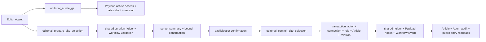

# Agent Workspace Editor Site Curation

目标：让 Editor 在 Agent 中读取一篇明确的跨作者 Article，并把一篇已经由 Member 公开、已经具备完整策展资料的 Article 加入站方公共入口；同一能力必须能把它从站方公共入口移除作为恢复。两个方向都使用 `prepare → 用户明确确认 → commit → readback`。

本批只证明跨作者 Article 的站方收录边界。它不提供普通编辑保存、队列、分配、分类、来源、排期、复核、通知或账户能力。

## Scope

- 新增 `editorial_article_get`：Editor 或 Super Admin 按精确 Article ID 读取一个服务端允许访问的跨作者工作副本、策展所需字段、原作者、当前 publication/curation 状态、公共路径、缺失项和 revision。
- 新增 `editorial_prepare_site_selection`：只接受同一 Article、最新 revision 和目标 `curated | removed`，返回服务端生成的动作、当前/目标状态、站方入口影响、原作者与公共路径、短期一次性 confirmation reference 和 audit ID；不改变 Article、版本、workflow 或公共入口。
- 新增 `editorial_commit_site_selection`：只接受同一连接刚刚 prepare 的 confirmation reference、绑定 revision 和新的 idempotency key；事务内重检后执行并读回最终状态、revision、公共路径和 audit ID。
- `curated` 只允许从 `selected | editing | needs_recheck` 进入；`removed` 在本批只允许从 `curated` 进入，作为本批 Add to site 的恢复。`removed → selected` 和再次 Add to site 继续使用网页后台，不进入本批。
- Add to site 复用网页后台当前的 latest draft promotion、策展完整性、媒体批准、workflow transition、Payload hooks、版本和通知；Remove from site 复用 `curated → removed` transition。网页和 Agent 不能形成第二套策展规则。
- 首批不提供列表工具。每次只处理用户明确给出的一个 Article ID，避免把 Needs attention、负责人或批量队列带入范围。
- 使用既有 `agent-events`、连接、revision、Payload transaction 和 row lock 完成确认、一次消费、幂等、冲突与审计；不新增 schema、migration、scope 或依赖。

## Real call chain

当前网页链为 `WorkflowActions → POST /api/articles/:id/transition → latest draft promotion → Articles access/hooks → Workflow Event`。实现只把其中站方收录的领域动作提取为 `article-curation.ts` 共享 helper；网页 endpoint 与 Agent service 各自保留输入、身份和确认边界。

## Tool and object boundary

### `editorial_article_get`

返回仅限本次判断所需内容：Article ID、title、locale、body/markdown、summary、format、cover 状态、分类名称、来源、freshness、原作者标识、publication/curation status、公共路径、策展缺失项、updatedAt 和 revision。

不返回或修改 owner、assigned editor、editor comments、homepage schedule、账户资料、连接资料、未关联个人数据或通用 Payload 字段。读取 unsupported rich text 时明确失败，不静默丢内容。

### `editorial_prepare_site_selection`

- `targetStatus=curated`：完整验证 latest draft、Member publication、原作者、summary、format、approved media、source 与 Guide freshness，摘要明确 Article 将进入站方 Stories/Guides/Places 等公共入口；canonical 仍是同一 `/posts` URL。
- `targetStatus=removed`：只接受当前 `curated` Article，摘要明确 Article 将离开站方公共入口，但 Member 个人公开和 canonical Article 仍然存在。
- Prepare 可以写一条最小 pending confirmation/audit event；不得更新 Article、Payload version、curation status、Workflow Event、通知或公开 read model。

### `editorial_commit_site_selection`

确认绑定 `actor + person + connection + object + action + target + revision`，最长 5 分钟、一次消费。Commit 不接受 `confirmed: true`、客户端角色、Agent 生成的影响摘要、公共 URL 或任意内部状态。

## Permission matrix

| Actor | 精确读取跨作者 Article | Prepare Add/Remove | Commit 自己的 confirmation | Commit 他人的 confirmation |
|---|---:|---:|---:|---:|
| Member，包括原作者 | 禁止；继续使用现有本人 Article 工具 | 禁止 | 禁止 | 禁止 |
| Editor | 允许，沿用当前网页 Article access | 允许，满足状态和完整性时 | 允许 | 禁止 |
| 其他 Editor | 可独立读取、prepare、commit | 可独立执行 | 允许自己的 | 禁止 |
| Super Admin | 与当前网页 editorial 权限一致 | 允许，不扩大到个人 publication 或账户动作 | 允许自己的 | 禁止 |

角色文字、capability 列表和 OAuth scope 只用于发现；每次读取、prepare 和 commit 都以当前服务端 User、Person、connection、Article access 和状态为准。Editor 降为 Member、账户暂停、Person 断开、连接撤销或 OAuth client 失效后立即失败关闭。

## Risk matrix

| 路径 | 公共影响 | 最低保护 | Readback / recovery |
|---|---|---|---|
| 精确 Article read | 无 | 当前角色、精确 ID、字段最小化、跨角色负例、revision | 返回同一对象与 revision；写 Agent read audit |
| Prepare curated/removed | 只写 pending audit，不改 Article | 当前权限、latest draft、transition、完整性、服务端摘要、5 分钟绑定 confirmation | Article revision、curation 和公共入口保持不变 |
| Commit `selected/editing/needs_recheck → curated` | 进入站方公共入口 | 用户明确确认、事务锁、角色/连接/object/target/revision 重检、幂等 | Article + latest version + Workflow Event + Agent event + anonymous curated query；恢复为确认后的 `curated → removed` |
| Commit `curated → removed` | 离开站方公共入口 | 与 Add 相同，不改变 personal publication | 匿名 curated query 不再命中；canonical Article 和原作者 Person 页面普通 Posts 仍可读 |

## Upgraded boundaries

- `data_truth`：实现和首轮验收只使用独立 Local `.test` User、Person、Article、connection 和 events；Production 不读取、不迁移、不写入。Preview 需要另行批准。
- `read_path`：Agent service 先重检当前连接和服务端角色，再通过 Payload Article access 读取精确 ID 与 latest draft；只映射首批策展字段。Member 对同一跨作者对象得到 `FORBIDDEN` 或 `NOT_FOUND`。
- `write_path`：仅共享 helper 驱动 `selected | editing | needs_recheck → curated` 与 `curated → removed`；Article hook 继续负责 transition、完整性、版本、notification 和 workflow event。Agent 不直接写内部字段。
- `permission_boundary`：Editor 与 Super Admin 沿用当前网页跨作者 Article 权限；Member 不获得 editorial tools。原作者、owner、public byline、Person relation、publication status、slug、locale 和 translation group 均不可由本工具改写。
- `confirmation_boundary`：服务端 reference 绑定 user/person/connection/article/action/target/revision，最长 5 分钟并一次消费；换用户、连接、对象、target、revision、角色或已消费均失败关闭。
- `concurrency`：Commit 锁定 actor context、confirmation event 和 Article；prepare 后任一 revision 字段变化返回 `REVISION_CONFLICT`，不自动覆盖或重新 prepare。
- `idempotency`：Commit key 按 connection + tool 作用域；同 key 同输入返回首次稳定结果，同 key 不同输入返回 `IDEMPOTENCY_CONFLICT`，不得产生第二条 Workflow Event 或二次通知。
- `audit_boundary`：记录 actor、connection、tool、Article、request、action/target digest、结果、前后 revision 和时间；Workflow Event 记录 curation before/after。不得记录 confirmation 明文、token、Cookie、正文、source check 或 Agent 对话。
- `anonymous_readback`：Add 后 Article 命中站方 curated read model；Remove 后不再命中，但个人公开 Article canonical 仍存在。英语通过不代表西班牙语 Article 已处理。
- `recovery`：无 migration。Agent Add 的直接恢复是对同一 revision 重新 prepare 并确认 Remove；禁用三项工具即可停止 Agent 策展，网页后台仍可处理。事务失败回滚，Payload versions 和 Workflow Events 保留现有恢复语义。
- `independent_review`：未主持实现的人只读复核权限矩阵、confirmation/replay、共享 workflow、原作者/个人公开不变量和匿名 readback，结论只能为 `PASS` 或 `BLOCK`。
- `key_invariants`：Prepare 不改变 Article 或公共入口；Commit 只处理一个明确的跨作者 Article；原作者、owner、公开署名、Member publication 和 canonical URL 不变；Member 不能调用；他人 confirmation 不能消费；001–002 工具和网页策展不退化；fixture 可精确删除。
- `finding_route`：违反冻结合同、当前 diff 回归、错用户/错内容/错权限、未公开内容泄露、残留或不可恢复问题阻断 003。队列、保存、负责人、分类、来源、排期、复核和通知留给新的 Editor 子级；账户/身份进入 004；客户端、监控、限流和 release 进入 005；其他问题另建 checklist，不扩张本批。

## No-go

- 不提供 Needs attention/list、负责人、普通正文保存、分类、来源、homepage placement、排期、复核或作者通知工具。
- 不允许 Editor Agent 修改 owner、author、public byline、Person、personal publication、slug、locale、translation group 或 Member 的 publication 决定。
- 不支持 `not_selected/removed → selected`、`selected → editing`、从 `removed` 再次 Add、任意 workflow transition 或多 Article/批量策展。
- 不开发通用 Payload CRUD、REST/GraphQL、SQL、CLI fallback 或无人值守动作。
- 不进入 004 的邀请、账户、身份、暂停/恢复、角色或提权；不进入 005 的客户端兼容、监控、限流或 Production release。
- 不新增依赖、schema、migration 或 OAuth scope。若现有 `agent-events`、revision 或 transaction 无法安全支持，停止并单独报告门禁需求。
- 不部署 Preview/Production，不创建真实账号或真实内容，不触碰真实公共状态，不 merge、不 push。
- 不修改无关 UI、公共页面或文案；Agent access 只增加这三项动作所需的短活动标签。

## Work

### Gate 0 — Intake

- [x] 001–002 已完成归档；002 transition review 允许 003 进入 intake，并要求首批只处理一个跨作者对象、一个公共策展变化和恢复。
- [x] 已核对 Editor Article access、WorkflowActions、transition endpoint、latest draft promotion、Article hooks、curated public read model、Agent confirmation/idempotency/audit 与 Local tests。
- [x] 用户于 2026-08-01 授权建立并提交本窄范围 checklist 基线；产品代码、schema、migration、Preview、Production、真实数据、merge 和 push未授权。
- [x] 现有 schema 可完整支持本批；若实现证据推翻此判断，停止在 Gate 1 前报告，不申请顺手 migration。

### Gate 1 — Shared curation contract

- [x] 提取网页 endpoint 与 Agent 共用的最小 `article-curation.ts` helper，不改变现有网页状态机或确认 UI。
- [x] 固定 latest draft、完整性、action/target、server summary、公共影响和错误码。
- [x] 保持原作者、owner、署名、Member publication 与 canonical URL 不变量。

### Gate 2 — Editor tools

- [x] 注册精确读取、prepare、commit 三项工具；capability 只按当前服务端角色返回，实际调用仍逐次校验。
- [x] 扩展 002 confirmation primitive，保持现有 Member confirmation token 与重放行为兼容。
- [x] 实现 revision conflict、5 分钟一次 confirmation、跨 actor/connection/object/target 拒绝和 commit 幂等。
- [x] Agent access 只增加三项短活动标签，不增加说明性 UI。

### Gate 3 — Local verification

- [x] 用一个虚构 Member Article 完成 Editor 精确读取、Add to site、同 key 重放、匿名站方入口读回、确认后的 Remove 和个人 canonical 保留。
- [x] 覆盖 Member/原作者、paused、missing Person、降权、撤销连接、disabled client、其他 actor confirmation、stale revision、过期、篡改、重复 key、错误状态和不完整 Article 负例。
- [x] 覆盖另一 Editor 与 Super Admin 可独立 prepare/commit，但不能消费首位 Editor confirmation。
- [x] 读回 Article/latest version、Workflow Event、Agent event、原作者/owner/byline、Member publication 和 anonymous curated query。
- [x] 现有 001–002 Agent tests、网页 editorial workflow、typecheck、lint 和 build 无回归。

### Gate 4 — Review and closeout

- [x] 更新 feature registry、current、父级计划与 Local implementation evidence。
- [x] 未主持实现的 reviewer 完成只读独立复审并给出 `PASS`；`BLOCK` 只按冻结合同和开发治理边界提出。
- [x] 只有 PASS 后才标 completed、移入 archive 并提交 closure；Preview 如有必要须另行批准并增加独立证据，不由 Local PASS 自动获得授权。

## Acceptance

- Editor 能按精确 ID 读取一篇其他 Member 的 Article 和最新 revision；Member 对同一 editorial tool 无能力且调用失败关闭。
- Agent 只能对已经 Member-public 且完整的单篇 Article 准备 Add；Prepare 后 Article、version、Workflow Event 和站方入口均不变。
- 未经用户对服务端摘要明确确认，Agent 不能把 Article 加入或移出站方公共入口。
- Commit 事务内重检当前角色、connection、OAuth client、object、transition、target、revision 与完整性；变化后安全失败。
- Add 后进入站方 curated read model；确认 Remove 后离开该入口，但 personal publication、canonical、原作者、owner 和公开署名保持不变。
- Confirmation 一次消费；同 key 重放返回首次结果，不重复写 Article、Workflow Event、通知或 Agent event。
- 其他 Editor/Super Admin 可按网页现有权限独立处理同一 Article，但不能使用别人的 confirmation。
- 没有新增 schema、migration、依赖、OAuth scope、通用 CRUD、批量能力或 004/005 行为。

## Validation

- `npm --prefix apps/web run test:agent`
- `npm --prefix apps/web run test:agent:live`
- `npm --prefix apps/web run test:editorial`
- `npm --prefix apps/web run typecheck`
- `npm --prefix apps/web run lint`
- `npm --prefix apps/web run build`
- Local `.test` fixture：exact read → prepare Add → explicit confirmation → commit → replay → anonymous curated readback → prepare Remove → explicit confirmation → commit → canonical readback。
- `npm run feature-registry:check`
- `npm run governance:check`
- `git diff --check`

## Writeback

- 当前执行：本 checklist、`docs/roadmap/README.md`、`docs/roadmap/checklists/README.md` 与父级清单。
- 当前能力：实现完成后更新 `docs/product-feature-registry.md` 与 `docs/current-state.md`。
- Local 运行、权限、公共 readback 与独立复审：两个已登记的 `docs/reference/implementation/agent-workspace-003-*.md`。
- 完成历史：`docs/archive/agent-workspace-editor-site-curation.md` 与 `docs/archive/README.md`。

## Current gate

关闭状态：Local 单篇跨作者 Article exact read、确认后 Add、幂等重放、确认后 Remove、权限负例、匿名 readback 和测试恢复全部 PASS；未主持实现者最终复审 `PASS`，`P0/P1/P2 = 0/0/0`。专用数据库已精确删除，本轮 Local PostgreSQL 已停止。Preview、真实账号、真实数据、公共状态写入、Production、schema、migration、merge 和 push均未执行；证据见 [`Local runtime`](../reference/implementation/agent-workspace-003-local-runtime-2026-08-01.md) 与 [`independent review`](../reference/implementation/agent-workspace-003-independent-review-2026-08-01.md)。
