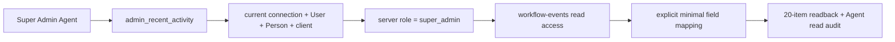

# Agent Workspace Super Admin Activity Read

目标：让 Super Admin 在 Agent 中查看最近 20 条站方 Article workflow activity，回答“最近发生了什么、由谁执行、作用于哪篇 Article、前后状态是什么”。本批只提供一项只读审计能力，不改变账户、身份、内容、workflow、通知或公开状态。

004 原候选同时包含低风险站务和高风险账户/身份动作。首批先证明只读审计边界；邀请、重发邀请、角色、暂停/恢复、Person、基础对象和任何写动作继续保留在网页后台，不由本 checklist 暗示后续一定开放。

## Scope

- 新增 `admin_recent_activity`：无对象写入参数，固定返回最近 20 条 `workflow-events`，按 `occurredAt` 倒序排列。
- 每条只返回 event ID、Article ID/title/locale/public path、actor ID/display name、axis、from/to status、notification kind/status 和 occurredAt。
- 不返回 User email、账户状态、当前角色、notification recipient/key/error、Article body/source/owner、Person、Agent token、confirmation、connection 或内部 Payload 字段。
- 工具只对当前服务端角色为 Super Admin 的连接注册；实际调用再次读取当前 User、Person、connection、OAuth client 和 role。Editor 与 Member 即使知道工具名也必须失败关闭。
- 查询使用现有只读 `workflow-events` collection 与关系；Agent service 额外施加 Super Admin 边界并显式映射返回字段，不新增第二套 Activity 真相。
- 每次成功或失败读取写入现有 `agent-events` 最小审计；不改 `workflow-events`，不新增 schema、migration、scope 或依赖。

## Real call chain

当前网页 Activity 入口由 Payload `workflow-events` collection 提供，记录本身 `create/update/delete` 均不对后台用户开放。Agent 只读取同一 collection，不创建新的审计表或平行事件模型。

## Tool and object boundary

### `admin_recent_activity`

- 输入为空；不提供任意 where、collection、field、SQL、全文搜索、导出或可调大 limit。
- 输出固定最多 20 条，包含一次查询的 `asOf`、实际 count 和显式映射后的 items。
- Article 或 actor 关系缺失时返回对应 ID 或 `null`，不使用 `overrideAccess` 绕过关系对象读取，也不因单条缺失扩大查询。
- `publicPath` 只是同一 Article canonical 路径；它不表示 Article 当前匿名可见，不返回 Preview token。
- 工具不读取 `agent-events`、登录记录、账户详情或全站通用审计；本批“Activity”严格指 Article publication/curation/notification workflow events。

## Permission matrix

| Actor | MCP discovery | Direct service call | 返回范围 |
|---|---:|---:|---|
| Member | 无 | `FORBIDDEN` | 无 |
| Editor | 无 | `FORBIDDEN` | 无；不沿用 collection 的 editorial 最大范围扩大 Agent capability |
| Super Admin | 有 | 允许 | 最近 20 条最小 workflow activity |
| Paused / missing Person / revoked connection / disabled client | 无有效调用 | 失败关闭 | 无 |
| 已降权的原 Super Admin | 新请求不注册；既有调用也重检 | `FORBIDDEN` | 无 |

客户端角色、capability 列表和工具名称都不授予权限。MCP token verification 与 service method 均以当前服务器 User 和连接状态为准。

## Risk matrix

| 路径 | 风险 | 最低保护 | Readback / recovery |
|---|---|---|---|
| Recent workflow read | 未公开 Article 标题、actor name 和内部状态可能泄露 | Super Admin 双层校验、固定 20 条、字段白名单、跨角色负例 | 同一 collection 只读返回；不产生 workflow 变化 |
| Relation lookup | 深度展开可能带出 email、正文、owner 或通知收件人 | depth 0 + 精确关系读取 + 显式映射 | 序列化输出敏感字段负例 |
| Agent read audit | 审计自身可能记录查询内容或私密结果 | 只记 actor、connection、tool、result、request ID 和时间 | `agent-events` 读回不含返回 items 或个人资料 |
| Concurrent new events | 两次读取可能因新事件而不同 | 返回 `asOf`，不声称 revisioned snapshot；本批无写后覆盖风险 | 重读获得新列表，不需回滚 |

## Upgraded boundaries

- `data_truth`：实现和验收只使用独立 Local 虚构 User、Person、Article、Workflow Event、connection 和 Agent event；Preview/Production 不读取、不写入。
- `read_path`：token verification → current connection/User/Person/client → explicit Super Admin check → `workflow-events` access → depth-0 relation IDs →最小 Article/User relation read →字段白名单。
- `write_path`：产品对象无写路径；唯一写入是现有 `agent-events` 的最小 read audit。不得更新 workflow event、Article、User、Person、notification 或 connection。
- `permission_boundary`：只有当前 Super Admin；Member、Editor、降权、暂停、missing Person、撤销 connection 和 disabled/expired OAuth client 均失败关闭。网页现有 Activity 权限不在本批修改。
- `audit_boundary`：记录 actor、connection、client family、tool、result、request ID 和时间；不记录返回 items、Article title、actor display name、email、通知字段、正文、token 或 Agent 对话。
- `recovery`：没有领域写入、版本或 migration；移除工具注册即可关闭 Agent 入口，网页 Activity 不受影响。Local 专用数据库按名称删除即可清理全部 fixture。
- `independent_review`：未主持实现的人只读复核 Super Admin-only discovery/call、字段最小化、敏感字段负例、workflow 不变、Agent audit 和现有 001–003 回归，结论只能为 `PASS` 或 `BLOCK`。
- `key_invariants`：只读最近 20 条 workflow activity；Member/Editor 无能力且直接调用失败；不泄露 email、recipient、error、key、正文、source、owner、账户或连接；不改变 workflow/Article/User/Person/notification；不新增 schema、migration、依赖或高风险账户动作；fixture 可精确删除。
- `finding_route`：违反上述边界、当前 diff 回归、错角色读取、私密字段泄露、领域写入或残留阻断 004。邀请/重发邀请、角色、暂停/恢复、Person、分类、Place、Media 和批量动作需要新的 Super Admin 子级；step-up/双重确认在首次高风险账户动作 intake 中重新设计；客户端、监控、限流、恢复和 release 进入 005；网页既有 Activity 权限差异另建独立权限 checklist，不扩张本批。

## No-go

- 不提供成员列表、账户详情、email 查找、邀请、重发邀请、角色变更、暂停/恢复、删除、Person 或身份动作。
- 不提供 Taxonomy、Place、Media、Article 修改、通知重试、Agent event 全局读取或运营命令。
- 不接受任意 filter、sort、limit、collection、field、REST/GraphQL、Payload CRUD、SQL、CLI fallback 或导出。
- 不把 read-only 工具包装成 prepare/commit；本批没有会改变公共、外部或特权状态的动作。
- 不新增 schema、migration、依赖、OAuth scope 或独立审计模型；现有结构不能安全支持时停止并报告门禁需求。
- 不进入 005 的客户端兼容、监控、限流、Preview/Production release；不创建真实账户、真实内容或真实邮件。
- 不修改网页 Activity UI、Users access、无关 UI 或文案，不 merge、不 push。

## Work

### Gate 0 — Intake

- [x] 001–003 已完成归档；003 final review 为 `PASS`，`P0/P1/P2 = 0/0/0`，Preview 未开启。
- [x] 已核对 Super Admin feature registry、Users/Activity collection、workflow event 字段、Agent role/capability/current-user 重检、Agent audit 与 Local live tests。
- [x] 004 原候选按风险拆分；首批只选择 ADM-09 的只读 workflow activity，不把 002/003 confirmation 证明外推到邀请、角色或暂停/恢复。
- [x] 用户于 2026-08-01 授权启动 004 intake 和提交窄范围 checklist 基线；产品代码、schema、migration、Preview、Production、真实数据、merge 和 push未授权。
- [x] 现有 schema 可支持本批；若实现证据推翻此判断，停止在 Gate 1 前报告。

### Gate 1 — Read contract

- [x] 固定 latest 20、排序、`asOf`、关系缺失行为和显式返回字段。
- [x] 使用当前 Super Admin、connection、Person、client 与 collection access；不依赖客户端 role 或 capability。
- [x] 固定 Agent read audit 字段，不记录返回内容或个人资料。

### Gate 2 — Tool

- [x] 注册一项只读 `admin_recent_activity`；只对 server-verified Super Admin 发现。
- [x] 实现 direct service permission、depth-0 relation lookup、字段白名单和稳定错误码。
- [x] Agent access 只增加一项短活动标签，不增加说明性 UI。

### Gate 3 — Local verification

- [x] 用独立 Local fixture 建立一篇 Article 及 publication、curation、notification workflow events，验证最新 20 条顺序和最小 readback。
- [x] 覆盖 Member、Editor、降权、paused、missing Person、revoked connection、disabled client 和不存在关系负例。
- [x] 验证输出与 Agent audit 均不含 email、notification recipient/key/error、正文、source、owner、token、connection secret 或 Agent 对话。
- [x] 验证调用前后 workflow event、Article、User、Person 与 notification 状态不变，仅新增最小 Agent read audit。
- [x] 现有 001–003 Agent tests、editorial workflow、typecheck、lint 和 build 无回归。

### Gate 4 — Review and closeout

- [x] 更新 ADM-09、current、父级计划与 Local implementation evidence。
- [x] 未主持实现的 reviewer 完成只读独立复审并给出 `PASS`。
- [x] PASS 后标 completed、清理专用 fixture并移入 archive；Preview 未执行。

## Acceptance

- Super Admin 能得到最近 20 条 workflow activity 的最小、可读、按时间倒序结果；Editor/Member 无工具且直接调用失败关闭。
- 结果能回答 Article、actor、publication/curation axis、前后状态、notification kind/status 和时间，不包含本批禁止的个人或内部字段。
- 角色、账户、Person、connection 或 OAuth client 变化后立即按当前服务端状态失败。
- 调用不改变 workflow event、Article、User、Person、notification 或公共 read model；仅写最小 Agent read audit。
- 没有新增 schema、migration、依赖、OAuth scope、通用查询、账户动作、004 相邻写能力或 005 行为。

## Validation

- `npm --prefix apps/web run test:agent`
- `npm --prefix apps/web run test:agent:live`
- `npm --prefix apps/web run test:editorial`
- `npm --prefix apps/web run typecheck`
- `npm --prefix apps/web run lint`
- `npm --prefix apps/web run build`
- Local 专用 fixture：Super Admin latest activity → order/field readback → Editor/Member/direct-call negatives → downgrade/pause/revoke/client negatives → mutation counts unchanged → Agent audit readback。
- `npm run feature-registry:check`
- `npm run governance:check`
- `git diff --check`

## Writeback

- 当前执行：本 checklist、`docs/roadmap/README.md`、`docs/roadmap/checklists/README.md` 与父级清单。
- 当前能力：实现完成后更新 `docs/product-feature-registry.md` 的 ADM-09 与 `docs/current-state.md`。
- Local 运行与独立复审：两个已登记的 `docs/reference/implementation/agent-workspace-004-*.md`。
- 完成历史：`docs/archive/agent-workspace-super-admin-activity-read.md` 与 `docs/archive/README.md`。

## Current gate

`PASS — P0/P1/P2 = 0/0/0`。Local 实现、work-item 验证、独立复审、专用 fixture 清理和归档均完成。Preview、真实账户、真实数据、真实邮件、Production、schema、migration、merge 和 push均未执行。
