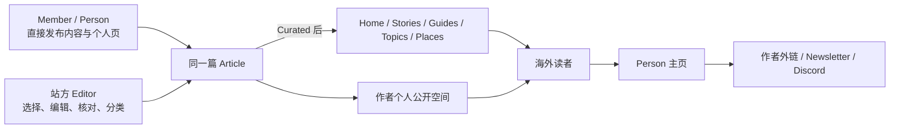
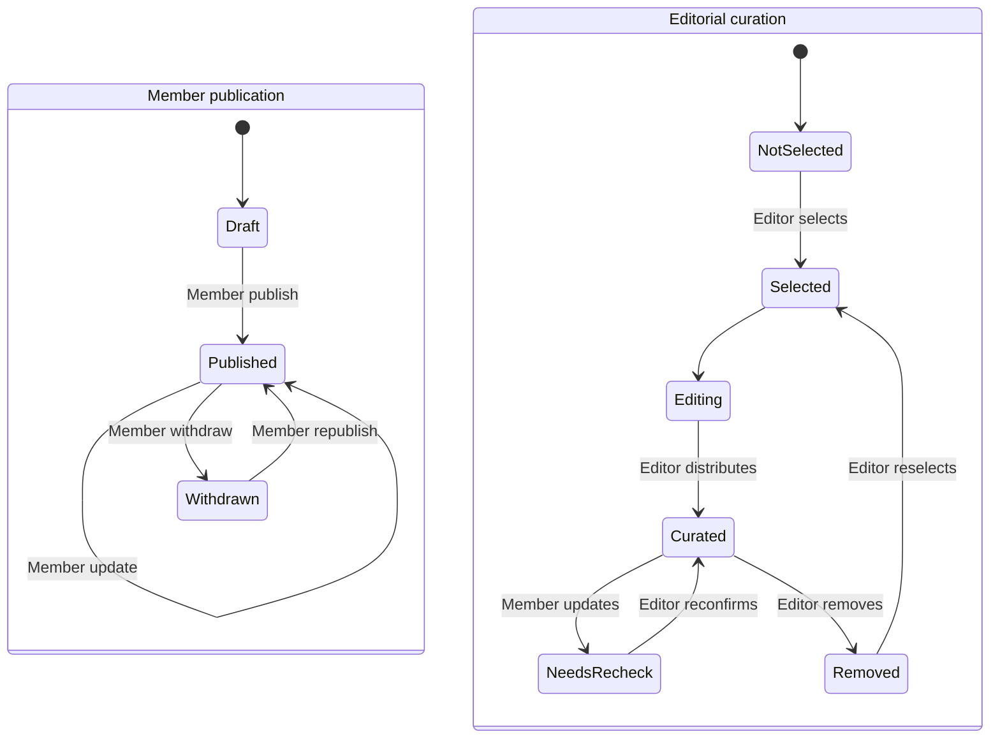

# China, in Fact：产品需求基线

> 正式品牌名：China, in Fact。正式域名：`chinainfact.com`。

## 内部品牌语境（非对外文案）

本节只供后续 Agent 理解产品，不是官网介绍、品牌 slogan 或可直接发布的对外文案。

China, in Fact 是一个让世界找到中国信息，也找到中国人的地方。

这里聚集着一群来自中国、生活在不同城市、从事不同行业的人。他们分享自己真正熟悉的生活、旅行、学习、工作、生意、研究和社会经验。网站把这些内容整理到一起，让需要的人容易找到，也让一次阅读自然延伸到作者主页、Newsletter、Discord，甚至更直接的交流。

对参与者来说，这是大家一起做大的入口。每个人贡献自己知道的事，也借助共同的流量被更多人看见。人们可能因为一个问题来到这里，最后记住一篇文章、一个地方，或者一个有意思的人。

品牌面向全世界。有人准备第一次来中国，有人已经在中国生活，有人在这里做生意、做研究，也有人只是想知道，中国人每天在想什么、做什么，日子究竟是什么样。

站方的选择、分类、核对和维护是信息组织机制，不把品牌定性为国际编辑出版物、媒体或杂志。当前产品首期只实现英语和西班牙语 locale；这是阶段范围，不是品牌受众边界。

## 1. 一句话定义

一个由真实中国人持续发布、由站方选择和组织的中国信息与人物网络。读者既能获得可信、深入的信息，也能通过每篇内容认识具体的人，继续进入作者主页、外部渠道和平台社群。

作者负责表达，站方负责策展和分发。两者作用在同一篇内容上：站方编辑不会生成“官方副本”，也不会取代原作者署名。

## 2. 产品价值

### 对海外读者

- 在一个地方理解中国社会，以及来华、在华、离华后和跨境关系。
- 看到有姓名、经历、位置和持续表达的真实中国人。
- 区分成员自由发布的内容与站方已经选择、核对和组织的内容。
- 从内容继续进入作者主页、Newsletter、Discord 和作者自己的渠道。

### 对铲子计划成员

- 直接发布自己的内容和维护个人页，不等待站方逐篇批准。
- 作为原作者持续积累公开内容，保留个人网站、社交账号与公开入口。
- 被站方选中后获得首页、栏目、主题、地点和搜索分发；站方编辑后署名仍属于本人。

### 对平台

- 从 100–200 名成员已经公开的内容中选择值得扩大分发的部分。
- 通过编辑、核对、分类和维护建立公共信任，通过人物与内容的持续关系建立温度。
- 把共同流量准确分发给原作者，同时形成面向全球的长期知识资产。

## 3. 产品关系



- Member publication 决定内容是否在作者自己的公开空间出现。
- Editorial curation 决定同一内容是否进入站方组织和推荐的入口。
- 公开 Person 是身份；Editor 与 Super Admin 是后台权限。同一账户可以同时拥有 Person 和站方权限。

## 4. 核心用户

### 海外读者

1. 想获得比新闻摘要更深入的中国理解。
2. 正在计划来华旅行、学习、工作或长期生活。
3. 想在中国经商、寻找合作或了解市场。
4. 从事中国相关研究、媒体、教育或专业工作。
5. 已离华、准备离华或长期往返中国。
6. 华裔、侨民、校友、跨国家庭及关注中国企业、科技、供应链和海外社区的人。

### 铲子计划成员

- 长期规模约 100–200 人，来自已有的真实关系网络。
- 可能是研究者、创业者、顾问、教师、创作者、律师、医生、旅行者或本地生活服务者。
- 可以贡献专业知识、个人经历、地方观察和日常生活，不统一包装成专家、员工或志愿者。
- 每人拥有公开 Person、个人内容归档和可配置外部链接。

### 站方

- Editor 从成员内容中选择、编辑、核对、分类、策展和维护官方分发。
- Super Admin 管理账户、权限、站点安全和恢复，并包含 Editor 能力。

## 5. 信息架构

### 官方稳定入口

| 对象 | 站方公开范围 |
|---|---|
| Stories | 站方已策展的故事、报道、分析、评论和更新 |
| Guides | 站方已策展且满足来源、时效和维护要求的实用指南 |
| Places | 中国境内地点及与中国直接相关的海外地理入口 |
| People | 成员与其他自然人的长期主页及内容归档 |

`Understand / Visit / Live / Study / Work / Business` 是目的入口；`Topics / Geography / Situation` 是横向发现。它们组织同一篇 Article，不复制内容，也不改变作者。

### 个人公开与官方公开

- Member Published Article 拥有稳定详情页，并进入作者 Person 的全部内容列表。
- 只有 `Member Published + Curated` 的 Article 才进入 Home、Stories、Guides、Topics、Places、Purpose、站方推荐和自动最新流。
- Story/Guide 等是站方对内容的策展分类，不是 Article 的所有权，也不能让 canonical 随分类改变。
- 当前 `/stories/[slug]` 与 `/guides/[slug]` 在路由升级时必须保持永久兼容；最终稳定详情路由由 migration-ready decision 固定。
- 未被策展不等于草稿、被拒绝或低质量；它只表示站方尚未把该内容纳入官方分发。

### 首页与人物规模

- 首页采用少量排期策展与 Curated 内容流组合，不要求每天人工排序。
- 主故事可由 Editor 排期；无排期时从符合条件的 Curated 内容回退。
- `Latest / Recently updated` 只从 Curated 内容生成。
- `People to know` 从资料完整且有 Member Published 内容的人物中每周稳定轮换，允许至多一人临时置顶。
- People 使用一主两辅 Spotlight、搜索、Topics/Places/Language 筛选和明确分页；不把 100–200 张头像堆成一面墙。

### 公共页面

```text
/[locale]
├── /stories
├── /guides
├── /places/[slug]
├── /purposes/[slug]
├── /topics/[slug]
├── /people
├── /people/[author-slug]
├── /[stable-article-route]/[slug]
├── /newsletter
└── /about
```

`locale` 首期支持 `en` 与 `es`。不同语言是独立 Article，以 translation group 关联，并分别决定个人公开与站方策展。

## 6. 内容与人物模型

### Article

- 同一语言的一次创作只有一个 Article ID；没有“成员原文”和“站方编辑版”两条记录。
- `author` 始终是原 Member 的 Person；Editor actor 进入版本和审计，不进入署名。
- Member publication：`Draft / Published / Withdrawn`。
- Editorial curation：`Not selected / Selected / Editing / Curated / Needs recheck / Removed`。
- Member Published Article 最低需要语言、标题、正文、作者和稳定 URL。
- 进入官方分发时由 Editor 补齐或确认摘要、封面、内容形态、分类、来源、Freshness、SEO 和排期。
- 内容形态包括 Guide、Reporting、Analysis、First-person、Update；它只决定官方 Stories/Guides 分类。
- Member 更新已 Curated Article 后，同一 Article 继续在个人页公开，策展状态转为 Needs recheck 并暂时退出官方入口。
- Member Withdrawn 从个人与官方入口撤回；Removed 只撤出官方分发。

### Person

Person 是作者的长期公开空间，包含：

- 姓名、头像、身份、地点、介绍、语言与关注主题。
- 作者全部 Member Published Article，并可标出站方精选。
- 个人网站、社交账号和公开联系方式。
- 与 Stories、Guides、Places、Topics 和 Purpose 的内容关系。

成员直接维护自己的 Person，保留版本历史与 Super Admin 暂停/恢复能力，不逐次等待 Editor 应用资料修订。Person 页不是简历、员工页、黄页、排行榜或交易页。

## 7. 发布与策展流程



| 能力 | 主要任务 |
|---|---|
| Member | 维护自己的 Person；保存、预览、直接公开、更新和撤回自己的 Article |
| Editor | 查看公开候选；在同一 Article 上编辑、核对、分类、策展、排期、撤出和复核 |
| Super Admin | 包含 Editor 能力；邀请、暂停、恢复成员和管理权限 |

后台使用 `My work / My profile` 和站方策展入口表达任务，不让 Member 在全量 CMS 集合、审核状态和内部字段中穿行。完整任务合同见 [`Member Publishing And Editorial Curation Requirements`](operational-publishing-requirements.md)。

## 8. 增长与留存闭环

1. 搜索、社交分享、作者渠道或站方栏目带来读者。
2. Curated 入口把读者带到同一 Article，文章近处明确展示原作者。
3. 读者进入 Person，看到作者的完整内容、经历和外部链接。
4. Newsletter 与 Discord 承担平台留存；作者外链承担对成员的流量分发。

首期不做站内私信、关注计数、支付、预约、服务市场、排行榜或个性化推荐。成功首先看内容是否带来稳定访问，以及读者是否继续订阅、加入社群和关注具体的人。
