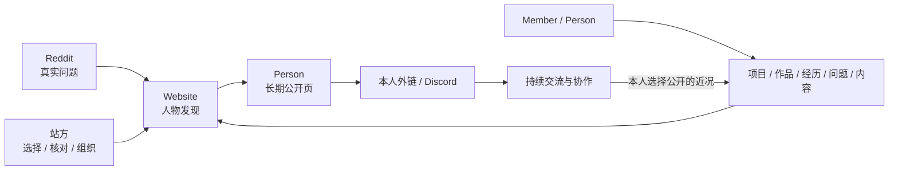
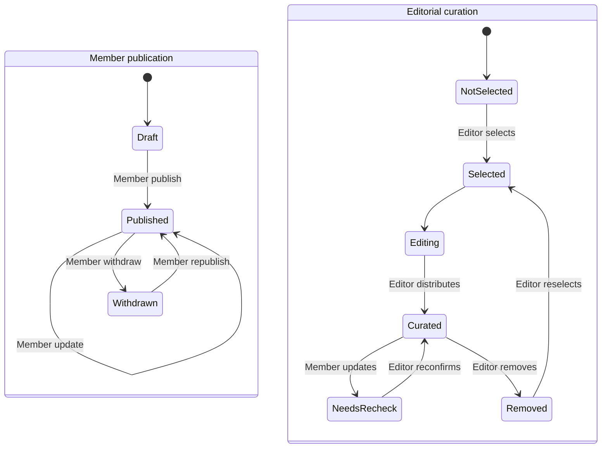

# China, in Fact：产品需求基线

> 正式品牌名：China, in Fact。正式域名：`chinainfact.com`。

## 内部品牌语境（非对外文案）

本节只供后续 Agent 理解产品，不是官网介绍、品牌 slogan 或可直接发布的对外文案。

China, in Fact 是一个让世界遇见一群真实、有趣、有灵魂的中国人的地方。

这里聚集着一群来自中国、生活在不同城市、从事不同行业的人。项目、作品、经历、问题和持续表达让每个人变得具体；Stories、Guides 与 Places 帮助世界理解他们所处的中国。网站让这些人长期可发现，Discord 承接持续交流与协作，Reddit 从真实问题进入外部对话。

对参与者来说，这是大家一起做大的公共入口。每个人可以贡献自己知道的事，也可以公开自己正在做的事、正在追的问题和希望遇见的人。访问者可能因为一个问题、一篇文章或一个项目来到这里，最后记住并找到一个具体的人。

品牌面向全世界。有人准备第一次来中国，有人已经在中国生活，有人在这里做生意、做研究，也有人只是想知道，中国人每天在想什么、做什么，日子究竟是什么样。

站方的选择、分类、核对和维护是信息组织机制，不把品牌定性为国际编辑出版物、媒体或杂志。当前产品首期只实现英语和西班牙语 locale；这是阶段范围，不是品牌受众边界。

## 1. 一句话定义

一个让世界遇见真实中国人，并从他们正在做的事继续连接的人物网络。

项目、作品、经历、问题和内容共同证明一个人是谁、在关心什么、正在做什么。成员负责自己的表达与公开边界，站方负责人物发现、事实维护、策展和分发；站方另以 `China, in Fact` 署名维护基础事实指南。成员内容仍只保留同一篇 Article，站方编辑不会生成“官方副本”或取代原作者署名。

## 2. 产品价值

### 对海外读者

- 遇见有姓名、面孔、处境、行动与持续表达的真实中国人。
- 从一个人的项目、作品、经历或问题进入中国，而不只从抽象议题进入。
- 获得可信的背景与基础事实，并分清个人表达与站方维护的内容。
- 继续进入对方的公开渠道、Discord 讨论或确实相关的外部对话。

### 对铲子计划成员

- 维护一个能体现自己当下行动、判断和兴趣的长期公开页。
- 自主公开项目与内容，保留个人网站、社交账号与其他继续连接的入口。
- 被站方放进人物、首页、主题、地点和内容入口后获得共同流量；原作者身份不被替换。

### 对平台

- 从成员明确公开的人物证据中组织值得认识的人，不把成员包装成统一角色。
- 通过编辑、核对、分类和维护建立公共信任，同时保留人物的复杂性与当下感。
- 把共同流量准确分发给具体的人，并形成面向全球的长期人物与中国知识网络。

## 3. 产品关系



- Person 是公开网络的中心；Article、Project 与其他证据都指回具体的人。
- Member publication 决定内容或项目是否在自己的公开空间出现。
- Editorial curation 决定同一内容是否进入站方组织和推荐的入口。
- 公开 Person 是身份；Editor 与 Super Admin 是后台权限。同一账户可以同时拥有 Person 和站方权限。

## 4. 核心用户

### 海外读者

1. 想获得比新闻摘要更深入的中国理解。
2. 正在计划来华旅行、学习、工作或长期生活。
3. 想在中国经商、寻找合作或了解市场。
4. 从事中国相关研究、媒体、教育或专业工作。
5. 已离华、准备离华或长期往返中国。
6. 华裔、侨民、校友、跨国家庭及关注中国企业、科技、供应链和海外社区的人。

### 铲子计划成员

- 长期规模约 100–200 人，来自已有的真实关系网络。
- 可能是研究者、创业者、顾问、教师、创作者、律师、医生、旅行者或本地生活服务者。
- 可以贡献专业知识、个人经历、地方观察和日常生活，不统一包装成专家、员工或志愿者。
- 每人拥有公开 Person、个人内容归档和可配置外部链接。

### 站方

- Editor 从成员内容中选择、编辑、核对、分类、策展和维护官方分发。
- Super Admin 管理账户、权限、站点安全和恢复，并包含 Editor 能力。

## 5. 信息架构

### 官方稳定入口

| 对象 | 站方公开范围 |
|---|---|
| People | 真实人物的长期主页，以及其当前项目、作品、经历、问题和内容 |
| Stories | 站方已策展的故事、报道、分析、评论和更新 |
| Guides | 站方已策展且满足来源、时效和维护要求的实用指南 |
| Places | 中国境内地点及与中国直接相关的海外地理入口 |

`Understand / Visit / Live / Study / Work / Business` 是目的入口；`Topics / Geography / Situation` 是横向发现。它们组织同一篇 Article，不复制内容，也不改变作者。

### 个人公开与官方公开

- Member Published Article 拥有稳定详情页，并进入作者 Person 的全部内容列表。
- 只有 `Member Published + Curated` 的 Article 才进入 Home、Stories、Guides、Topics、Places、Purpose、站方推荐和自动最新流。
- Story/Guide 等是站方对内容的策展分类，不是 Article 的所有权，也不能让 canonical 随分类改变。
- 当前 `/stories/[slug]` 与 `/guides/[slug]` 在路由升级时必须保持永久兼容；最终稳定详情路由由 migration-ready decision 固定。
- 未被策展不等于草稿、被拒绝或低质量；它只表示站方尚未把该内容纳入官方分发。

### 首页与人物规模

- 首页首个完整叙事单元必须让访问者遇见一个具体的人及其当前行动；文章、指南和地点成为理解此人的证据与路径。
- 首页随后呈现少量不同处境的人、他们正在做或追的问题，以及来自这些人的近期内容；不要求每天人工排序。
- People 索引先通过具体行动和判断建立人物感，再提供搜索、Topics/Places/Language 与明确分页；筛选不主导首屏。
- 人物是否出现不再以先有 Article 为前提；有明确公开边界的项目、作品、经历、问题或持续表达即可构成人物证据。
- 不设默认顶级 Projects 导航。项目先作为 Person 的行动证据；跨人物项目入口只在真实使用证明有必要时建立。

### 公共页面

```text
/[locale]
├── /stories
├── /guides
├── /places/[slug]
├── /purposes/[slug]
├── /topics/[slug]
├── /people
├── /people/[author-slug]
├── /[stable-article-route]/[slug]
├── /newsletter
└── /about
```

`locale` 首期支持 `en` 与 `es`。不同语言是独立 Article，以 translation group 关联，并分别决定个人公开与站方策展。

## 6. 内容与人物模型

### Article

- 同一语言的一次创作只有一个 Article ID；没有“成员原文”和“站方编辑版”两条记录。
- Member Article 的 `author` 始终是原 Member 的 Person；Editor actor 进入版本和审计，不进入署名。
- Site Article 以 `China, in Fact` 机构署名，关联内部中文 Editorial Master，不创建或借用 Person。
- 中文母稿保存站方事实、来源、权利、时效和编辑状态，只供内部审查；English 与 Español 分别从同一份已批准母稿形成独立 Article。
- Member publication：`Draft / Published / Withdrawn`。
- Editorial curation：`Not selected / Selected / Editing / Curated / Needs recheck / Removed`。
- Member Published Article 最低需要语言、标题、正文、作者和稳定 URL。
- 进入官方分发时由 Editor 补齐或确认摘要、封面、内容形态、分类、来源、Freshness、SEO 和排期。
- 内容形态包括 Guide、Reporting、Analysis、First-person、Update；它只决定官方 Stories/Guides 分类。
- Member 更新已 Curated Article 后，同一 Article 继续在个人页公开，策展状态转为 Needs recheck 并暂时退出官方入口。
- Member Withdrawn 从个人与官方入口撤回；Removed 只撤出官方分发。
- Site Article 不进入 Person 个人归档；只在有真实相关人物时提供 People 入口，不强行挂靠。

### Person

Person 是一个人的长期公开空间，包含：

- 姓名、头像、身份、地点、介绍、语言与关注主题。
- 当前项目、正在追的问题、所处阶段、希望遇见的人或获得的帮助。
- 作者全部 Member Published Article，并可标出站方精选。
- 个人网站、社交账号和公开联系方式。
- 与 Stories、Guides、Places、Topics 和 Purpose 的内容关系。

成员直接维护自己的 Person 与公开项目，保留版本历史、撤回能力与 Super Admin 暂停/恢复能力，不逐次等待 Editor 应用资料修订。Person 页不是简历、员工页、黄页、排行榜或交易页。

### Project

Project 是 Person 的行动证据，不是独立增长单位。它至少关联一名公开 Person，并由成员明确选择公开标题、简述、阶段、外链、当前近况与希望获得的连接；允许多名协作者。Discord 帖子不能自动成为公开 Project，也不能按显示名自动关联 Person。

## 7. 发布与策展流程



| 能力 | 主要任务 |
|---|---|
| Member | 维护自己的 Person 与 Project；保存、预览、直接公开、更新和撤回自己的 Article |
| Editor | 查看公开候选；在同一 Article 上编辑、核对、分类、策展、排期、撤出和复核 |
| Super Admin | 包含 Editor 能力；邀请、暂停、恢复成员和管理权限 |

后台使用 `My work / My profile` 和站方策展入口表达任务，不让 Member 在全量 CMS 集合、审核状态和内部字段中穿行。完整任务合同见 [`Member Publishing And Editorial Curation Requirements`](operational-publishing-requirements.md)。

Agent Workspace 的目标是让已有后台账户的人从自己的 Agent 完成同一组权限内任务。Agent 通过远程 Gateway 获得结构化业务工具，服务器继续逐次校验身份、角色、对象所有权和状态转换；本地 Workspace、客户端配置和模型判断都不授予权限。001 的 Member foundation 已用 Cursor 在 Local 与受保护 Preview 完成真实 OAuth、草稿工具链、越权拒绝和撤权验证；测试夹具已删除，Production 仍未提供该入口。完整合同见 [`Agent Workspace Requirements`](agent-workspace-requirements.md)。

## 8. 增长与留存闭环

1. 搜索、Reddit 真实问题、社交分享、作者渠道或站方入口带来读者。
2. 首页、People、项目、文章或地点让读者遇见一个具体的人。
3. Person 把分散证据组织成“他是谁、现在在做什么、从哪里继续”。
4. 作者外链承担直接连接；Discord 承担持续交流、项目更新与协作；经本人选择公开的近况再回到网站。
5. Newsletter 保留关系，Stories、Guides 与 Places 持续为人和问题提供可信背景。

首期不做站内私信、关注计数、支付、预约、服务市场、排行榜、自动 Discord 同步或个性化推荐。成功首先看访问者是否进入 Person、继续到项目/外链/Discord，以及成员是否愿意持续更新自己的公开页。
