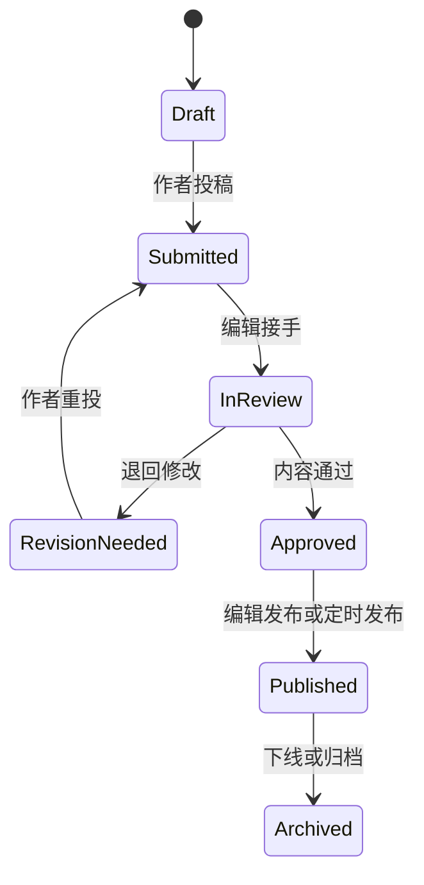

# China, in Fact：产品需求基线

> 正式品牌名：China, in Fact。域名、商标和品牌资产仍待决定。

## 1. 一句话定义

一个由真实中国人共同构成、由编辑机制组织和把关，面向英语区和西班牙语区用户的中国信息与人物网络：读者既能获得可信、深入的中国信息，也能通过内容认识具体的人，并继续关注、加入社群或进入作者自己的渠道。

它是一个由人物驱动的编辑型信息 Hub。平台的编辑标准建立公共信任，作者的真实身份、经历和持续表达建立人与人之间的信任；内容把两者连接起来。作者主页、社群和外部渠道属于核心关系链，不是文章之外的附加功能。

## 2. 产品价值

### 对海外读者

- 在一个地方获得关于中国社会，以及来华、在华、离华后与跨境关系的系统信息。
- 看到由具体的人持续贡献、有署名且经过编辑组织的中国视角。
- 从公开内容继续进入 Newsletter、Discord 社群、作者主页和作者自己的服务渠道。

### 对中国作者与贡献者

- 作为真实人物被看见，拥有公开的作者主页和持续积累的专栏。
- 借助平台的编辑、分类、分发和 SEO 获得更大的共同流量。
- 保留自己的对外链接、联系方式与私域入口。

### 对平台

- 通过主编策展，把分散的作者内容组织成可信的主题入口。
- 同时建立编辑可信度与人物可信度，让读者通过内容、人物与社群形成长期关系。
- 逐步建立可复用的中国知识库和跨语言分发能力。

## 3. 三方关系


平台负责编辑、核验、策展和聚合流量；作者贡献知识、经历、判断和人格；读者通过内容认识平台与作者，再进入可持续联系渠道。专业程度可以不同，事实、经验和观点必须被清楚区分。

## 4. 核心用户

### 海外读者

1. 对中国感兴趣，想获得比新闻摘要更深入的理解。
2. 正在计划来华旅行或短期停留。
3. 准备在中国学习、工作或长期生活。
4. 想在中国做生意、寻找合作或了解市场。
5. 从事中国相关研究、媒体、教育或专业工作。
6. 已经离华、准备离华或长期往返中国。
7. 华裔、侨民、校友或跨国家庭，希望理解自己与中国的关系。
8. 关注中国企业、科技、供应链和海外社区。

### 中国作者

- 预计长期规模为 100–200 人。
- 首批贡献者来自已有的真实关系网络，能够长期协作；学生或志愿者是参与背景，不作为统一的公开身份包装。
- 可能是研究者、创业者、顾问、教师、创作者、律师、医生、旅行者或本地生活服务者。
- 既可以贡献专业知识，也可以贡献个人经历、地方观察和日常生活；不要求所有人都被包装成专家。
- 平台分发共同流量，同时允许作者保留个人网站、社交账号和公开渠道。

### 编辑团队

- 主编负责内容标准、首页策展、内容对象、目的入口与横向语义归类，以及最终发布。
- 超级管理员负责账号、权限、站点设置和后期分类配置。

## 5. 信息架构

### 稳定内容对象

首期主导航按稳定对象组织：

| 对象 | 覆盖范围 |
|---|---|
| Stories | 个人故事、报道、分析和时效更新 |
| Guides | 可执行、需要持续核验的实用指南 |
| Places | 中国境内地点及与中国直接相关的海外地理入口 |
| People | 作者、专家和当地人物等自然人的长期主页 |

### 目的入口

`Understand / Visit / Live / Study / Work / Business` 为读者提供目的入口。同一内容可以进入多个目的集合，不复制内容，也不以目的集合决定唯一 URL。

- `Understand` 服务没有行动任务、但希望理解中国的读者，不作为内容兜底桶。
- `Live` 覆盖准备、在华生活、离境、离华后、返回与长期往返。
- `Business` 覆盖经商、创业、投资、采购、合作及企业相关判断。

### 横向发现

- `Topics` 组织跨对象议题，是全站可见的发现入口，但不是第五个内容对象。
- `Geography` 覆盖中国境内地点和与中国直接相关的海外社区、企业节点与跨境区域。
- `Situation` 描述读者与中国的关系状态：`Exploring / Preparing / In China / Leaving / After China / Cross-border`。
- `Language` 是独立出版轴；`Freshness` 是核验、维护、排序与展示状态。

设计原则：

- 每篇内容有一个公开对象；它决定进入 Stories 或 Guides，不由目的入口决定 URL。
- `visa`、`insurance`、`driving`、`healthcare`、`money`、`internet` 等是 Topics，不升级成主导航。
- 机构和服务不进入 People，通过内容、搜索或外部链接被发现。
- 首页不平均展示所有入口，由主编策展出当前最值得读的内容、地点和人物。
- People 既是独立对象，也是 Stories、Guides 与 Places 的常驻人格层；作者身份不能只出现在文章末尾。
- 对象类型保持稳定；目的集合与横向语义由编辑配置，不把判断逻辑散落在页面组件里。

### 首页编排

首页采用少量人工决定与自动内容流组合，不要求每天手工重排：

- 主故事由主编排期，可设生效与到期时间；无有效排期时自动回退到最新合格重点内容。
- 支持内容来自主编维护的推荐池，系统按新鲜度、维护状态、主题与作者重复度轮换。
- `Latest` 与 `Recently updated` 由发布时间、更新时间和核验状态自动生成。
- `People to know` 从资料完整且有公开内容的人物中轮换，兼顾主题、地点、新人和近期曝光；允许临时置顶。
- 重大事件可临时覆盖部分位置，到期后恢复常规编排。正常节奏是每周维护推荐池，日常无需人工排序。

### 公共站首期页面

```text
/[locale]
├── /stories
│   └── /[slug]
├── /guides
│   └── /[slug]
├── /places
│   └── /[slug]
├── /purposes
│   └── /[slug]
├── /topics
│   └── /[slug]
├── /people
├── /people/[author-slug]
├── /newsletter
└── /about
```

`locale` 首期支持 `en` 与 `es`。语言版本拥有独立 URL 和独立发布状态，不要求所有文章同时具备两种译文。

## 6. 内容与人物模型

### 内容

首期只需要一个统一的 `Article` 模型，通过 `format` 区分编辑形态：

- Guide：可执行、需要持续维护的实用指南，公开进入 Guides。
- Reporting：报道与现场观察，公开进入 Stories。
- Analysis：解释、评论与研究，公开进入 Stories。
- First-person：个人经历与第一人称叙事，公开进入 Stories。
- Update：时效性较强的变化或提醒，公开进入 Stories。

每篇内容至少包含：

- 标题、摘要、正文、封面图。
- 原始语言与公开语言版本。
- 作者。
- 一个内容形式，由此进入 Stories 或 Guides。
- 零到多个目的集合、Topics、Geography 与 Situation 值。
- 发布时间、更新时间、核验与维护状态。
- 来源或事实核查备注。
- 编辑状态。
- SEO 标题、描述和分享图。

### 作者主页

作者页不是简历附件，而是平台的自然人物入口，包含：

- 姓名、头像、简短身份。
- 一段可读的个人介绍。
- 这个人理解中国的具体位置、经历或观察角度。
- 专业主题与所在城市。
- 作者在平台发布的全部内容。
- 个人网站、社交账号或公开联系方式。
- 服务入口可后期增加，首期只做清晰的外部链接，不做站内交易。

每位作者的“子博客”通过 `/people/[author-slug]` 实现，不创建独立 App、子域名或独立内容系统。

People 不使用服务商黄页、创作者排行榜或社交网络式表达。人物发现依靠编辑选择，以及人物与内容、地点、主题之间的交叉关系；不显示粉丝数、热度排名或交易按钮。

100–200 人规模通过分层发现承载：首页和内容页只展示少量相关人物；People 顶部使用每周稳定的一主两辅 `Spotlight`，`All people` 提供姓名搜索、Topics、Places、Language 筛选及明确分页，桌面端每页约 24 人、移动端约 12 人。Spotlight 不是固定三人，也不在每次刷新时随机变化：系统每周从合格人物池生成一组，分别照顾当期重点、新近贡献者和长期低曝光人物；编辑最多临时置顶一人，并可排除不适合推荐的人。

人物资料完整且至少有一篇公开内容后才进入公共 People；暂停贡献者退出自动推荐但保留历史主页。Stories、Guides、Places、Topics 与 Purpose 页面根据人物已有内容的 Topics、Places、Purpose、Language、新鲜度和近期曝光自动匹配相关人物。首期使用可解释的规则，不依赖个性化画像或复杂模型；同一周期内结果保持稳定，并限制少数人物连续高频曝光，不使用商业转化或人气作为默认排序。

## 7. 编辑与发布流程



### 角色权限

| 角色 | 权限 |
|---|---|
| Author | 创建文章；编辑自己的草稿；提交审核；维护自己的公开资料；不能自行发布 |
| Editor | 查看全部投稿；编辑内容；指定内容对象、目的与横向分类；退回、批准、定时发布、下线 |
| Super Admin | 拥有 Editor 权限；管理作者、角色、站点设置；后期管理分类 |

后台首期不需要自行设计一套复杂工作台。先使用成熟 CMS 的管理界面，只有当真实编辑流程出现明确摩擦时再做定制。

后台原型只证明工作流合同：作者填写内容、来源说明并提交，编辑负责分类、核验、退回、批准与公开。内容审核、分类和最终公开是连续但可区分的步骤；移动端支持状态查看和轻量审核，最终排期或立即公开保留明确确认。

## 8. 增长与留存闭环

公共站的主要转化顺序：

1. 搜索、社交分享或作者外部渠道带来读者。
2. 内容页、人物页、地点与主题之间双向连接，帮助读者从一篇内容认识更多具体的人。
3. Newsletter 是全站统一的主要留存动作。
4. Discord 是希望与平台及其人物继续交流的读者入口。
5. 作者主页把高意向读者引向作者自己的渠道。

首期不做站内私信、关注计数、支付、预约或服务市场。先验证内容是否能形成稳定访问，以及读者是否愿意订阅、加入社群和继续关注作者。
