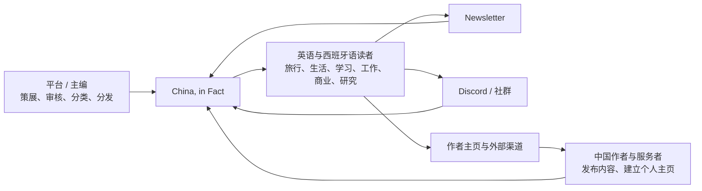
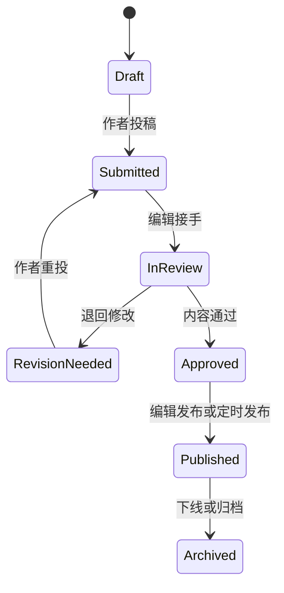

# China, in Fact：产品需求基线

> 正式品牌名：China, in Fact。域名、商标和品牌资产仍待决定。

## 1. 一句话定义

一个面向英语区和西班牙语区用户的中国信息与人物网络：用户可以按来华目的找到可信、深入、有人情味的内容，也可以继续关注、加入社群，或直接联系内容背后的中国作者与服务者。

它首先是一个编辑型信息聚合 Hub，同时承载一组作者个人专栏。它不是把文章简单堆在一起，也不是服务商黄页。

## 2. 产品价值

### 对海外读者

- 在一个地方获得关于来华旅行、生活、学习、工作、商业与研究的系统信息。
- 看到真实、具体、有署名的中国视角。
- 从公开内容继续进入 Newsletter、Discord 社群、作者主页和作者自己的服务渠道。

### 对中国作者与服务者

- 拥有公开的作者主页和持续积累的专栏。
- 借助平台的编辑、分类、分发和 SEO 获得更大的共同流量。
- 保留自己的对外链接、联系方式与私域入口。

### 对平台

- 通过主编策展，把分散的作者内容组织成可信的主题入口。
- 通过内容、人物与社群形成长期关系，而不是只获得一次性搜索流量。
- 逐步建立可复用的中国知识库和跨语言分发能力。

## 3. 三方关系



平台负责建立信任和聚合流量；作者贡献内容、人物感与专业能力；读者通过内容发现平台和作者，再进入可持续联系渠道。

## 4. 核心用户

### 海外读者

1. 对中国感兴趣，想获得比新闻摘要更深入的理解。
2. 正在计划来华旅行或短期停留。
3. 准备在中国学习、工作或长期生活。
4. 想在中国做生意、寻找合作或了解市场。
5. 从事中国相关研究、媒体、教育或专业工作。

### 中国作者

- 预计长期规模为 100–200 人。
- 可能是研究者、创业者、顾问、教师、创作者、律师、医生、旅行者或本地生活服务者。
- 既可能写通用知识，也可能通过专业内容承接进一步交流或服务。

### 编辑团队

- 主编负责内容标准、首页策展、栏目归类和最终发布。
- 超级管理员负责账号、权限、站点设置和后期分类配置。

## 5. 信息架构

### 首期一级栏目

一级栏目按读者的来华意图组织，首期固定为：

| 栏目 | 覆盖范围 | 示例主题 |
|---|---|---|
| Travel | 短期旅行与入境体验 | itineraries、transport、payments、local etiquette |
| Live | 搬迁与日常生活 | housing、healthcare、insurance、banking、driving |
| Study | 留学、交换与语言学习 | universities、applications、campus life、Mandarin |
| Work | 就业与职业生活 | job search、work culture、permits、career stories |
| Business | 经商、创业与合作 | market entry、company setup、tax、sourcing、partnerships |
| Understand | 中国社会、文化与研究 | society、history、ideas、media、field notes |

设计原则：

- 一篇内容只有一个主要栏目，保证导航和 URL 稳定。
- `visa`、`insurance`、`driving`、`healthcare`、`money`、`internet` 等是跨栏目主题标签，不升级成一级导航。
- 城市、地区、受众阶段和内容形式使用筛选或标签表达。
- 首页不平均展示所有栏目，由主编策展出当前最值得读的内容和人物。
- 首期栏目写在代码配置中；后续保留迁移为后台可配置分类的接口，不把判断逻辑散落在页面组件里。

### 公共站首期页面

```text
/[locale]
├── /travel
├── /live
├── /study
├── /work
├── /business
├── /understand
├── /topics/[slug]
├── /articles/[slug]
├── /people
├── /people/[author-slug]
├── /newsletter
└── /about
```

`locale` 首期支持 `en` 与 `es`。语言版本拥有独立 URL 和独立发布状态，不要求所有文章同时具备两种译文。

## 6. 内容与人物模型

### 内容

首期只需要一个统一的 `Article` 模型，通过 `format` 区分呈现：

- Guide：长期有效的实用指南。
- Story：个人经历、访谈与现场故事。
- Analysis：解释、评论与研究。
- Update：时效性较强的变化或提醒。

每篇内容至少包含：

- 标题、摘要、正文、封面图。
- 原始语言与公开语言版本。
- 作者。
- 一个主要栏目。
- 零到多个主题、地点和受众标签。
- 内容形式、发布时间、更新时间。
- 来源或事实核查备注。
- 编辑状态。
- SEO 标题、描述和分享图。

### 作者主页

作者页不是简历附件，而是平台的人物入口，包含：

- 姓名、头像、简短身份。
- 一段可读的个人介绍。
- 专业主题与所在城市。
- 作者在平台发布的全部内容。
- 个人网站、社交账号或公开联系方式。
- 服务入口可后期增加，首期只做清晰的外部链接，不做站内交易。

每位作者的“子博客”通过 `/people/[author-slug]` 实现，不创建独立 App、子域名或独立内容系统。

## 7. 编辑与发布流程



### 角色权限

| 角色 | 权限 |
|---|---|
| Author | 创建文章；编辑自己的草稿；提交审核；维护自己的公开资料；不能自行发布 |
| Editor | 查看全部投稿；编辑内容；指定栏目和主题；退回、批准、定时发布、下线 |
| Super Admin | 拥有 Editor 权限；管理作者、角色、站点设置；后期管理分类 |

后台首期不需要自行设计一套复杂工作台。先使用成熟 CMS 的管理界面，只有当真实编辑流程出现明确摩擦时再做定制。

## 8. 增长与留存闭环

公共站的主要转化顺序：

1. 搜索、社交分享或作者外部渠道带来读者。
2. 栏目页、相关文章和作者页帮助读者继续浏览。
3. Newsletter 是全站统一的主要留存动作。
4. Discord 是希望深入交流的读者入口。
5. 作者主页把高意向读者引向作者自己的渠道。

首期不做站内私信、支付、预约或服务市场。先验证内容是否能形成稳定访问，以及读者是否愿意订阅、加入社群和继续关注作者。
