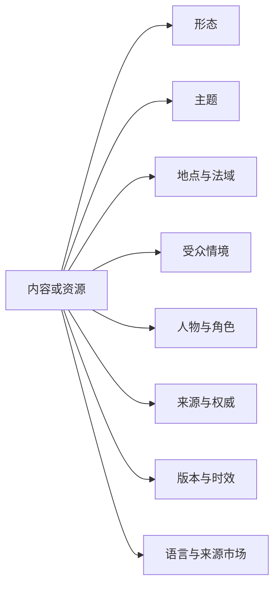

# China, in Fact 信息架构扩展调研

## 文档状态

这是一份独立扩展研究记录。它不替代零基调研；其中与内容分类直接相关的结论已于 2026-07-27 获得批准，并由 [ADR-0004](../../decisions/0004-broaden-purpose-and-context-classification.md) 修订产品基线。当前已接受结构是：

- 稳定内容入口为 `Stories / Guides / Places / People`。
- 目的入口为 `Understand / Visit / Live / Study / Work / Business`。
- 横向语义分类为 `Topics / Geography / Situation`。
- `Language` 与 `Freshness` 分别属于出版和维护维度。

本文保存扩展样本、反例、风险和后续验证方向；最终约束以 [ADR-0003](../../decisions/0003-layered-information-architecture.md)、[ADR-0004](../../decisions/0004-broaden-purpose-and-context-classification.md)、[`product-brief.md`](../../product-brief.md) 与 [`DESIGN.md`](../../../DESIGN.md) 为准。

## 摘要

扩大研究后，原结构仍解决了一个真实问题：不能让一排“来华目的”同时承担导航、文章归属和 URL 骨架。扩展研究没有推翻四个内容对象，但证明第二层目的过窄，且横向维度混合了语义、出版与维护属性。信息架构也不只由内容分类决定；产品边界、用户所处法域、内容权威、更新时间、人物角色、多语言市场和作者供给方式，都会改变用户最终需要看到的入口。

本轮被吸收进产品基线的判断有六项：

1. `Stories / Guides / Places / People` 继续作为稳定内容对象与主导航。
2. 目的入口扩展为 `Understand / Visit / Live / Study / Work / Business`，覆盖非来华、在华、离华后与跨境关系。
3. `Topics / Geography / Situation` 是横向语义分类；Topics 必须全站可发现，但不升级成内容对象。
4. `Language` 是独立出版轴，`Freshness` 是维护与展示状态，不属于内容分类。
5. Stories 对外保持一个对象，内部区分报道、分析、第一人称与更新；People 只表示自然人。
6. 真实内容盘点、卡片分类和树测试仍用于验证标签与入口表现，竞品数量本身不能替代用户证据。

## 一、研究问题

本轮不再比较“旧六栏目”和“新四对象”谁更好，而是追问：

- China, in Fact 是编辑媒体、实用指南、办事路由、人物网络、社区，还是其中有限的组合？
- 哪些信息和关系应由平台自己维护，哪些只需解释并链接到官方或交易产品？
- 用户怎样寻找答案，编辑又怎样生产、审核和更新内容？
- 英语与西语用户之间，除了语言还存在哪些市场、法域和文化差异？
- 100–200 位作者参与后，怎样避免随机供给、利益冲突和内容失效？

## 二、方法与限制

本轮累计扫描 50 余个产品或独立服务面，覆盖拉美、北美、欧洲、东亚、东南亚、大洋洲、中东、南亚、非洲和全球产品。

样本分为两层：

- **广度扫描**：查看入口承诺、一级导航、服务范围和商业模式。
- **代表性深读**：继续检查任务路径、内容对象、作者角色、来源、更新时间、多语言方式和转化路径。

公开站点能证明一个机构如何组织自己，不能证明用户真的理解该结构。论坛和公开提问只用于发现候选变量，不能代替访谈、分析数据或可用性测试。

上一轮的 64 个中国任务由研究者合成，适合做结构压力测试，不属于真实用户需求证据。

## 三、扩展样本地图

| 产品模型 | 代表样本 | 主要结构 |
|---|---|---|
| 国家与城市综合服务 | 上海国际服务、北京国际门户、Argentina Extranjeros、Canada Newcomers | 人群角色、办事任务、旅程阶段 |
| 目的型国家产品 | Make it in Germany、Welcome to France、Work in Estonia、Study Australia | 就业、投资、留学等独立服务范围 |
| 安顿支持 | Japan Daily Life Support、New Zealand Live、Australia settlement topics | 到达后生活、简明语言、咨询与支持机构 |
| 目的地发现 | Visit Mexico、Colombia Travel、Japan Guide | 地点、兴趣、路线、行前准备 |
| 搬迁与侨居指南 | Expat.com、Mexperience、Portugalist、Moving2Canada | 旅程、指南、服务转介 |
| 本地生活媒体 | SmartShanghai、the Beijinger、ExpatGo、Expat Living | 文章、地点、活动、目录 |
| 中国专业与解释媒体 | ChinaFile、Sixth Tone、China Briefing、The China Project | 报道、分析、专题、作者与专家 |
| 全球解释媒体 | Global Voices、Rest of World、The Conversation | 地区、议题、体裁、作者、译者与证据 |
| 社区共建 | Atlas Obscura、Forumosa、ASEAN NOW | 贡献、成员、问答、编辑审核 |
| 中国数字服务工具 | Nihao China、Shanghai Easy Go | 支付、交通、地图、翻译与办事整合 |

增加国家数量不是唯一的广度。即使服务同一国家，政府门户、搬迁获客站、编辑媒体和社区也会采用完全不同的结构，因为它们拥有的服务、收入和维护责任不同。

## 四、主要发现

### 1. 成熟体系经常拆分产品

[Make it in Germany](https://www.make-it-in-germany.com/en/)服务国际技术人才，[Welcome to France](https://welcome.businessfrance.fr/en/)聚焦投资、企业设立与国际招聘，[Work in Estonia](https://workinestonia.com/)和[e-Residency](https://www.e-resident.gov.ee/)分别服务就业与数字公司。

这说明 `Visit / Study / Work / Build / Move` 可能代表不同服务范围，而不天然是一家编辑媒体的同权栏目。平台需要说明自己在每个范围内提供的是报道、解释、比较、经验还是交易。

### 2. 栏目常常是商业模式的结果

- 政府站按任务组织，因为它拥有权威信息和办事入口。
- 搬迁站突出签证、住房、保险和咨询，因为这些内容承担获客。
- 城市媒体突出地点和活动，因为本地密度与广告决定价值。
- 编辑媒体突出最新、议题、体裁和作者，因为它拥有报道与判断。
- 社区突出成员和问答，因为互动本身就是产品。

因此不能只看栏目是否成熟，还要看它为谁负责、靠什么生存。

### 3. 用户不只处在来华旅程中

除游客、学生、职员和家庭外，还包括：

- 没有来华计划、只想理解中国的读者。
- 从事研究、媒体、教育和专业工作的用户。
- 已经离华、准备离华或长期往返的人。
- 华裔、侨民、校友和跨国家庭。
- 关注中国企业、科技、供应链和海外社区的人。

[ChinaFile](https://www.chinafile.com/)与[Rest of World](https://restofworld.org/)都展示了“中国与世界的关系”不等于“中国境内生活”。

### 4. 实际问题是条件化的

支付、签证、交通、住房、学校、工作许可和商业合作反复出现，但答案取决于护照、出发国、家庭、城市、行业、身份和时间。

用户真正寻找的通常是：“以我的条件，现在应该怎么办？”因此搜索、快速判断、决策树和上下文筛选，可能比静态任务页更重要。

### 5. 多语言不等于同步翻译

[W3C](https://www.w3.org/International/questions/qa-international-multilingual)明确区分 international 与 multilingual。墨西哥、智利、西班牙和乌拉圭用户共享西语，但面对不同航线、换汇、政策和商业环境。

[Global Voices](https://globalvoices.org/)还明确区分作者与译者。英语和西语版本可以共享人物、来源和概念，但应允许不同标题、发布状态、背景信息和策展顺序。`Build` 也不能靠逐字翻译解决命名问题。

### 6. People 包含多种角色

人物可能是作者、受访者、消息来源、专家、审稿人、译者、服务者或赞助方。每种角色涉及不同的资质、利益披露、编辑责任、联系方式和隐私边界。

[The Conversation 作者指南](https://cdn.theconversation.com/static_files/files/3275/TCAUNZ_New_Author_Guide_May_2024.pdf?1716183446=)要求作者在专业范围内写作并披露利益关系；[Atlas Obscura](https://www.atlasobscura.com/faq)把社区贡献与编辑审核分开。

### 7. 时效性是一套发布制度

签证、税务、医疗、劳动和跨境资金等内容，需要来源、适用法域、最后核验、下次复核、有效期、负责人、修订与撤回规则。

[GOV.UK 内容维护](https://www.gov.uk/guidance/content-design/content-maintenance)使用复核日期与二次审核；[过期内容规则](https://guidance.publishing.service.gov.uk/writing-to-gov-uk-standards/plan-manage-content/retire-content/)区分撤回、取消发布和历史状态。`Freshness` 因而不能只是一枚标签。

### 8. 通用办事指南的护城河正在缩小

[Nihao China](https://m.unionpayintl.com/ZT/en/NHCAPP/)和[Shanghai Easy Go](https://english.shanghai.gov.cn/en-ExpatServices-Videos-WhatsNew/20250702/104ac119548743968fe343bb14d14bdd.html)已经整合支付、交通、地图、翻译或城市服务。

如果平台只是重复“下载哪个 App、点哪里”，内容会快速过期。更持久的价值可能是比较来源、解释选择、指出例外、记录真实经验并把用户送到可靠服务。

### 9. 大型作者网络需要供给治理

没有委约和覆盖计划时，100–200 位作者容易产生随机供给：热门城市与职业重复，难题无人维护，翻译和核查成为瓶颈。

[ChinaFile 投稿与报酬说明](https://www.chinafile.com/contributor-guidelines-and-compensation)提到，基于其对中国境外 NGO 法的解释，不能向中国境内供稿人支付稿酬。这不是对本项目的法律判断，但说明主体、合同、报酬和作者所在地会反过来限制内容模型。

### 10. 资金、信任和安全属于产品设计

[The China Project 的停刊说明](https://thechinaproject.com/2023/11/06/some-sad-news/)提到，政治化攻击产生法律成本并影响投资、广告和赞助，即使订阅增长仍不足以维持运营。

人物资料、联系渠道和 Newsletter 还涉及个人信息处理。中国[个人信息保护法](https://www.miit.gov.cn/zwgk/zcwj/flfg/art/2022/art_04a0f1fb5df244e39688fd5372623a8d.html)要求合法、正当、必要、透明和最小范围处理。作者安全、资助披露、商业内容与编辑独立不能只作为后台问题。

### 11. 国际用户也有可达性差异

用户可能在刚落地、网络不稳、只使用手机、数字信心不足或需要辅助技术时查询信息。[GOV.UK assisted digital](https://www.gov.uk/service-manual/assisted-digital/)把信任、网络条件、数字技能和可访问性纳入服务研究。

平台未必需要提供人工协助，但移动端、低带宽、屏幕阅读器、简明语言、紧急信息和官方线下支持去向应进入代表性测试。

## 五、对分层结构的修订结论

保留的基础：

- 内容对象和用户任务不应混成一层。
- 地点与人物值得作为长期关系存在。
- 同一内容可以进入多个目的集合，而不复制正文。
- 两种语言应有独立 URL 和发布状态。

需要修订的部分：

- `Understand` 恢复为目的与策展入口，服务没有行动任务但希望理解中国的读者；它不是内容兜底桶。
- `Live` 取代 `Move`，覆盖准备、在华生活、离境、离华后、返回与长期往返。
- `Business` 取代 `Build`，避免把创业、投资、采购、合作与企业研究压进含义含混的动词。
- `Geography` 取代 `Region`，覆盖中国境内地点和与中国直接相关的海外社区、企业节点与跨境区域。
- `Situation` 取代线性的 `Stage`，可取 `Exploring / Preparing / In China / Leaving / After China / Cross-border`。
- Stories 内部区分 `Reporting / Analysis / First-person / Update`；Guides 只承载可执行且需要维护的内容。

最终结构：

```text
主导航：Stories / Guides / Places / People
目的入口：Understand / Visit / Live / Study / Work / Business
语义分类：Topics / Geography / Situation
独立维度：Language / Freshness
```

目的入口只负责策展和发现，同一内容可进入多个目的，不拥有内容或唯一 URL。`Latest` 是首页和内容流状态。机构与服务不进入 People，通过内容、搜索和外部链接被发现。

## 六、知识关系假设

下面是后台需要考虑的维度，不是公共栏目建议：



这些维度不要求一一成为数据库模型、筛选项或公开导航。是否独立建模，应由真实内容量、展示差异和维护责任决定。

## 七、边界案例

| 内容或任务 | 当前结构中的位置 | 暴露的问题 |
|---|---|---|
| 墨西哥与西班牙护照规则比较 | Guide | 同语言、不同来源国和法域 |
| 智利企业在深圳做供应商尽调 | Guide / Business | 行业、规模和风险比任务名更关键 |
| 中国 AI 公司在巴西的影响 | Story / Analysis | 中国议题不一定发生在中国境内 |
| 成都家庭搬迁与特殊教育 | Guide / Story | 家庭、医疗、隐私和高时效交叉 |
| 律师解释合同并提供服务 | Person / Guide | 资格、法域、利益冲突和商业披露 |
| 签证政策突然变化 | Update / Guide | 需要版本、来源、通知和撤回 |
| 中国乡村口述史 | Story / Person / Place | 作者、受访者、译者是不同关系 |
| 离华后的资金和社保 | Guide | 来华目的不能覆盖离境与回流 |
| 中国研究资料书目 | 无清晰位置 | 资源或集合可能是独立形态 |
| 社区问答中的经验 | 无清晰位置 | 未核实经验与编辑指南的权威不同 |

这些案例支持当前分层，但也说明公共入口不能代替更细的编辑关系和维护规则。

## 八、后续验证建议

1. 盘点首批真实可生产的 50 个内容题目，而不是继续想象无限内容库。
2. 访谈不同情境的英语和西语读者；西语参与者同时记录来源国家。
3. 用 40–50 个真实内容题目做开放卡片分类，不提供任何预设栏目。
4. 从结果形成 2–3 套候选树，测试首次选择、最终到达和犹豫路径。
5. 访谈首批候选作者，记录专业范围、语言、频率、翻译、报酬和安全限制。
6. 用 10 篇高风险指南演练来源、二审、复核、过期、撤回和双语版本分叉。
7. 纳入移动端、低带宽、数字信心和可访问性需求不同的参与者。

方法参考：[GOV.UK 从用户需求开始](https://www.gov.uk/service-manual/user-research/start-by-learning-user-needs)、[ONS 用户需求证据](https://service-manual.ons.gov.uk/content/writing-for-users/user-needs)、[DfE 开放卡片分类实例](https://design-histories.education.gov.uk/deliver-good-services/using-a-card-sort-to-understand-how-users-group-information)。

## 九、使用方式

- 本文继续作为访谈提纲、内容盘点和结构测试的研究输入。
- 已接受的分类结论由 ADR-0004 约束，并同步到 product、design 与 active checklist。
- 后续验证可以调整公开标签、排序和呈现，不应在没有新证据时重新混合内容对象、目的入口与横向语义。
- 如果后续获得真实用户和作者证据，应更新本文，而不是新建“最终版”或第二份扩展报告。
