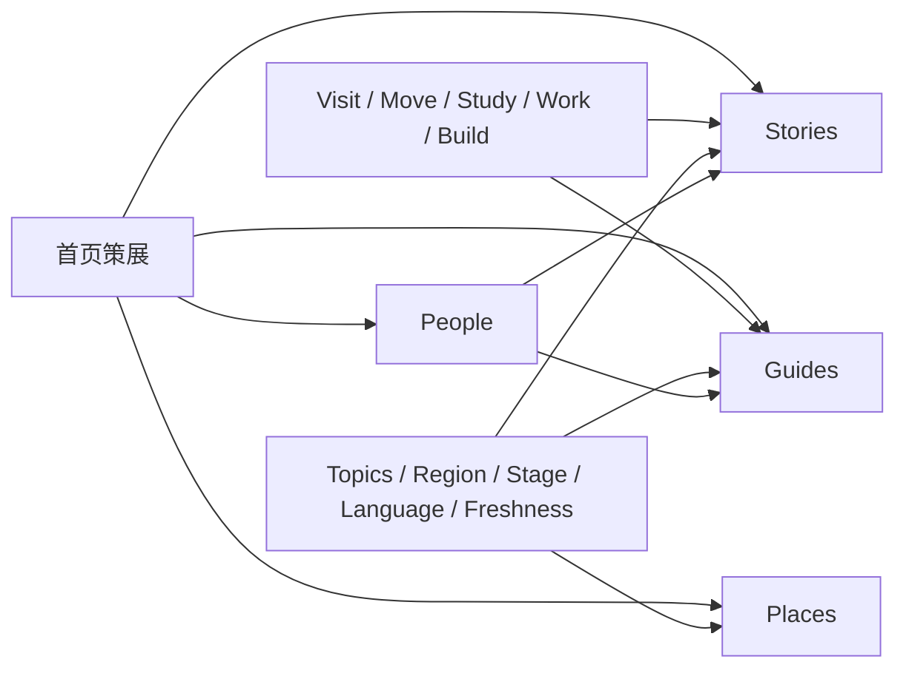

# China, in Fact 信息架构零基调研

## 结论

从零开始后，没有证据支持先确定一排“来华目的栏目”，再把全部内容塞进去。

27 个样本显示，成熟产品通常同时使用四套结构：

1. **内容对象**：报道、指南、地点、人物、活动、服务。
2. **用户任务**：了解、规划、入境、安顿、处理日常事务、寻找机会。
3. **情境维度**：城市与地区、所处阶段、语言、更新时间。
4. **关系入口**：作者、专家、社区、机构与可交易服务。

它们不是同一层级。压成一排一级栏目后，签证、支付、城市、作者、政策更新等内容都会反复跨栏。

当前最值得进入产品决策的候选，是**内容对象作为稳定主导航，用户任务作为第二入口**：

```text
主导航：Stories / Guides / Places / People
任务入口：Visit / Move / Study / Work / Build
横向维度：Topics / Region / Stage / Language / Freshness
```

该分层结构已于 2026-07-26 获得批准；其中 `Build` 仍是可在原型中检验的公开文案。`Latest` 可作为首页状态或内容流，不必与稳定对象并列。首期不需要把 jobs、housing、classifieds 或服务目录做成产品能力。

## 研究约束

- 零假设：假定 China, in Fact 没有既定栏目。
- 采样时不使用 `Travel / Live / Study / Work / Business / Understand` 作为字段或筛选条件。
- 先记录每个产品的入口承诺、导航、任务路径、内容对象、服务对象、地点、人物、更新机制和商业模式，再聚类。
- 旧方案只在候选结构独立形成后比较。
- 本报告保存证据；产品决定见 ADR-0003 与 `docs/product-brief.md`。

## 样本范围

本轮检查 27 个产品，覆盖墨西哥、哥伦比亚、泰国、马来西亚、葡萄牙、荷兰、新加坡、加拿大、台湾、越南、韩国、哥斯达黎加、日本、中国、欧洲跨国与全球平台。

| 产品模型 | 代表样本 | 观察到的结构 |
|---|---|---|
| 政府城市/国家服务 | Shanghai、Beijing、Canada newcomers、I amsterdam | 旅程阶段、办事任务、机会入口 |
| 搬迁与侨居指南 | Mexperience、Portugalist、Moving2Canada、IamExpat、Expat.com | 到达前后任务、指南、服务转介 |
| 本地生活媒体 | SmartShanghai、the Beijinger、ExpatGo、Expat Living、10 Magazine | 文章、地点、活动、目录、社区 |
| 新闻与解释媒体 | Mexico News Daily、Sixth Tone、The Local、Tico Times | 最新、报道、专题、观点、作者 |
| 专业机会媒体 | China Briefing、Vietnam Briefing、Singapore Global Network | 行业、政策、职业、商业、专家与活动 |
| 社区与市场 | Forumosa、ASEAN NOW、Expat.com | 论坛、成员、问答、jobs、housing、classifieds |
| 目的地规划 | Japan Guide | 地点、兴趣、行程规划、论坛、预订 |

这个范围刻意没有把墨西哥、哥伦比亚和泰国当成边界；它们只是跨地区样本中的三个起点。

## 盲聚类结果

将站点栏目名去掉后，原始需求聚成八组。以下名称是研究标签，不是栏目建议。

| 需求簇 | 代表问题 |
|---|---|
| 建立认识 | 这个国家现在怎样；社会如何运作；历史、文化和地区差异是什么 |
| 做出决定 | 是否前往；去哪里；何时去；选择哪种路径；成本与风险如何 |
| 完成进入 | 签证、入境、海关、抵达、住宿、第一笔支付、第一段交通 |
| 建立生活 | 住房、通信、银行、保险、医疗、税、教育、家庭、法律、语言 |
| 寻找机会 | 课程与奖学金、求职与许可、创业、投资、采购、合作与行业判断 |
| 参与当地 | 地点、饮食、活动、兴趣、社区、志愿、邻里与日常体验 |
| 跟踪变化 | 新闻、政策、价格、交通、开放时间、安全与定期更新 |
| 找到对象 | 作者、当地人、专家、机构、工作、房源、服务与可联系渠道 |

这八组不能直接变成八个栏目：有些是长期内容领域，有些是一次任务，有些依赖实时数据，有些是独立对象。

## 中国场景压力测试

用 64 个常见中国任务检查结构，重点包括：

- 入境与短停：签证或免签、转机、海关、酒店、机场到市区、紧急联系。
- 数字与支付：SIM/eSIM、网络访问、地图、翻译、支付宝、微信支付、银行卡。
- 城际与城市移动：12306、火车票、出租车、地铁、共享单车、驾照与租车。
- 安顿与家庭：租房、银行、税、保险、医疗、宠物、婚育、学校、社区与学中文。
- 学习：院校与专业、申请、奖学金、签证、校园生活、毕业后的路径。
- 职业：招聘、工作许可、合同、薪酬、劳动权益、职场文化与行业人物。
- 商业：市场判断、公司设立、税务、监管、数据、知识产权、采购、雇佣与地区选择。
- 理解中国：社会、历史、文化、思想、媒体、科技、经济、城乡与区域差异。
- 在地参与：城市、餐饮、活动、场馆、兴趣社群、志愿活动和当地人物。
- 时效信息：政策变化、临时关闭、票务、极端天气、交通与安全更新。

压力测试暴露出五个结构问题：

1. **同一任务跨多个目的。** 支付、签证、交通、医疗同时服务游客、学生、职员、家庭和商务人员。
2. **同一读者会连续变换阶段。** “考虑来华—短访—留学—工作—定居”不是互斥身份。
3. **地点本身是强入口。** 上海、成都、云南或大湾区不能只做某个目的栏目的子项。
4. **人物不是文章标签。** 作者、专家和当地人的长期主页是产品承诺的一部分。
5. **时效要求不同。** 深度故事、常青指南和政策更新需要不同的更新时间、核验与展示规则。

## 三套候选结构

### A. 单层目的导航

示意：`Visit / Move / Study / Work / Business / Understand`

优点：第一次来的人容易按眼前目标进入；政府服务站和搬迁站大量采用。

问题：跨目的任务必须重复归类；`Understand` 会成为兜底；地点、人物、报道和更新没有稳定位置；内容规模增长后编辑争议最大。

适用：办事门户、获客型 relocation 产品。与“编辑媒体 + 人物网络”的完整产品承诺不匹配。

### B. 单层内容对象导航

示意：`Stories / Guides / Places / People`

优点：对象稳定；作者网络清楚；适合编辑生产、URL、SEO、多语言发布和长期扩容。

问题：有明确任务的新用户需要自行判断去哪找；若首页和搜索不提供任务入口，办事效率会低。

适用：编辑媒体、杂志、知识库。

### C. 双层混合结构

稳定对象：`Stories / Guides / Places / People`

任务集合：`Visit / Move / Study / Work / Build`

横向维度：主题、地区、阶段、语言、内容形态、更新状态。

优点：保留对象稳定性，同时让明确目标有直达入口；人物和地点是一等对象；一个指南可出现在多个任务集合中而不复制主归属；适合 100–200 位作者持续增长。

风险：需要编辑团队明确“对象类型、主题、任务集合”是不同字段；设计上必须让两个入口互补，不能出现两套同权导航。

## 推荐进入产品评审的结构

选择 C 作为下一轮原型基线，并将分层关系写入产品真相。

建议对象关系：



建议路由仅用于验证结构：

```text
/{locale}/stories/{slug}
/{locale}/guides/{slug}
/{locale}/places/{slug}
/{locale}/people/{slug}
/{locale}/goals/{visit|move|study|work|build}
/{locale}/topics/{slug}
```

`goals` 是内部结构名，不要求成为可见 URL。首页应通过策展区同时证明“了解中国”和“解决来华问题”两种价值，而不是平均展示所有入口。

## 最后才与旧方案比较

| 旧项 | 零基研究后的处理 |
|---|---|
| Travel | 保留为 `Visit` 任务集合，不再承担稳定内容归属 |
| Live | 拆成 `Move` 旅程与日常主题；不再作为单一大栏目 |
| Study | 保留为任务集合与主题 |
| Work | 保留为任务集合与主题 |
| Business | 改成更具体的 `Build` 工作名，待文案评审；作为任务集合与专业主题 |
| Understand | 取消兜底栏目；相关内容进入 Stories，并由社会、历史、文化、经济等主题组织 |

因此，旧六项不是全部作废：其中五项仍能作为任务入口发挥作用。需要放弃的是“六项同时承担一级导航、文章主归属和 URL 骨架”这一做法。

## 证据偏差与未决问题

- 商业搬迁站会高估签证、房产、保险和咨询需求。
- 生活方式媒体会高估高消费家庭、餐饮和活动。
- 论坛最接近长尾问题，但信息容易过时且分类混乱。
- 政府门户任务清楚，人物感和编辑判断较弱。
- 商业专业站以服务获客为目标，不能直接决定公共媒体结构。
- 英语样本多于西班牙语样本；下一轮需专门验证西语栏目词义和拉美读者理解。
- 本轮验证了信息架构，没有验证各入口的搜索量、内容供给量或作者招募意愿。

## 主要来源

- 墨西哥：[Mexperience](https://www.mexperience.com/)、[Mexico News Daily](https://mexiconewsdaily.com/)
- 哥伦比亚：[Medellin Guru](https://medellinguru.com/)、[Expat.com Colombia](https://www.expat.com/en/guide/south-america/colombia/)
- 东南亚：[ASEAN NOW](https://aseannow.com/)、[ExpatGo Malaysia](https://www.expatgo.com/)、[Expat Living Singapore](https://expatliving.sg/)、[Singapore Global Network](https://singaporeglobalnetwork.gov.sg/)
- 欧洲：[Portugalist](https://www.portugalist.com/)、[IamExpat Netherlands](https://www.iamexpat.nl/)、[I amsterdam](https://www.iamsterdam.com/en/live-work-study)、[The Local](https://www.thelocal.com/)
- 北美：[Moving2Canada](https://moving2canada.com/)、[Canada newcomer services](https://www.canada.ca/en/immigration-refugees-citizenship/campaigns/newcomers.html)
- 东亚：[Forumosa](https://tw.forumosa.com/categories)、[10 Magazine Korea](https://10mag.com/)、[Japan Guide](https://www.japan-guide.com/)
- 其他：[Vietnam Briefing](https://www.vietnam-briefing.com/)、[Tico Times](https://ticotimes.net/)、[Expat.com](https://www.expat.com/)
- 中国：[International Services Shanghai](https://english.shanghai.gov.cn/en-LivinginShanghai/index.html)、[Beijing International Web Portal](https://english.beijing.gov.cn/)、[China Briefing](https://www.china-briefing.com/)、[SmartShanghai](https://www.smartshanghai.com/)、[Sixth Tone](https://www.sixthtone.com/)、[Study in China](https://apply.studyinchina.edu.cn/)、[the Beijinger 产品说明](https://truerun.com/our-products/)

所有页面于 2026-07-26 重新检查。结论来自结构比较，不代表对各站内容质量或立场的背书。
