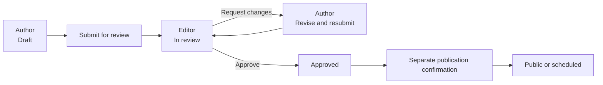

# Stitch 作者与编辑工作流原型

## 当前状态

- 项目：[China in Fact Editorial](https://stitch.withgoogle.com/projects/12004751494305530503?pli=1)
- Fixture：作者 Chen Rui；Guide `Driving in Shanghai: licences, permits and the first week`。
- 画布：后台首轮八页与 Refined 八页；公共站另有两张 Newsletter Final 状态页。
- 状态：产品负责人已接受角色边界、审核路径和移动端功能范围，作为 P1 后台实现合同；旧模板视觉和文案不进入接受范围。
- 边界：这是工作流和权限证明，不代表已经选定 CMS，也没有产品代码、账号、数据或公开能力。

## 工作流合同

- 作者只能保存、预览、提交和回应退回意见，不能批准、排期或公开。
- 编辑审核同时查看正文、来源、评论和分类；批准不直接等于公开。
- 最终公开使用独立确认页，同时显示标题、作者、对象、语言、URL、来源核验、分类、审核人和 Freshness 日期。
- 移动端只覆盖状态查看、作者修订和轻量审核；最终公开保留在独立桌面确认页。

## 当前评审目标

| 目标 | Screen ID | 证明内容 |
|---|---|---|
| Contributor My Work Desktop Refined | `4e0ab8e283e849e3b598f8e6dcd9a46c` | 八条作品、六种状态、进入修订或继续编辑 |
| Contributor Edit Draft Desktop Refined | `9b6e6238a0864bd5936285ad6d4842ac` | 标题、摘要、正文、封面、来源、保存、预览、提交 |
| Contributor Changes Requested Desktop Refined | `53d26425cd1a4957bae38f0da5edf121` | 编辑意见、锚定评论、修订历史、重新提交 |
| Editor Review Queue Desktop Refined | `d9acb7e5e74749da846a2525b687b6db` | 十二条投稿、状态、负责人和下一步审核动作 |
| Editor Review Detail Desktop Refined | `99c589dc2ec444dbb4b64c2b4c94c6ed` | 阅读、来源核验、评论、分类、退回与批准 |
| Editor Publication Confirmation Desktop Refined | `f2d3ece1bdc446c88ac1d70c75bcca5b` | 独立排期或立即公开确认 |
| Contributor My Work & Revision Mobile Refined | `45c933fcf6c84386a374f0237aef6fcd` | 移动端状态与修订，不含公开权限 |
| Editor Light Review Mobile Refined | `d618ac32d15a410785fe3e6880537bfd` | 移动端来源、评论、分类和轻量审核 |

首轮八张同名无 `Refined` 后缀的页面只保留为比较证据，不作为评审目标。

## 第一轮人工检查

已经证明：

- 作者桌面列表覆盖 `Draft / Submitted / In review / Changes requested / Approved / Public`，操作中没有公开按钮。
- 作者编辑页把 `Save draft / Preview / Submit for review` 明确分开。
- 作者退回页使用 `Save draft / Preview / Resubmit`，没有批准或公开动作。
- 编辑详情只显示 `In review`，包含 Purpose、Topics、Geography、Situation、Language 和 Freshness。
- 批准与公开被拆成两个页面；公开页默认选中排期并显示日期、时间和时区。
- 编辑移动端包含来源、两条锚定评论、完整分类和 `Save review / Request changes / Approve`，没有排期或公开动作。
- 两张移动端截图宽度为 780px，对应 390px 逻辑画布；首轮目测没有横向溢出。

初始下载预览中已被排除或定点修正的问题：

- Stitch 的初始下载预览仍出现旧模板页脚，如 `Internal Editorial Operations / System Status / Documentation / Support`，不能作为最终可见文案。
- Contributor Changes Requested 的初始下载预览改错标题，并把锚点标记露在正文和来源里。
- Review Queue 的下一步动作使用 hover 隐藏，`Changes requested` 仍有截断样例；不利于日常扫读。
- Review Detail 的初始预览残留 `Create New`；Contributor Mobile 缺少两条锚定评论，日期仍是旧样例。
- 部分作者后台仍使用衬线字体，与 `DESIGN.md` 的后台字体合同不一致。

## 修正与证据限制

2026-07-27 已对七张 Refined 页面执行原位定点修正：删除模板页脚、恢复统一 fixture、清理裸露标记、补全队列动作与状态、删除 Review Detail 的 `Create New`，并补作者移动端评论和 2026 日期。Stitch 返回了逐屏 DOM operation 记录。

修正后，Stitch 的 screen download URL 和截图 URL 仍返回修正前缓存，但画布记录了逐屏 DOM operation。产品负责人已接受功能边界；实现不得从缓存旧截图复制文案或字体，而应以 `DESIGN.md`、本页工作流合同和 Refined screen ID 为准。

## 接受边界

- 作者端任何状态都没有批准、排期或公开动作。
- 编辑审核、批准和最终公开是三个可辨认步骤。
- 分类字段与已接受的信息架构一致，Language 和 Freshness 没有混入 Topics。
- 移动端能完成修订与轻量审核，且没有最终公开入口或横向溢出。
- 删除全部模板页脚、内部术语、操作指导和解释性文案。
- 后台统一使用 `Satoshi / Geist Mono`，状态不能只靠颜色表达。
- 八张 Refined 页面用于结构和状态追溯；P1 中的真实组件仍须重新通过权限负例、响应式和 copy gate。
