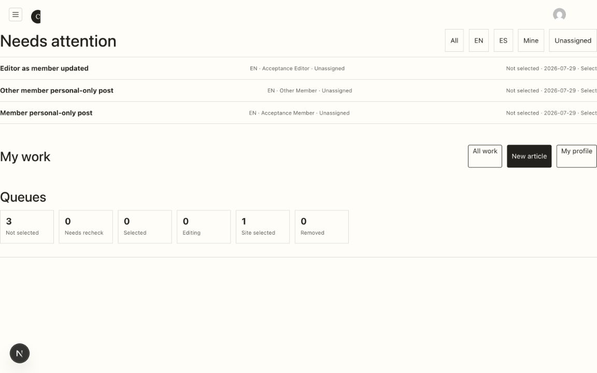
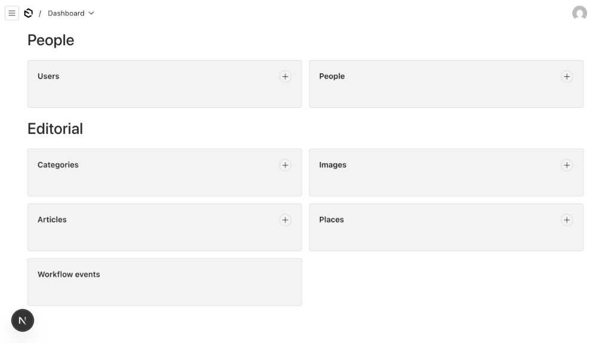
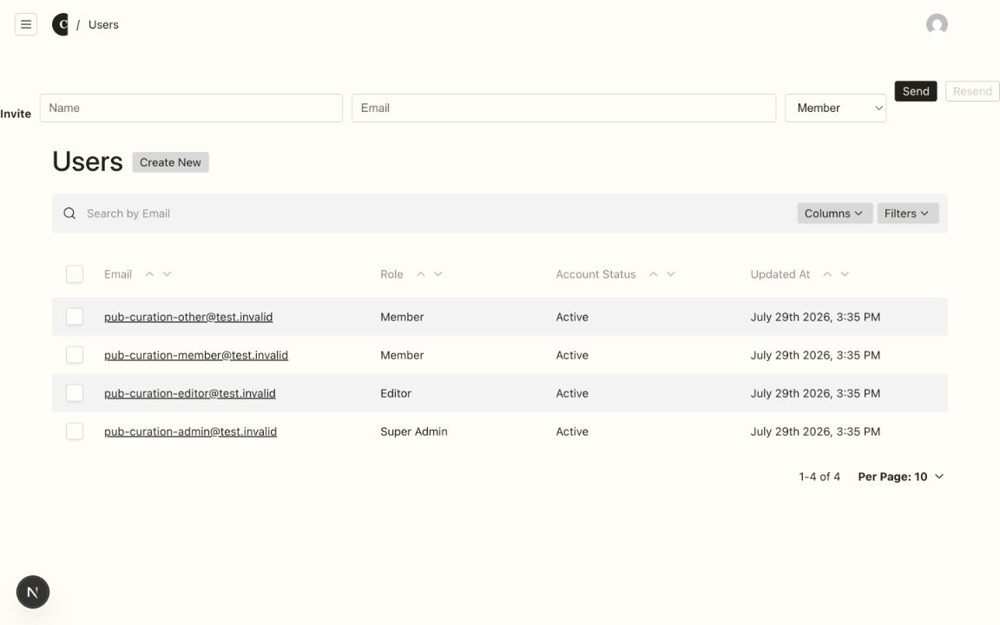
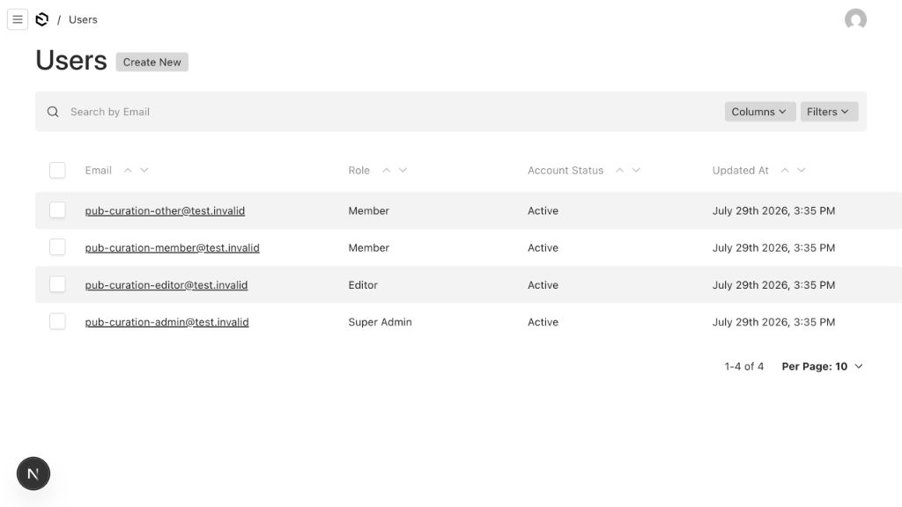
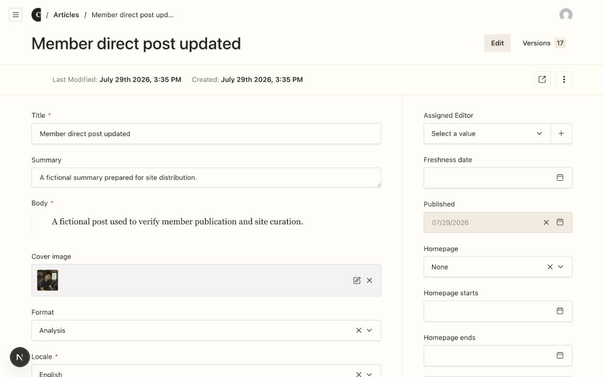
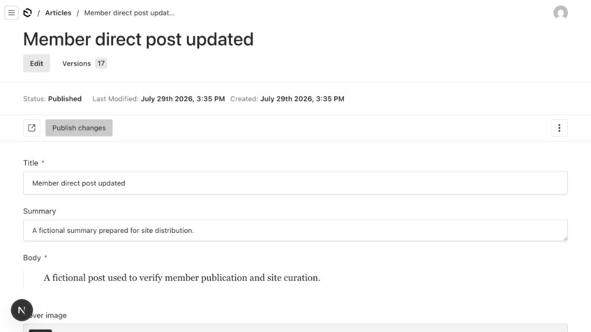

# Admin Payload-native Baseline

本文件是 `ADMIN-UI-001` 的第一轮证据，回答两个问题：当前 Admin 为什么出现跨区散落；Payload `3.86.0` 已经提供了哪些不应重做的成熟界面。

结论：当前主要问题不是 Payload 原生 UI 粗糙，而是整套 Nav、Dashboard 和若干原生页面插槽被自定义实现绕开。重构应恢复 Payload 原生壳层、列表和编辑页，只把角色任务、双轴发布与邀请等产品独有能力组合回官方扩展点。

## Evidence Boundary

- 基线 commit：`c9e228b`。
- 当前自定义面：主工作树、隔离的本地 fixture PostgreSQL、`127.0.0.1:3000`。
- Payload 原生面：同一 commit 的 detached 临时 worktree、同一隔离 fixture、`127.0.0.1:3001`。
- 原生面只临时移除 Admin component 注册和 `custom.scss` 引入，没有修改 schema、migration、权限、hook、endpoint 或 fixture 数据。
- 全程未连接 Preview 或 Production，未发送真实邮件，未触碰真实账户。
- 干净隔离库上的 `npm --prefix apps/web run test:editorial` 为 PASS；原本地开发库存在重复 `(translation_group, locale)` fixture，未删除或修复该库。

## Native Capability Check

仓库锁定 `payload@3.86.0`、`@payloadcms/ui@3.86.0`。安装包类型与运行面确认：

- Payload 原生 Nav 已提供 collection group、权限过滤、折叠、breadcrumbs、账户和退出。
- 根 Admin 支持 `beforeNavLinks`、`afterNavLinks`、`beforeDashboard`、`afterDashboard` 和 dashboard widgets。
- Collection list 支持 `beforeListTable`、`afterListTable`、list actions、原生 Create New、search、columns、filters、sort 和 pagination。
- Document edit 支持原生 Status、Preview、Publish/Unpublish、Versions、lock、validation、autosave 和 field shell。
- Field、RowLabel、document control 和 graphics 都有受支持的局部扩展点。
- 当前 `Nav` 和 `views.dashboard.Component` 配置属于整组件替换，不是局部扩展。

## Visual Baseline

### Dashboard

当前自定义 Dashboard 把任务列表、筛选、My work 动作和队列直接铺到 viewport。`MemberWorkspace` 同时使用 `grid-column: 1 / -1`、`width: 100%` 和 viewport 推导的 `min-width`，宽屏下内容与动作被拉向两端。

Payload 原生 Dashboard 自带稳定 gutter、标题层级、collection grouping 和创建入口。目标不是照搬 collection cards，而是保留这套壳层与 widget 几何，把 Needs attention、My work 和 Queues 做成原生 dashboard widgets。

### Members

当前 `InviteMember` 通过 `beforeList` 插入六列横向表单。它位于原生 Users 标题和 toolbar 之外，同时与原生 Create New 形成两个新建路径。

Payload 原生 Users list 已经正确组织标题、Create New、search、columns、filters、table 和 pagination。邀请业务应进入这一结构的 action/drawer 或 `beforeListTable`，不能再次改变 list shell。

### Article editor

当前 Article editor 的字段几何大体来自 Payload，但自定义配置移除了原生 Status、Publish 和 Unpublish，并在 sidebar 追加多个动作与保存状态。`ArticleWorkspaceMode` 又通过 document-level dataset 和 CSS 选择器隐藏字段。

Payload 原生 editor 已经提供 breadcrumbs、title、versions、document status、preview、document controls、field shell 和 sidebar。目标以此为骨架，只保留双轴发布、策展与翻译动作；不能重排整页或重做字段控件。

## Provisional Audit Score

这是静态代码与三张桌面关键面的第一轮分数，完整全路由、三角色、状态和 overlay 审计尚未结束。

| Dimension | Score | Current evidence |
|---|---:|---|
| Accessibility | 2/4 | DOM selector 补 aria、CSS 隐藏字段、缺少统一 focus-visible 证明 |
| Performance | 2/4 | `window.fetch` 全局劫持；`MutationObserver` 监听整个 `document.body` |
| Responsive | 2/4 | viewport `min-width`、六列表单和宽屏跨区散落 |
| Theming | 2/4 | 覆盖 Payload 根色阶；Admin 使用 Georgia，违反 `DESIGN.md` |
| Anti-patterns | 3/4 | 视觉克制，但重复标准入口并发明整壳行为 |
| **Total** | **11/20** | **Acceptable，存在系统性 P1** |

当前计数：`P0=0 / P1=5 / P2=6`。分数只用于排序，不代表视觉门禁通过。

## Findings

### P1

1. **整套 Nav 被替换。** `payload.config.ts` 注册 `components.Nav`，`AdminNav.tsx` 重建品牌、角色链接和退出。影响是丢失 Payload 原生 grouping、active state、breadcrumbs 关系、折叠行为和升级兼容性。
2. **Dashboard 整页被替换且直接对 viewport 定宽。** `MemberWorkspace.tsx` 与 `custom.scss` 同时跨满 grid、使用 `100%` 和 viewport `min-width`。宽屏下标题、筛选、动作和列表失去共同内容起点。
3. **Invite 插错层级。** `Users.admin.components.beforeList` 放入六列原始表单，绕开原生标题、actions 和 gutter，并与 Create New 重复。
4. **保存组件劫持全局 fetch。** `SaveSafetyStatus.tsx` 替换 `window.fetch`，把整个页面的 Article/Person POST/PATCH 当成保存状态来源。任一相关请求都会污染状态，且组件卸载顺序会影响恢复。
5. **视图聚焦依赖 DOM 隐藏。** `ArticleWorkspaceMode`、`ProfileFocus` 和 `custom.scss` 通过 html dataset、field id 与 `:has()` 隐藏字段。它不是权限边界，也依赖 Payload 私有 DOM 形状。

### P2

1. `UploadAccessibility` 用全页 `MutationObserver` 和私有 selector 反复补 aria，应先验证 Payload 原生上传控件，再删除或改为受支持组件。
2. `custom.scss` 全局隐藏 Payload settings、drag-and-drop、filename 和 URL 元数据，升级后可能误伤其他 collection。
3. `NewArticleStart` 重做 Create New 并在原位展开四列 form，造成 Dashboard action 区尺寸突变。
4. `InviteMember` 混用 raw input/select 和 Payload Button，控件高度、focus、disabled 与错误呈现不属于同一组件词汇。
5. `Brand.tsx` 与 `.admin-brand` 在 Admin 使用 Georgia；`DESIGN.md` 已明确 Admin 只用 Satoshi 与 Geist Mono。
6. custom dashboard 没有与 Payload 原生 loading、empty、error、widget preference 对齐的状态合同。

## Component Disposition

| Component | Baseline decision | Native-first target |
|---|---|---|
| `AdminNav` | `remove` | 恢复原生 Nav；角色快捷入口进入 `beforeNavLinks` / `afterNavLinks` |
| `AdminLogo` / `AdminIcon` | `compose` | 保留 graphics slot 与正式品牌名，不改变原生尺寸、字体和定位 |
| `MemberWorkspace` | `compose` | 拆入 Payload dashboard widgets；不再替换 dashboard view |
| `NewArticleStart` | `remove` | 使用 Payload 原生 Article create route，由角色快捷入口直达 |
| `InviteMember` | `retain-minimal` | 保留 invite/resend 业务；改为原生 list action/drawer 或 `beforeListTable` |
| `ArticleWorkspaceMode` | `remove → native` | 优先使用 Payload 原生 tabs/field condition，不再用 DOM dataset 隐藏字段 |
| `NoPublishButton` | `retain-minimal` | 只抑制与双轴状态冲突的 Publish/Unpublish；恢复原生 Status |
| `WorkflowActions` | `retain-minimal` | 只承担个人发布和站方策展转换，继续使用 Payload Button/toast |
| `TranslationActions` | `retain-minimal` | 只承担英西关联动作 |
| `ProfileActions` | `retain-minimal` | 只承担 Person 公开状态动作 |
| `ProfileFocus` | `remove` | 现有 server access 与 `admin.condition` 负责边界；不再 CSS 隐藏 |
| `SaveSafetyStatus` | `remove` 优先 | 先验证原生 autosave/lock/error；若有缺口，只补局部 retry，不劫持 fetch |
| `UploadAccessibility` | `remove` 优先 | 原生 aria 通过即删除；有缺口则进入受支持 upload component |
| `ProfileLinkRowLabel` | `compose` | 保留官方 RowLabel 扩展点 |
| `PublicUseApprovalField` | `retain-minimal` | 保留 timestamp-as-checkbox 业务，继续使用 Payload CheckboxInput |

## Route Audit Matrix

| Surface | Member | Editor | Super Admin | Native shell decision |
|---|---|---|---|---|
| Dashboard | My work / My profile | Needs attention / own work | Needs attention / administration | 原生 dashboard + role widgets |
| Users | no entry | no entry | invite、resend、role、pause | 原生 list/edit + one invite extension |
| People | own profile direct | list/edit | list/edit | 原生 list/edit；保留 profile action |
| Articles | own create/list/edit | own work + all/curation | own work + all/curation | 原生 list/edit；保留双轴 action |
| Images | own uploads | editorial use | all | 原生 list/upload/edit |
| Categories / Places | no entry | editorial list/edit | list/edit | 原生 list/edit |
| Activity | no entry | read-only | read-only | 原生 list，禁止自定义编辑行为 |

## Three-surface Direction

待用户确认的方向只有一条：

1. Dashboard 使用 Payload 原生 header、gutter、nav 和 dashboard widget 网格；Needs attention、My work、Queues 是业务 widgets。
2. Members 完整保留原生 Users list；Invite 进入原生 action 层，不再横跨 viewport。
3. Article 完整保留原生 document shell、fields、sidebar、status、versions 和 preview；只在受支持区域保留双轴动作与翻译。

这三条通过 `payload-native-baseline` 与 `visual-direction` 门禁后，才开始修改主工作树产品代码。

## Remaining Audit

- 完成 Member、Editor、Super Admin 三角色的全路由运行时截图。
- 补齐 empty、loading、error、disabled、lock、version、upload、drawer/dialog 和长内容状态。
- 验证 Payload 原生 autosave 失败、离线恢复和 upload aria，决定两个 `remove` 优先组件的最终去留。
- 解决 Members 的 Invite 与原生 Create New 单一路径问题；若必须改变 create permission 或 endpoint，另走 `permission-change` 门禁。
- 完成 `1280×800`、`1440×900`、`1920×1080` 和 125% zoom 桌面复审。
