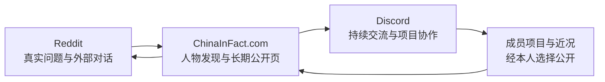

# People 与社群方向：现状证据

本页保存 2026-08-26 的只读证据和方向演变，不替代 `product-brief.md`、`DESIGN.md` 或后续 accepted decision。Discord 帖子只做聚合与主题观察，不把群内原文、用户 ID 或未授权资料复制进网站。

## 定位演变

| 时间 | 当时的理解 | 已暴露的限制 |
|---|---|---|
| 2026-07-25 | 面向英语与西班牙语读者的中国信息与人物网络；People 主要承接作者子页面与内容归档 | 信息和编辑流程先行，人物仍依赖先有文章 |
| 2026-08-11 | 从“编辑出版物”校准为“通往真实的人的桥梁”；Person 升级为正式名片 | 页面仍以档案字段和文章关系为主，项目与社群只是后续模块 |
| 2026-08-18 | People 审计提出“编辑可信度 + 人物发现 + 明确连接” | 当时公开人物与完整字段太少，体验难以兑现 |
| 2026-08-26 | Discord 已形成真实项目供给；产品负责人明确要求网站回到“meet a bunch of interesting people” | 旧的内容优先增长闭环和独立项目目录不足以表达当前机会 |

早期定位是发展过程中的假设，不是不可修改的前提。保留其中仍成立的可信编辑、真实署名和安全边界；页面优先级、增长入口和 People 定义按当前证据继续向前推进。

## 当前供给

### Discord 成员项目

只读读取 `chinaknowledge` 服务器的 `成员项目` Forum，排除“如何发布和维护项目”说明帖：

| 指标 | 当前值 |
|---|---:|
| 项目帖 | 34 |
| 独立发布者 | 23 |
| 带公开链接 | 24 |
| 带图片或其他附件 | 18 |
| 已产生回复的项目帖 | 16 |
| 回复总数 | 40 |
| 发帖时间范围 | 2026-07-31 至 2026-08-26（北京时间） |

项目已经覆盖个人写作、文化解释、旅行、供应链、教育、语言工具、播客、互动阅读、AI 产品、研究工具、数字体验与集体创作等方向。它们最有价值的部分不是“项目数量”，而是让一个人的兴趣、判断、行动和当前处境变得具体。

### Production People

匿名读取 Production People API 得到 11 个公开可读 Person。公开字段完整度为：

| 字段 | 有数据的人数 |
|---|---:|
| 头像、身份、地点、介绍、外链 | 11 |
| 本人引语 | 1 |
| 能帮什么 | 1 |
| Discord 联系方式 | 1 |
| 编辑判词 | 0 |

这说明基础身份数据已经存在，但网站还很难在十秒内回答三件事：这个人是谁、为什么值得认识、现在可以从哪里继续。

## 方向判断

项目数据把 People 的可用单位从“资料完整的作者”推进为“正在做事、观察世界、愿意公开连接的人”。文章仍然重要，但不再是一个人进入 People 的唯一理由。项目、作品、问题、经历和持续表达都可以成为认识人的证据。

三个载体的职责应当不同：

- 网站：面向世界的长期公开入口，让人先遇见具体的人，再理解其项目、作品、经历和中国经验。
- Discord：成员与读者继续对话、更新项目、提出需求和形成协作的活跃层。
- Reddit：从真实问题出发参与外部讨论，把确实相关的人、项目或内容带入对话；不做自动群发或导流机器人。

## 对下一步的约束

- People 是产品核心，不再只是 Stories / Guides 后面的作者层。
- 项目是人物证据。不得直接把 Discord Forum 复制成项目黄页，也不得把项目数量变成排行榜或社交分数。
- Person 页应呈现“他在关心什么、正在做什么、留下了什么、如何继续”，不以简历字段堆砌替代人物感。
- People 首页应允许从项目、问题、地点、主题和近况遇见人；筛选是辅助，不能成为数据库式主体验。
- Discord 内容进入网站前必须由本人选择并确认公开范围；Discord 身份与 Person 之间不得按显示名自动合并。
- Reddit 只承担真实问题发现和人工参与；遵守社区规则，先回答问题，再决定是否提供相关链接。
- 首期继续不做关注数、热度榜、评分、站内私信、交易撮合或自动推荐黑箱。

## Design asset state

2026-08-26 已新建 Figma 核心文件 [`ChinaInFact — People & Community Core Experience`](https://www.figma.com/design/uduLwDLMhjiP5FB79pHBPW/ChinaInFact-%E2%80%94-People---Community-Core-Experience?node-id=0-1&p=f&t=6LqYOiMf7RXGtkMF-0)。Figma AI 根据产品合同、真实数据形状和设计约束完成 Home desktop/mobile、People desktop、Person desktop/mobile 与 Core patterns 六个 frame；随后由 Figma AI 自行完成可见文案清理。独立 metadata 读回确认六个 frame 均存在，目标禁用词扫描为零。该文件是后续评审的设计 proof，不构成代码实现、schema、真实数据或 Production 授权；Codex 未改前端，也未手工替代 Figma AI 设计。

## 证据来源

- 当前仓库：`docs/product-brief.md`、`DESIGN.md`、`docs/decisions/0011-song-editorial-design-direction.md`、People 页面源码。
- Production：匿名 `GET /api/people?limit=100&depth=1` 读回（2026-08-26）。
- Discord：本机 allowlisted Bot 对 `chinaknowledge / member-projects` 的只读 active/archive thread 与 starter-message 聚合（2026-08-26）。
- 历史审计：2026-08-18 People/person Production 审计，当时为 10 个公开 People，主要缺口是人物识别与连接不够明确。
