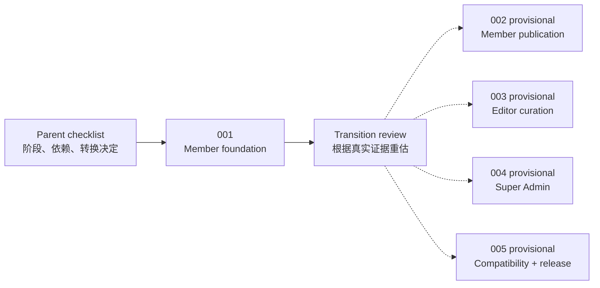

# Agent Workspace Parent Checklist

本页是 Agent Workspace 的父级控制清单。它记录终局、阶段关系和转换门槛，不直接授权代码、配置、schema、migration、部署或真实数据操作。任何实现只能由当时唯一 active 的子级 `ChangeContractV1` 授权。

稳定产品合同见 [`Agent Workspace Requirements`](../agent-workspace-requirements.md)。当前 active 子级见 [`AGENT-WORKSPACE-001`](checklists/agent-workspace-member-foundation.md)。

## Program Goal

让已有后台账户的人在自己选择的 Agent 中，通过同一远程 MCP Gateway 用自然语言完成服务器判定的权限内任务；Member、Editor、Super Admin 分阶段开放，身份、状态、版本、确认和审计始终留在 China, in Fact 服务端。

虚线表示候选关系，不表示已经批准的执行顺序。001 完成后必须重新分析；002–005 可以保留、拆分、合并、改序或取消。

## Program Status

| ID | 当前状态 | 候选结果 | 进入条件 |
|---|---|---|---|
| `AGENT-WORKSPACE-001` | active；Cursor Local real-client 与独立复审 PASS | OAuth、远程 MCP、Member read/draft/preview | 剩余 Gate 5 与外部门禁；TRAE/WorkBuddy 转 005 |
| `AGENT-WORKSPACE-002` | provisional | Member prepare/confirm/commit，个人公开、更新、撤回与重新公开 | 001 closure + transition review 后重新定义 |
| `AGENT-WORKSPACE-003` | provisional | Editor Needs attention、分配、分类、来源、策展、排期与复核 | 001 closure 后由 transition review 判断是否已具备工具、并发和确认基础；不预设必须等待 002 |
| `AGENT-WORKSPACE-004` | provisional | Super Admin 明确安全子集、step-up、账户与基础对象操作 | 特权动作风险与网页保留边界重新评估后定义 |
| `AGENT-WORKSPACE-005` | provisional | 多客户端收口、必要时 CLI fallback、运营监控和 Production release | 真实客户端使用证据与 002–004 实际范围确定后定义 |

`provisional` 只保留问题和候选结果，不是仓库通用 checklist 状态，也不构成实现授权。子级真正开始时只能使用仓库允许的 `active` 状态。

## Parent Checklist

- [x] 建立完整 Agent Workspace 产品需求，固定远程 MCP、服务器权限和多客户端方向。
- [x] 建立 `AGENT-WORKSPACE-001`，只交付 Member read/draft/preview 基础。
- [ ] 完成 001 的实现、验证、独立复审、证据写回与 closure。
- [ ] 进行一次正式 transition review，不沿用 001 开始前对 002–005 的工作量和顺序假设。
- [ ] 根据 transition review 对 002–005 做 `keep / split / merge / reorder / cancel` 决定，并记录理由。
- [ ] 只为下一条得到批准的结果创建一个 active 子级 checklist；其余继续停留在本页。
- [ ] 每个子级关闭后更新本页的实际结果、遗留风险、可复用合同和下一阶段进入条件。
- [ ] 必要 capability 子级完成后，再把 005 定义为 phase-release 子级；Production 部署、真实成员接入和公开启用仍在 005 内分别批准和读回。

## Transition Review After 001

001 关闭后至少回答：

1. Cursor 已证明的真实连接合同能否复用；TRAE、WorkBuddy 因 001 无账号而转入 005，是否需要在下一 capability 子级前增加兼容预检。
2. OAuth、撤销、capability、revision、幂等和审计合同是否已经稳定。
3. Member 实际更需要本地 Markdown 工作副本，还是更直接的结构化写作工具。
4. 保存草稿的延迟、错误和冲突是否足以支持公开状态动作。
5. `prepare → confirm → commit` 应先在 Member publication 还是 Editor curation 上验证。
6. Editor 是否需要独立工具，还是可以复用文章工具加更严格 capability。
7. 哪些 Super Admin 动作适合 Agent，哪些应永久保留在网页后台。
8. 非 MCP Agent 的真实需求是否足以支持 CLI fallback；没有证据时不开发。
9. Gateway 是否仍适合同域部署；没有运行证据时不拆服务。
10. 下一阶段应是 002、003，还是一个重新编号和收窄的新切片。

Transition review 的结果必须写入 implementation reference 或 accepted decision，再修改本页和创建下一子级。聊天结论不能代替写回。

## Child Draft Boundaries

### 002 — Member publication candidate

- 候选目标：让 Member 通过 Agent 安全改变个人公开状态。
- 必须重新验证：公开前摘要、用户确认、对象 revision、重复 commit、公共 URL、撤回与恢复。
- 当前不决定：是否包含翻译、媒体、Person 公开或真实成员接入。

### 003 — Editor curation candidate

- 候选目标：让 Editor 处理 Needs attention 到 Curated/Removed 的受约束工作流。
- 必须重新验证：跨作者编辑、负责人、来源、分类、排期、Needs recheck、作者通知和公开署名。
- 当前不决定：是否与 002 并行、合并或先于 002。

### 004 — Super Admin candidate

- 候选目标：开放经风险评估后适合 Agent 的最小特权动作。
- 必须重新验证：step-up、双重确认、角色变化、暂停/恢复、审计、恢复和网页保留动作。
- 默认不包含：Super Admin 提权、删除、migration、密钥、Production 发布或批量公开。

### 005 — Compatibility and release candidate

- 候选目标：收口得到真实使用证明的客户端，并以 phase-release 合同完成可运营的 Production release。
- 必须重新验证：TRAE/WorkBuddy 真实 OAuth、DCR、callback 和 Member workflow，Cursor `8787` 端口预检与无人工 callback，adapter 维护成本、Workspace 分发、版本升级、监控、限流、撤销、支持流程和恢复。
- 发布归属：005 持有 release 编排，但 Production 部署、真实账户、真实数据和公开启用仍是相互独立的批准门禁。
- CLI fallback 只有在非 MCP Agent 的真实需求成立时进入；编号不保证它一定实现。

## Program Rules

- 同一时刻只允许一个实现型 active 子级 checklist。
- 父级清单不持有代码 `allowed_paths`，不绕过子级 ChangeContract。
- 后续编号是导航预留，不是已接受设计或承诺交付。
- 一个子级未关闭时，不为下一个子级修改代码、schema 或 Production 状态。
- 每次阶段转换都用刚完成的运行、权限、客户端和用户证据重新估算。
- 不为预想的 Astria 复用提前抽共享 SDK；出现第二个真实实现点后再决定。
- 不建设大陆网络封锁适配、区域中继或境内镜像。

## Program Closure

只有在以下事实成立后才能关闭父级清单：

- 必要角色已经通过真实 Agent 完成其被批准的完整任务。
- 客户端范围以真实使用收敛，不再依赖未经验证的配置假设。
- 身份、权限、确认、审计、恢复和撤销均有 Production 证据。
- 未实现的候选能力已明确取消或转入新的产品决定，不以“以后再做”留在 active 状态。
- Current、feature registry、decisions、reference 和 archive 已完成最终写回。
