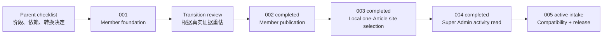

# Agent Workspace Parent Checklist

本页是 Agent Workspace 的父级控制清单。它记录终局、阶段关系和转换门槛，不直接授权代码、配置、schema、migration、部署或真实数据操作。任何实现只能由当时唯一 active 的子级 `ChangeContractV1` 授权。

稳定产品合同见 [`Agent Workspace Requirements`](../agent-workspace-requirements.md)。001–004 已完成并归档；当前唯一 implementation active 子级是 [`AGENT-WORKSPACE-005`](checklists/agent-workspace-compatibility-release.md)。005 Gate 4 独立复审 `PASS`；Gate 5 Recovery amendment D 已冻结，先适配 Production backup restore assertion，再进入 migration 与 staged release。

## Program Goal

让已有后台账户的人在自己选择的 Agent 中，通过同一远程 MCP Gateway 用自然语言完成服务器判定的权限内任务；Member、Editor、Super Admin 分阶段开放，身份、状态、版本、确认和审计始终留在 China, in Fact 服务端。

实线表示 transition review 推荐的下一步，仍不构成执行授权；虚线表示后续候选关系。

## Program Status

| ID | 当前状态 | 候选结果 | 进入条件 |
|---|---|---|---|
| `AGENT-WORKSPACE-001` | completed；Local + Preview Cursor real-client PASS | OAuth、远程 MCP、Member read/draft/preview | 已归档；WorkBuddy 转 005；TRAE 后续从适配目标删除 |
| `AGENT-WORKSPACE-002` | completed；Local + Preview Cursor + final review PASS | Member publication 的 prepare/confirm/commit/readback、重放、撤回与过期拒绝 | 已归档；confirmation primitive 可供 003 intake 复用，Production 未开启 |
| `AGENT-WORKSPACE-003` | completed；Local work-item + final review PASS | 精确读取一篇跨作者 Article；确认后 Add to site，并以确认后的 Remove 恢复 | 已归档；专用 fixture 已删除，Preview 未开启 |
| `AGENT-WORKSPACE-004` | completed；Local work-item + independent review PASS | Super Admin-only 最近 20 条 Article workflow activity 最小读取 | 已归档；专用 fixture 已删除，Preview 未执行；高风险账户/身份动作保持网页或新 checklist |
| `AGENT-WORKSPACE-005` | active；Gate 5 recovery amendment | WorkBuddy/Cursor 真实兼容、运营保护、恢复与 Production release | 只适配 backup restore assertion；之后逐门验证，TRAE 不在范围 |

`provisional` 只保留问题和候选结果，不是仓库通用 checklist 状态，也不构成实现授权。子级真正开始时只能使用仓库允许的 `active` 状态。

## Parent Checklist

- [x] 建立完整 Agent Workspace 产品需求，固定远程 MCP、服务器权限和多客户端方向。
- [x] 建立 `AGENT-WORKSPACE-001`，只交付 Member read/draft/preview 基础。
- [x] 完成 001 的实现、Local/Preview 验证、独立复审、证据写回与 closure。
- [x] 完成正式 transition review，以 Cursor Preview 运行和撤权证据重新估算 002–005。
- [x] 记录决定：002 `keep + narrow`，003 `keep` 且排在 002 后，004 `split`，005 `keep + expand`。
- [x] 只为下一条得到批准的结果创建一个 active 子级 checklist；其余继续停留在本页。
- [x] 最终 closure 复审 PASS 后归档 002，并确认实际结果、遗留风险、可复用 confirmation 合同和 003–005 进入条件。
- [x] 建立 003 active intake，把首批收窄为一个跨作者 Article、Add to site 和对应 Remove 恢复；不含普通保存、队列或其他策展能力。
- [x] 完成 003 的 Local 实现、权限与恢复矩阵、独立复审、fixture 清理和 closure；`P0/P1/P2 = 0/0/0`，Preview 未执行。
- [x] 建立 004 active intake，把首批收窄为 Super Admin-only 的 Article workflow activity 只读工具；不含账户、身份、邀请或写动作。
- [x] 完成 004 Local 实现、权限与字段隔离矩阵、领域不变读回、Agent 审计、001–003 回归、独立复审、fixture 清理和 closure；`P0/P1/P2 = 0/0/0`，Preview 未执行。
- [x] 建立 005 active phase-release intake，把首个执行门收窄为 WorkBuddy 真实兼容与 Cursor 回归，并把运营保护、migration 和 Production 分立设门；TRAE 已从当前适配要求删除。
- [ ] 后续子级关闭后继续更新本页的实际结果、遗留风险和下一阶段进入条件。
- [ ] 必要 capability 子级完成后，再把 005 定义为 phase-release 子级；Production 部署、真实成员接入和公开启用仍在 005 内分别批准和读回。

## Transition Review After 001

正式证据见 [`Agent Workspace 001 Transition Review`](../reference/implementation/agent-workspace-001-transition-review-2026-07-31.md)。结论是保持 `002 → 003 → 004 → 005` 的推荐顺序，但只有 002 是下一候选，任何阶段都须另建 active checklist。

001 关闭后至少回答：

1. Cursor 已证明的真实连接合同能否复用；WorkBuddy 因 001 无账号而转入 005，是否需要在下一 capability 子级前增加兼容预检。TRAE 的 001 未验证记录保留为历史，但不再是当前支持目标。
2. OAuth、撤销、capability、revision、幂等和审计合同是否已经稳定。
3. Member 实际更需要本地 Markdown 工作副本，还是更直接的结构化写作工具。
4. 保存草稿的延迟、错误和冲突是否足以支持公开状态动作。
5. `prepare → confirm → commit` 应先在 Member publication 还是 Editor curation 上验证。
6. Editor 是否需要独立工具，还是可以复用文章工具加更严格 capability。
7. 哪些 Super Admin 动作适合 Agent，哪些应永久保留在网页后台。
8. 非 MCP Agent 的真实需求是否足以支持 CLI fallback；没有证据时不开发。
9. Gateway 是否仍适合同域部署；没有运行证据时不拆服务。
10. 下一阶段应是 002、003，还是一个重新编号和收窄的新切片。

Transition review 的结果必须写入 implementation reference 或 accepted decision，再修改本页和创建下一子级。聊天结论不能代替写回。

## Transition Review After 002

正式证据见 [`Agent Workspace 002 Transition Review`](../reference/implementation/agent-workspace-002-transition-review-2026-08-01.md)。Cursor Preview 已证明 confirmation、revision、幂等、撤回、过期和匿名读回合同，也暴露了工作区 server 初次启用、callback 端口占用和长任务 re-auth 三项真实客户端问题。

结论：003 保留但首批必须收窄，按普通跨作者 read/save 与需 confirmation 的公共策展动作分级；004 继续拆分且不把 confirmation 证明外推到提权、删除、migration、密钥、Production 或批量公开；005 增加 callback、token renewal、长任务恢复和失败 OAuth client 清理。CLI fallback 仍无开发依据。

## Child Draft Boundaries

### 002 — Member publication candidate

- 候选目标：让 Member 通过 Agent 安全改变个人公开状态。
- 必须重新验证：公开前摘要、用户确认、对象 revision、重复 commit、公共 URL、撤回与恢复。
- 当前不决定：是否包含翻译、媒体、Person 公开或真实成员接入。

### 003 — Completed Editor curation slice

- 实际结果：Editor/Super Admin 可精确读取一篇跨作者 Article，经确认加入站方公共入口，并经另一份确认移除；Member publication、canonical、owner、原作者和公开署名不变。
- 已证明边界：服务端角色、revision、confirmation、一次消费、事务重检、幂等、审计、匿名 readback 与恢复；没有新增 schema、migration、依赖或 Preview 能力。
- 仍未覆盖：普通保存、Needs attention 列表、负责人、分类、来源、排期、复核、通知和批量操作；如需继续必须建立新的 Editor 子级，不回开 003。

### 004 — Completed Super Admin activity read

- 实际结果：只有 Super Admin 能发现并读取最近 20 条 Article publication/curation/notification workflow activity；结果使用字段白名单并写最小 Agent read audit。
- 已证明边界：固定排序与 20 条上限、MCP discovery/call、Editor/Member/降权/暂停/缺 Person/撤销连接/禁用 client 负例、私密字段隔离、workflow 与领域对象不变；独立复审 `PASS`，专用 fixture 已删除。
- 账户与身份动作：邀请、重发邀请、角色、暂停/恢复、Person 和删除均不进入本批；如果以后确有需求，必须用新的 upgraded checklist 重新设计 step-up、双重确认与恢复。

### 005 — Active compatibility and release

- 当前目标：收口得到真实使用证明的客户端，并以 phase-release 合同完成可运营的 Production release；docs-only intake 与 Gate 1 只读预检已经完成。
- 当前门：WorkBuddy 5.3.5 已完成真实 OAuth、9 tools、私有 draft、跨作者拒绝、re-auth、撤销和 publication prepare 确认呈现；Cursor 3.13.25 已完成 callback、授权、9 tools discovery 和 `account_context + capabilities_list` 实际调用。没有 commit 或公共状态变化，Preview 已恢复。
- 首个执行门：Gate 2 客户端、Gate 3 运营保护与 Gate 4 Preview rehearsal 均独立复审 `PASS`；Gate 5 Recovery amendment D 已冻结，进入 HEAD 后只修改 backup restore assertion。
- 后续门：Agent endpoint 限流、最小可观测性、支持/恢复、现有第 13 条 Agent migration 与 Production release 均在各自批准后执行。TRAE 不再构成 005 gate 或父级 closure 条件。
- 发布归属：005 持有 release 编排，但 Production 部署、真实账户、真实数据和公开启用仍是相互独立的批准门禁。
- CLI fallback 只有在非 MCP Agent 的真实需求成立时进入；编号不保证它一定实现。

## Program Rules

- 同一时刻只允许一个实现型 active 子级 checklist。
- 父级清单不持有代码 `allowed_paths`，不绕过子级 ChangeContract。
- 后续编号是导航预留，不是已接受设计或承诺交付。
- 一个子级未关闭时，不为下一个子级修改代码、schema 或 Production 状态。
- 每次阶段转换都用刚完成的运行、权限、客户端和用户证据重新估算。
- 不为预想的 Astria 复用提前抽共享 SDK；出现第二个真实实现点后再决定。
- 不建设大陆网络封锁适配、区域中继或境内镜像。

## Program Closure

只有在以下事实成立后才能关闭父级清单：

- 必要角色已经通过真实 Agent 完成其被批准的完整任务。
- 客户端范围以真实使用收敛，不再依赖未经验证的配置假设。
- 身份、权限、确认、审计、恢复和撤销均有 Production 证据。
- 未实现的候选能力已明确取消或转入新的产品决定，不以“以后再做”留在 active 状态。
- Current、feature registry、decisions、reference 和 archive 已完成最终写回。
