# Agent Workspace Compatibility And Release

目标：用真实客户端和可运营保护把 001–004 已完成的 Agent capability 收口为可恢复的 Production release。005 不新增 Member、Editor 或 Super Admin 业务动作；它验证客户端、连接寿命、callback、分发、限流、可观测性、支持、migration 与 staged release。

当前 `allowed_paths` 只允许 intake、证据与 release 文档。若真实兼容或运营预检发现必须修改代码、配置、workflow 或 provider，先把最小路径和验收 amendment 提交到 HEAD，再请求相应授权；本 checklist 不能用宽目录提前授权未知修复。

## Scope

- 首个新客户端只验证本机 WorkBuddy 5.3.5；Cursor 3.13.25 作为已知客户端 regression。
- TRAE SOLO 0.1.3 与新版 TRAE IDE 分开判定；先核对产品线、账号与 remote MCP/OAuth 实际入口，不能以官方新版公告代替 SOLO 实测。
- 客户端门使用受保护 Preview、虚构 `.test` Member 和私有 draft；publication prepare 只验证停止和确认呈现，不 commit，不改变公共状态。
- 运营门覆盖 Agent metadata/DCR/authorize/token/revoke/MCP 的最低限流、结构化无敏感日志、告警/支持、撤权、清理和关闭态恢复。
- release 门只应用既有第 13 条 Agent migration，不新增 schema；先 staged Production、Gateway off readback，再单独批准 public enable 与真实成员接入。
- 005 最终 closure 需要真实客户端、Preview、运营保护、migration/recovery、Production readback 和未主持实现者独立复审全部满足；任一外部门未批准时保持 active，不把 `NOT RUN` 写成 PASS。

## Call and release chain

```mermaid
flowchart LR
    C["WorkBuddy / Cursor"] --> M["Protected Preview MCP"]
    M --> O["Metadata + DCR + PKCE"]
    O --> A["Browser login + consent"]
    A --> T["10m access + rotating refresh"]
    T --> S["Existing 001-004 tools"]
    S --> P["Payload permissions + audit"]
    P --> X["Revoke + exact cleanup"]
    X --> R["Operational gates"]
    R --> D["Staged Production, Gateway off"]
    D --> E["Separately approved public enable"]
```

## Upgraded boundaries

- `data_truth`：兼容阶段只用 Preview 虚构 `.test` User/Person/Article/connection/client/event；Production 运行只读、migration、真实账号与真实数据分别批准。Preview 与 Production 不共享 fixture、token、dump 或 secret。
- `read_path`：client metadata → DCR → login/consent → token verification → current connection/User/Person/client → existing service permissions → minimal result/audit。运行观测不读取正文、email、token 或对话。
- `write_path`：首个客户端门只创建私有 fixture 与既有 Agent connection/audit；publication prepare 不改领域状态。后续唯一 schema write 是已存在 `20260730_181300` migration 的单独 apply；Production public enable 只改经过批准的 Gateway/provider 状态。
- `permission_boundary`：005 不改变 001–004 capability matrix。Member、Editor、Super Admin 仍由服务器当前状态决定；测试客户端、配置、OAuth scope 或 release 身份不增加角色。
- `audit_boundary`：保留现有 domain audit；运行事件最多记录 route class、outcome、HTTP status、client family、request correlation 和时间，不记录 token/code/cookie/email/title/body/confirmation/DB URL/Agent conversation。
- `recovery`：客户端门撤销 connection、删除精确 fixture/client/event、恢复 SSO/Gateway；运营保护可回退 provider rule 或代码提交；Production 先 staged deployment，Gateway flag 可立即关闭，代码可 rollback。Agent migration 默认保留空兼容表，不对有数据 Production 执行 down。
- `independent_review`：未主持实现者在每个 upgraded 外部批次后只读判定 `PASS/BLOCK`；最终 reviewer 必须核对真实 client evidence、rate-limit/log privacy、migration/recovery、关闭/开启态、公共站回归和清理。
- `key_invariants`：不新增业务工具；不跨 connection 复用 confirmation；不把配置加载或产品宣传算作真实兼容；不在仓库存 token/secret/个人数据；不让 deployment 隐式 migration；不因 Gateway 开启削弱公共站、CMS、SSO、Payload 权限或默认关闭恢复。
- `finding_route`：客户端特有格式/callback 问题留在 005 compatibility；通用 server 修复先做合同 amendment；新业务 capability 回到独立 006+ checklist；账户/身份高风险动作回到独立 Super Admin checklist；provider incident 进入独立 incident；Astria、CLI 和大陆网络不进入 005。

## No-go

- 不新增或扩张 Member、Editor、Super Admin 工具，不做邀请、角色、暂停/恢复、删除、批量公开或任意 CRUD/SQL/CLI。
- 不把 TRAE IDE 新版能力归到 TRAE SOLO 0.1.3，不为缺 MCP/OAuth 的客户端降级静态 API key。
- 不使用 Production 真实内容做兼容 fixture，不发送真实邮件，不复制 Preview/Production token、Cookie、secret、dump 或个人数据。
- 不在没有 durable/provider 证据时实现 serverless 内存限流；不把 DCR 总量阈值宣称为完整公网防护。
- 不新增 schema/migration/依赖；若运营保护必须新增依赖或数据结构，停止并另报门禁。
- 不部署 Preview/Production、不改 SSO/env/firewall、不登录真实客户端、不执行 migration、不开放 public MCP，除非对应 gate 单独批准。
- 不 merge、不 push，不触碰 `outputs/**`。

## Work

### Gate 0 — Intake baseline

- [x] 001–004 已完成归档；Preview SSO 恢复，Gateway 默认关闭，Production 没有 Agent schema 或入口。
- [x] 核对当前 Cursor 3.13.25、WorkBuddy 5.3.5、TRAE SOLO 0.1.3 与官方兼容资料；版本与产品线不混用。
- [x] 核对 Gateway、DCR、OAuth lifetime/rotation、audit、默认关闭、现有 rate/monitor gap 与 Production 第 13 条 migration门。
- [x] 用户于 2026-08-01 批准启动 005 intake；当前授权只覆盖 docs-only baseline 与窄提交。

### Gate 1 — Real-client preflight

- [ ] 得到 `real-client-login + preview-read` 批准后，只读核对 WorkBuddy/TRAE 当前登录可用性、Preview project/SSO/Gateway/env、数据库与 callback 端口；不改变状态。
- [ ] 固定 WorkBuddy/ Cursor 实际配置格式、callback、DCR client family 和清理 locator；TRAE 不可用时记录明确 blocker。
- [ ] 若发现 server incompatibility，只写诊断和精确 amendment；不在本门改代码。

### Gate 2 — Protected Preview compatibility

- [ ] 分别取得 Preview deploy、public MCP、虚构 fixture 与真实客户端授权；先备份/计数，再临时开放。
- [ ] WorkBuddy 完成 DCR/PKCE/consent/tools、私有 Member create/get/save/preview、prepare stop、跨 10 分钟 renewal/reconnect 和 revoke failure。
- [ ] Cursor 完成 `type:http`、8787 preflight、deep-link/re-auth、tools 与 capability regression；不停止端口占用者。
- [ ] 精确删除 User/Person/Article/version/workflow/connection/event/client，恢复 SSO/env/Gateway，并逐项读回 0 或原值。
- [ ] 独立 reviewer 对客户端批次给出 `PASS/BLOCK`；PASS 不自动进入 provider 或 Production。

### Gate 3 — Operational protection

- [ ] 用 Preview 流量证据确定 DCR、authorize、token、revoke、MCP 的限流位置、key、window、threshold、429、绕过条件和恢复；provider rule 与代码分开批准。
- [ ] 定义并验证最小运行事件、查询/告警、支持定位和隐私负例；domain audit 与 HTTP observability 不混为一张表。
- [ ] 完成 connection/client cleanup、token replay、disabled Gateway、provider failure 和 rollback drill；不泄露凭据或内容。
- [ ] 如需产品代码，先 amendment exact paths、测试和回退并进入 HEAD，再请求 `product-code`。
- [ ] 独立 reviewer 给出运营门 `PASS/BLOCK`。

### Gate 4 — Preview release rehearsal

- [ ] 在关闭态部署上验证 health/public site/Admin/OAuth/MCP 404、migration status、env/project/region 与 provider rules。
- [ ] 在批准的临时开启态完成 metadata、401 challenge、真实客户端 smoke、日志/429/readback 和关闭恢复。
- [ ] fixture、DCR clients、connections、events、env、SSO 与 aliases 精确清理；Preview 回到已声明状态。
- [ ] 独立 reviewer 给出 Preview release `PASS/BLOCK`。

### Gate 5 — Production migration and staged release

- [ ] 分别取得 database backup、migration 与 production deploy 批准；先备份/SHA/restore smoke，再 apply 既有 `20260730_181300`，读回 13 migrations 与 Agent tables 空基线。
- [ ] 以 Gateway off 的 staged Production 验证公共站、CMS、health、metadata/MCP 404、日志、provider rules 和 rollback target；不绑定公开启用。
- [ ] 独立 reviewer 给出 staged release `PASS/BLOCK`。

### Gate 6 — Public enable and closure

- [ ] 单独取得 `production-public-enable` 和必要真实账户批准；先最小 allowlist/rollout，再验证 OAuth、tools、permission negative、revoke、rate-limit、logs 与 support。
- [ ] 任何真实 Member 接入、真实内容修改或公开状态动作另行确认；005 release 本身不授权。
- [ ] 更新 current、feature registry、parent、evidence 与 runbook；最终独立复审 PASS 后归档并提交 closure。

## Acceptance

- WorkBuddy 与 Cursor 在当前版本真实完成标准 OAuth/MCP、token renewal/re-auth、既有工具和撤销；TRAE 达成真实证明或明确保持未支持，不能虚假标绿。
- 公网 Agent endpoints 有可读回、可恢复的限流与最小无敏感 observability；支持人员能按 correlation 定位，不接触 token、正文或对话。
- Production 只应用既有 Agent migration，备份/恢复、空表读回、staged deployment、Gateway off/on 与 rollback 全部有证据。
- 001–004 权限、confirmation、revision、idempotency、audit 和公共 readback 不回归；没有新增通用能力或平行真相。
- 每个外部状态变化和最终 closure 都有独立 reviewer PASS；未批准或未运行项保持 open。

## Validation

- Intake：`npm run governance:check`、`git diff --check`，仅 docs-only changed paths。
- Compatibility：当前客户端版本/配置 readback、OAuth/DCR/callback/network trace、10 分钟 renewal、MCP tools/calls、revoke、数据库计数与精确 cleanup。
- Product amendment 如有：对应 Agent tests、专用 Local database、typecheck、lint、build、feature registry 与 isolated governance。
- Preview：deployment/env/SSO/alias/project readback、public site/Admin/health/metadata/MCP、provider rate-limit、logs、fixture cleanup 与关闭恢复。
- Production：backup/SHA/restore、migration status/apply/readback、staged smoke、Gateway off/on、rate-limit/log/support、rollback 与最终独立 review。

## Writeback

- 当前执行：本 checklist、`docs/roadmap/README.md`、`docs/roadmap/checklists/README.md` 与父级计划。
- 当前能力和环境：只有实际变化后才更新 `docs/current-state.md` 与 `docs/product-feature-registry.md`；兼容宣传不登记为能力。
- 分门证据：005 intake、client compatibility、operational readiness、Preview runtime、Production runtime 与 independent review reference。
- 完成历史：最终 PASS 后移入 `docs/archive/agent-workspace-compatibility-release.md` 并更新 archive router。

## Current gate

Gate 0 intake 已完成，等待用户决定是否批准 Gate 1 的 `real-client-login + preview-read` 只读预检。当前 checklist 不授权产品代码、客户端登录、Preview/Production 写入、public MCP、provider 配置、migration、真实账户/数据、merge 或 push。
