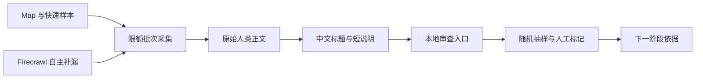

# GUIDE-FOUNDATION-001 原文采集与中文抽样审查

目标：快速采集覆盖外国人来华和在华生活的大量人类原文，并提供一个人类能随时浏览、筛选和随机抽样的中文审查入口。第一阶段只回答“有哪些内容、原文质量如何、哪些方向值得继续”，不写最终文章。

用户于 2026-08-03 接受本合同，并进一步明确：原始人类表达必须保留；中文承担内部编辑真相；英西翻译、公开发布和站方署名稍后单独决定。Pilot 001 抽样通过后，用户已明确批准启动 Firecrawl 正式采集；本合同继续禁止产品接入和内容公开。

## Scope

- 采集公开、无需登录的人类原文；原始正文、标题、作者信息、URL 和抓取时间保持可追溯，不让 AI 改写后覆盖原文。
- 已知域名先运行 Map 和 `3–10` 页快速样本；没有明显提取故障即可进入带页面与额度上限的连续批次。
- Firecrawl 可以自动选择站内路径、Sitemap 和补充来源；发现广告、目录、交易页、重复页或离题内容后再收紧规则。
- 以 `55,000 credits` 为本计费周期采集硬上限，预计取得约 `43,600–54,300` 个外文与中文权威候选页面；不把数量设为硬验收，也不在采集前完成完整分类体系。
- 外文来源采用 canonical 调研报告中的 11 个正文站点；中文权威来源另按移民、外交、商务、支付、税务、教育、工作、交通和重点城市服务建立白名单。
- 为所有记录生成中文标题和短说明，帮助浏览；完整中文翻译只对抽样页或人工点选页生成，不提前翻译整个语料库。
- 第一阶段唯一人类交付物是本地中文审查入口：能筛选来源与主题、随机抽样、查看原文和中文辅助版本、打开源网页并留下判断。
- 外部产物只进入 `/Volumes/External/service/china-in-fact-materials/guide-foundation/`；仓库只保存合同、入口和不含第三方正文的验证证据。

## Collection contract

- 原始抓取正文是内容真相；中文标题、摘要和翻译只帮助审查，必须始终能回到原文和源网页。
- 最小 manifest 只强制记录 batch/job ID、URL、域名、抓取时间、状态、内容 hash、语言和额度，不要求先填写完整编辑元数据。
- canonical URL 与内容 hash 用于去重；相同页面的更新保留抓取时间，不静默覆盖抽样时看到的版本。
- 原始正文只供产品负责人、指定编辑和研究 Agent 使用，不进入公开站点、Sitemap、现有 CMS 或 Agent Gateway。
- 每个批次可单独停止、隔离和按 manifest 删除；来源提出合理删除要求或发现明确禁止时可精确移除。
- 不设统一自动到期日；第一阶段完成时再根据真实语料、来源规则和后续用途决定保留与删除，不让该决定阻塞采集。

## Chinese review entry

- 首页显示总量、来源、语言、主题簇、提取状态和已审数量，不堆放原始文件路径。
- 支持按来源、语言、批次、主题和提取质量筛选，并提供真正随机的 `抽一篇`。
- 单篇审查同时提供原始标题、原文、源链接、中文标题与短说明；完整中文翻译按需生成并明确标为审查辅助。
- 人工标记保持简单：`保留观察 / 有价值 / 无效 / 提取失败 / 暂不使用`，允许一条短备注。
- 审查结果按原始记录 ID 保存；重新抓取或重新翻译不能丢失人工判断。
- 入口首先服务中文编辑，不在可见界面暴露 job、hash、Provider 或内部存储术语。

## No-go

- 不修改 `apps/**`、`packages/**`、schema、migration、权限、Agent Gateway、Preview 或 Production。
- 不购买或升级 Firecrawl 方案，不承诺额外额度；本计费周期累计采集不超过 `55,000 credits`，余额接近 `40,000` 时停止新任务并复核。
- 不采集个人账号区、登录后内容、付费内容、私密社区、个人数据或来源明确禁止的内容。
- 不生成最终英语或西班牙语文章，不把中文辅助摘要当成最终稿，不让 AI 以自己的文风重写原作者全文。
- 不向真实 Member 开放原始正文，不自动创建 Article，不批量公开内容，不把第三方作者替换成站方或虚构 Person。
- 不在本合同实现站方机构署名、中文母稿、翻译工作流、CMS 字段、SEO/GEO 页面或公开语言路由。
- 不覆盖现有素材库 `README.md`、`INDEX.md`、`sources/` 或待审提案；新产物进入独立子目录。

## Acceptance

- [x] 首批三个来源完成 Map 与 9 份样本，原文提取可读且能回到源网页；证据见 [`Pilot 001`](/Volumes/External/service/china-in-fact-materials/guide-foundation/pilot-001/README.md)。
- [x] Batch 002 的 15 个 Crawl 任务与中文官方候选完成；`17,706` 条进入统一索引，URL 与正文 hash 可去重，失败和噪声有独立标记。
- [x] 中文审查入口可本地打开，能够筛选、随机抽样、阅读原文、查看中文辅助内容和保存人工标记。
- [x] Pilot 001 的 9 条记录已有中文标题与短说明；完整中文翻译继续保持按需生成，不要求全库预翻译。
- [x] 产品负责人完成 Pilot 001 抽样，确认正文可用、广告偏多但不阻断，并批准进入正式采集。
- [x] 输出语料规模、来源覆盖、重复率、提取失败率、抽样质量和下一阶段建议；没有生成或公开英西文章。

## Validation

- Intake：`npm run governance:check`、`git diff --check`、本地链接和 DocContractV1 检查。
- Collection：Map 数量、域名边界、最小 manifest、唯一 URL/hash、正文非空率、失败率和 credits/page。
- Review：筛选、随机抽样、原文/中文视图、源链接、人工标记保存、重新打开与窄屏可用。
- Boundary：确认公开路由、CMS、Sitemap、Production 和现有 Article 数据均未改变。
- Closeout：目标抽样回放、治理检查和 `git diff --check`。

## Writeback

- 当前执行状态写入本 checklist、`docs/roadmap/checklists/README.md` 和 `docs/roadmap/README.md`。
- 采集与抽样证据写入本 checklist 和外部批次 README；原文、中文辅助内容、索引和人工标记写入声明的外部研究目录。
- 中文母稿、英西翻译、站方机构署名、Article/CMS、Member/Agent 访问和公开发布分别建立后续产品决定与 upgraded checklist；不扩入本批。
- 完成后将本 checklist 移入 `docs/archive/`，并在 archive router 登记。

## Next phase boundary

- Member 或已授权的人类原文优先保留真实表达，并在后续翻译中保留原作者；未获授权的第三方全文只作为内部素材。
- 站方制作的内容以中文内部母稿为编辑真相，英语和西班牙语作为派生翻译，发布状态可以分别控制。
- 站方原创内容需要正式机构署名；相关 People 不能被伪装成作者。该变化将修订当前“Article 必须属于 Person”的产品合同。
- 上述方向已被用户接受，但本合同只收集验证它们所需的素材，不提前实现产品模型。

## Current gate

- [x] 用户接受建立 `GUIDE-FOUNDATION-001`。
- [x] 将第一阶段收窄为人类原文采集和中文可视化抽样审查。
- [x] 用户明确启动首次 Firecrawl 采集。
- [x] 运行三个来源的 Map 与 9 份快速样本。
- [x] 建立本地中文审查入口并用真实样本回放。
- [x] Pilot 001 抽样通过并批准 `55,000 credits` 正式采集上限。
- [x] 启动 Batch 002 首波 sitemap-backed 来源采集。
- [x] Batch 002 全部下载完成：外文 `17,142` 条，中文官方候选 `564` 条，其中正文成功 `542` 条、失败 `22` 条；Firecrawl 周期用量记录为 `24,872 credits`。
- [x] 试验场收敛为浅层工作根 `/Volumes/External/service/china-in-fact-corpus/`，旧 Batch 002 路径只保留兼容链接。
- [x] 生成 `catalog.sqlite`、`catalog.jsonl` 与 `report.json`；清洗修订后识别 `803` 条重复，`16,292` 条正文达到基础可读阈值。
- [x] 建立 Batch 002 本地中文抽审入口，支持来源、主题、语言、质量、提醒和判断筛选，随机抽样、清洁/原始正文切换、源网页和人工判断保存已验证。
- [x] Codex 完成 24 条跨来源、语言与质量状态的分层抽样：`6` 条有价值、`7` 条保留观察、`5` 条无效、`4` 条提取失败、`2` 条暂不使用；报告位于 `/Volumes/External/service/china-in-fact-corpus/sample-review.md`。

当前门禁：本清单验收已完成，等待迁入 archive；后续中文母稿、英西翻译、机构署名和公开发布由 `MIDGAME-COLD-START-001` 单独负责。

Pilot 001 与 Batch 002 均只处理内部原始正文和审查派生层，没有生成英西成品、创建公开内容或修改 App。
