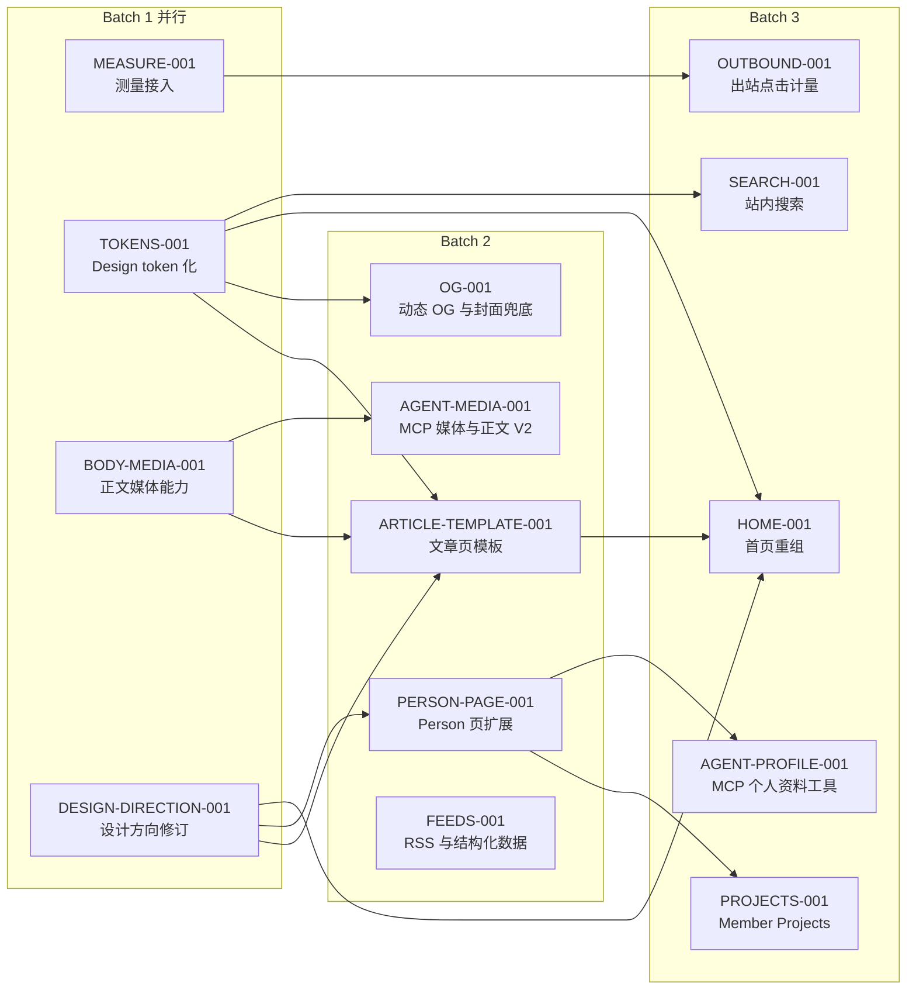

# Site Infrastructure Parent Checklist

本页是「网站基础设施升级」的父级控制清单，记录终局、批次、依赖和转换门槛，不直接授权代码、schema、migration、部署或真实数据操作。任何实现只能由当时 active 的子级 `ChangeContractV1` 授权。

## Program Goal

把 chinainfact.com 建成两侧的基础设施：铲子计划成员获得完整的发布与展示能力（正文媒体、Agent 通道、正式个人名片、项目展示）；海外读者获得专业的阅读体验并被持续路由到真实的人（Discord、个人站、成员项目）；站方获得可测量、可分发的技术底盘（Analytics、OG、Feed、结构化数据）。内容本身与内容运营不属于本 program。

## 总路线图

## Work Item Registry

| ID | 批次 | 状态 | 目标 | 阻塞于 |
|---|---|---|---|---|
| `INFRA-MEASURE-001` | 1 | active | Web Analytics、GSC/Bing、隐私文案核对 | 无 |
| `INFRA-TOKENS-001` | 1 | active | 设计 token 化与样式架构重构，视觉零变化 | 无 |
| `INFRA-BODY-MEDIA-001` | 1 | active | 正文图片与白名单 embed 能力 | 无 |
| `DESIGN-DIRECTION-001` | 1 | active | DESIGN.md 桥梁化方向修订与 ADR | 无 |
| `INFRA-ARTICLE-TEMPLATE-001` | 2 | queued | 文章页模板：目录、排版、作者卡、文末路由模块 | TOKENS、DESIGN-DIRECTION、BODY-MEDIA |
| `INFRA-OG-001` | 2 | queued | 动态 OG 图生成与封面兜底视觉系统 | TOKENS |
| `INFRA-AGENT-MEDIA-001` | 2 | queued | Agent 正文合同 V2、media_upload、set cover、发布预检 | BODY-MEDIA |
| `INFRA-BODY-MEDIA-002` | 2 | queued | 正文媒体权限收敛与发布管道补全（独立复审 F1/F2/F4） | BODY-MEDIA |
| `INFRA-PERSON-PAGE-001` | 2 | queued | Person schema 扩展与个人页重构 | DESIGN-DIRECTION |
| `INFRA-FEEDS-001` | 2 | queued | RSS/JSON Feed、Person 与文章结构化数据补全 | 无 |
| `INFRA-HOME-001` | 3 | queued | 首页重组：人物权重、社群模块、Hero 组合 | TOKENS、DESIGN-DIRECTION、ARTICLE-TEMPLATE |
| `INFRA-PROJECTS-001` | 3 | queued | Member Projects 一等对象与展示入口 | PERSON-PAGE |
| `INFRA-AGENT-PROFILE-001` | 3 | queued | MCP `my_profile_*` 与外链维护工具 | PERSON-PAGE |
| `INFRA-SEARCH-001` | 3 | queued | 站内搜索（Postgres 全文检索 + 搜索页） | TOKENS |
| `INFRA-OUTBOUND-001` | 3 | queued | 作者外链、Discord、项目外链出站点击计量 | MEASURE |
| `OPS-SOCIAL-PIPELINE-001` | 外部 | queued | codex-ops 侧社交素材流水线，不进本仓库 | MEASURE（UTM 约定） |

`queued` 只保留目标与进入条件，不构成实现授权。子级开始时必须按本页 mini-spec 建立 active checklist 并在 router 登记。

## 并行与合并规则

- Batch 1 四项可同时 active：路径互不重叠（MEASURE 走 layout/隐私页/Vercel 设置；TOKENS 走样式层；BODY-MEDIA 走 editor 配置与渲染器逻辑；DESIGN-DIRECTION 只改 docs）。
- 样式冲突唯一热点是 `globals.css`：TOKENS 持有其结构性重写权；BODY-MEDIA 只允许在文件尾部追加独立注释块的最小样式，合并顺序固定为 TOKENS 先进 `main`，BODY-MEDIA 样式段随后 rebase。
- Batch 2 内 ARTICLE-TEMPLATE 与 PERSON-PAGE 都改前端组件，但路由与组件文件不重叠；OG、AGENT-MEDIA、FEEDS 与两者无路径交集，可并行。
- 一个分支和 PR 对应一个子级 checklist；跨子级顺手修改一律进入对方 checklist 的 finding_route，不扩大当前 diff。
- 每批关闭条件：本批全部子级归档、feature registry 与 current-state 写回、下一批进入条件复核。

## Mini-specs（queued 子级的建立依据）

### INFRA-ARTICLE-TEMPLATE-001（upgraded：公开渲染面）

- 目标：文章页成为可读、可路由的模板——目录（≥3 个 H2 时显示）、列表与行距排版修复、成员稿作者卡（文首简版 + 文末完整版）、文末路由模块（相关人物 / 社群入口 / 下一篇）、机构稿 Related people 呈现。
- 关键路径：`apps/web/src/app/(frontend)/[locale]/posts/**`、`apps/web/src/components/**`；不改 schema 与权限。
- 验收要点：桌面与 390px 无溢出；作者卡链接进 Person；模块在无数据时整体隐藏而非留空。
- 吸收 BODY-MEDIA-001 复审 F3：公开渲染器补 HorizontalRule/Checklist/Align/Indent 的呈现或明确降级决定。

### INFRA-OG-001（base）

- 目标：`/opengraph-image` 动态生成（标题 + 作者头像/字标 + 品牌底），封面缺失时公共卡片使用系统化兜底视觉；废除标题重复红块的生成逻辑。
- 关键路径：`apps/web/src/app/**/opengraph-image*`、`editorial-cover.tsx`、相关脚本。

### INFRA-BODY-MEDIA-002（upgraded：媒体权限与发布管道，源自 BODY-MEDIA-001 独立复审 finding）

- 目标：F1——beforeValidate hook 补 upload 节点媒体归属校验（仿 `assertMediaAllowedForMemberPublication`），并收敛 `getDraftPreviewCMSArticle` 的 `overrideAccess: true` 对 body media 的越权 populate（属既有模式缺口，非 001 回归）；F2——发布管道对 body 内作者图片补 `markMediaForMemberPublication`，否则公开页正文图片被安全忽略（fail-safe 但不满足 001 验收第 1 条，宜在 Preview 验收前完成）；F4——inlineBlock 写读不一致收敛与 `ignoreNode` 日志降噪。
- 关键路径：`apps/web/src/collections/Articles.ts`、`EditorialMasters.ts`、`content/cms.ts`、`article-publication.ts`。

### INFRA-AGENT-MEDIA-001（upgraded：Agent 合同与媒体写路径）

- 目标：`AgentArticleBodyV2` 增加 image（引用本人已上传 media）与 embed 块；新增 `media_upload`（走唯一 pathname 直传管道）、`article_set_cover`；`article_preview` 返回缺封面/摘要/标题层级预检。
- 关键路径：`apps/web/src/agent/**`、`Media.ts` 访问规则复用；服务端校验媒体归属。
- 不变量：不能引用他人媒体；不支持的节点显式报错不静默丢弃。

### INFRA-PERSON-PAGE-001（upgraded：schema 与个人数据面）

- 目标：Person 增加长自述（richText）、「我能帮什么」、近期动态区；页面重构为值得放进个人社交 bio 的正式名片；双语字段延续现有 EN/ES 回退规则。
- 关键路径：`People.ts`、migration、`/people/[slug]` 页面与组件、My profile 表单。

### INFRA-FEEDS-001（base）

- 目标：`/feed.xml`（按 locale 的公开内容）、文章 `BreadcrumbList`、Person 页 `ProfilePage`/`Person` JSON-LD、成员稿 author 指向 Person URL。
- 关键路径：`apps/web/src/app/**`（新增 route handler 与 metadata），无 schema 变化。

### INFRA-HOME-001（upgraded：首页公开面）

- 目标：按修订后的 DESIGN.md 重组首页：Hero 支持人物+内容组合叙事、People 模块扩容、社群延续模块、Latest 呈现去机器感（发布节奏由内容侧负责，模板只保证形态）。
- 关键路径：`apps/web/src/app/(frontend)/[locale]/page.tsx` 与组件。

### INFRA-PROJECTS-001（upgraded：新 collection 与公开面）

- 目标：`member-projects` collection（名称、一句话、封面、成员关系、外链、公开状态）+ Person 页项目区 + 独立入口页；成员自管、站方可精选。
- 关键路径：新 collection、migration、前端页面；权限模型比照 Person 自管规则。

### INFRA-AGENT-PROFILE-001（upgraded：Agent 写路径扩面）

- 目标：MCP 增加 `my_profile_get / my_profile_save / my_links_save`，复用 Person 版本、锁定与权限模型；负例含暂停账户与跨人修改拒绝。
- 关键路径：`apps/web/src/agent/**`。

### INFRA-SEARCH-001（base，视实现可升级）

- 目标：Postgres 全文检索（公开 Article/Person/Place 标题与摘要）+ `/search` 页；不引入外部搜索服务。
- 关键路径：查询层、搜索页、可能的索引 migration（如需则升级 risk_tier）。

### INFRA-OUTBOUND-001（base）

- 目标：作者外链、Discord 入口、项目外链的无 cookie 出站事件计量（Analytics custom events），形成可回报成员的分发数字。
- 关键路径：链接组件统一出站包装；隐私文案核对。

### OPS-SOCIAL-PIPELINE-001（外部，codex-ops）

- 目标：输入文章 URL，产出多角度 X 帖、Substack 摘要、IG 文案与配图，带 UTM；工具与凭据留在 codex-ops，不进本仓库。

## Program Rules

- 父级不持有代码 `allowed_paths`，不绕过子级 ChangeContract。
- 并行 active 子级的 `allowed_paths` 不得重叠；重叠需求由本页改写批次或合并顺序解决。
- upgraded 子级实现前冻结批次合同，独立复审按开发治理合同的阻断边界执行。
- migration、Production 部署、真实数据与内容公开保持逐项单独批准，不因批次关闭自动授权。
- 后续编号是导航预留，不是已接受设计或承诺交付。

## Program Closure

- 全部批次子级归档或明确取消；queued 项不得以「以后再做」长期滞留。
- 成员可经网页与 Agent 完成含媒体的完整发布，并拥有正式个人名片与项目展示。
- 读者路径（内容 → 人 → 社群/外链）与站方分发底盘（测量、OG、Feed）均有 Production 证据。
- current-state、feature registry、decisions、reference 与 archive 完成最终写回。
