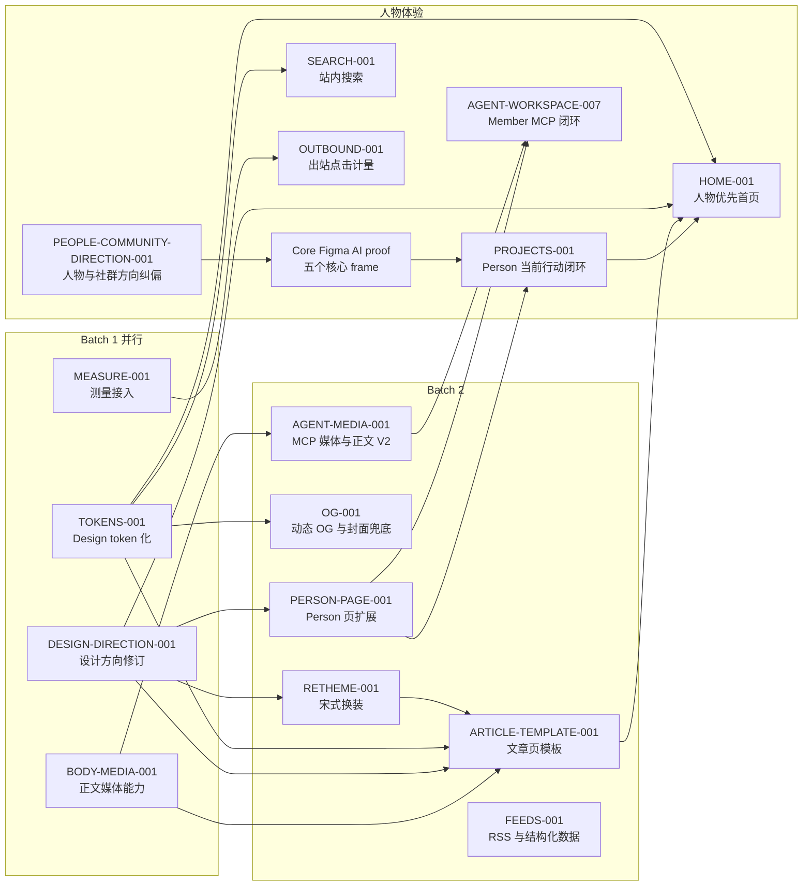

# Site Infrastructure Parent Checklist

本页是「网站基础设施升级」的父级控制清单，记录终局、批次、依赖和转换门槛，不直接授权代码、schema、migration、部署或真实数据操作。任何实现只能由当时 active 的子级 `ChangeContractV1` 授权。

## Program Goal

把 chinainfact.com 建成让世界遇见真实中国人的公开入口。项目、作品、经历与内容共同证明一个人是谁、在关心什么、正在做什么；网站负责长期发现，Discord 负责持续交流与协作，Reddit 负责从真实问题进入外部对话。铲子计划成员仍获得发布与展示能力，站方仍维护可信编辑和可测量的技术底盘。内容本身与内容运营不属于本 program。

2026-08-26 的方向纠偏优先于早期 Batch 3 假设。HOME 与 PROJECTS 在新合同完成前不得按旧 mini-spec 启动；“独立项目目录”不再是默认结论。

## 总路线图

## Work Item Registry

| ID | 批次 | 状态 | 目标 | 阻塞于 |
|---|---|---|---|---|
| `INFRA-MEASURE-001` | 1 | done | Web Analytics 与 GSC 已上线，[已归档](../archive/site-measurement-foundation.md)；Bing 注册 deferred（2026-08-12 用户决定） | 无 |
| `INFRA-TOKENS-001` | 1 | done | token 化重构上线，[已归档](../archive/design-token-architecture.md)；`globals.css` 修改权移交 RETHEME | 无 |
| `INFRA-BODY-MEDIA-001` | 1 | active | 正文媒体能力已上线，剩 Preview/生产验收后归档 | 无 |
| `DESIGN-DIRECTION-001` | 1 | done | 宋式方向写入 DESIGN.md 与 ADR-0011，[已归档](../archive/design-direction-revision.md) | 无 |
| `INFRA-RETHEME-001` | 2 | active | 宋式 token 候选已在旧分支；核心页面 proof 后按当前主线收敛，[checklist](checklists/site-retheme-song.md) | PROJECTS 顺序门 |
| `INFRA-ARTICLE-TEMPLATE-001` | 2 | active | 保留目录、署名、文末路由行为与测试；等待新页面合同后移植，[checklist](checklists/article-page-template.md) | RETHEME rebase |
| `INFRA-OG-001` | 2 | active | 保留动态 OG 与封面兜底候选；等待 Person/Home 构图后校准，[checklist](checklists/dynamic-og-cover-fallback.md) | PEOPLE/HOME composition |
| `INFRA-AGENT-MEDIA-001` | 2 | active | Agent 正文合同 V2、media_upload、set cover、发布预检，[checklist](checklists/agent-media-tools.md) | 无 |
| `INFRA-BODY-MEDIA-002` | 2 | active | 正文媒体权限收敛与发布管道补全（独立复审 F1/F2/F4），代码已上线，见 [checklist](checklists/article-body-media-002.md)；剩生产验收 | 无 |
| `INFRA-PERSON-PAGE-001` | 2 | active | 正式名片已进 `main` 并上线，只剩专项 UI 验收后归档，[checklist](checklists/person-page-expansion.md) | 不扩入新 People 体验 |
| `INFRA-FEEDS-001` | 2 | active | 保留 feed/JSON-LD 候选；Person/Project 公开模型稳定后最后移植，[checklist](checklists/feeds-structured-data.md) | PROJECTS、ARTICLE |
| `PEOPLE-COMMUNITY-DIRECTION-001` | 方向门 | active | 人物与社群优先产品合同及 Core Figma AI proof 已完成，[checklist](checklists/people-community-direction.md) | 最终治理写回与归档 |
| `INFRA-PROJECTS-001` | 3 | queued | 首个实现切片：公开 Project + Person `Now` + People 到本人外链的闭环；无 `/projects` | PEOPLE-COMMUNITY-DIRECTION closeout、PERSON-PAGE closeout |
| `INFRA-HOME-001` | 3 | queued | 人物优先首页：person-and-pursuit lead、人物 passage、成员作品、Guides 与社群继续 | PROJECTS、ARTICLE-TEMPLATE |
| [`AGENT-WORKSPACE-007`](../archive/agent-workspace-member-completion.md) | 3 | done | 资料/外链、Profile 公开、媒体/文章发现与双语 draft 的 Member MCP 闭环已上线并归档 | 无 |
| `INFRA-SEARCH-001` | 3 | queued | 站内搜索（Postgres 全文检索 + 搜索页） | TOKENS |
| `INFRA-OUTBOUND-001` | 3 | queued | 作者外链、Discord、项目外链出站点击计量 | 无（MEASURE 已完成） |
| `OPS-SOCIAL-PIPELINE-001` | 外部 | queued | codex-ops 侧社交素材流水线，不进本仓库 | 无（UTM 约定已就绪） |

`queued` 只保留目标与进入条件，不构成实现授权。子级开始时必须按本页 mini-spec 建立 active checklist 并在 router 登记。

## 并行与合并规则

- Batch 1 四项可同时 active：路径互不重叠（MEASURE 走 layout/隐私页/Vercel 设置；TOKENS 走样式层；BODY-MEDIA 走 editor 配置与渲染器逻辑；DESIGN-DIRECTION 只改 docs）。
- 样式冲突唯一热点是 `globals.css`：TOKENS 持有其结构性重写权；BODY-MEDIA 只允许在文件尾部追加独立注释块的最小样式，合并顺序固定为 TOKENS 先进 `main`，BODY-MEDIA 样式段随后 rebase。
- 2026-08-12 的 RETHEME、ARTICLE、OG 与 FEEDS 分支均已与当前 `main` 分叉 39 个提交，merge-tree 出现冲突；保留工作成果但不直接整枝合并。
- 核心页面 Figma AI proof 已完成；后续顺序固定为 PROJECTS 人物闭环 → RETHEME → ARTICLE → HOME → OG → FEEDS。Figma AI 负责 UI 重构；代码只在设计验收后实现。每条旧分支只移植当前合同仍需要的部分，并重新验证。
- Batch 2 名义 glob 相交但文件集不重叠的豁免：OG 的 `opengraph-image.tsx` 落在 posts/people 路由目录内但不属页面子级文件；FEEDS 对两个页面文件只插 JSON-LD，合并顺序在 ARTICLE-TEMPLATE 与 PERSON-PAGE 之后 rebase。
- `CMSRichText.tsx` 与 `content/cms.ts` 的修改权转移：BODY-MEDIA-001/002 代码已冻结（仅剩验收与归档），Batch 2 内分别由 ARTICLE-TEMPLATE 与 PERSON-PAGE 持有。
- Batch 2 全部实现线在独立 git worktree 分支进行，不写主工作树；合并由总控串行执行。
- 一个分支和 PR 对应一个子级 checklist；跨子级顺手修改一律进入对方 checklist 的 finding_route，不扩大当前 diff。
- 每批关闭条件：本批全部子级归档、feature registry 与 current-state 写回、下一批进入条件复核。

## Mini-specs（子级建立与路由依据）

### INFRA-ARTICLE-TEMPLATE-001（upgraded：公开渲染面）

- 目标：文章页成为可读、可路由的模板——目录（≥3 个 H2 时显示）、列表与行距排版修复、成员稿作者卡（文首简版 + 文末完整版）、文末路由模块（相关人物 / 社群入口 / 下一篇）、机构稿 Related people 呈现。
- 关键路径：`apps/web/src/app/(frontend)/[locale]/posts/**`、`apps/web/src/components/**`；不改 schema 与权限。
- 验收要点：桌面与 390px 无溢出；作者卡链接进 Person；模块在无数据时整体隐藏而非留空。
- 吸收 BODY-MEDIA-001 复审 F3：公开渲染器补 HorizontalRule/Checklist/Align/Indent 的呈现或明确降级决定。
- 复审 finding（2026-08-12 PASS，不阻断，后续路由依据）：`GuideArticleByline` 死导出与 `articleCopy`/Discord 常量重复宜后续清理；无封面文章从兜底封面改为纯排版开场属可见变化，合并评审时确认；汉字衬线栈字面值路由 RETHEME-001。

### INFRA-OG-001（base）

- 目标：`/opengraph-image` 动态生成（标题 + 作者头像/字标 + 品牌底），封面缺失时公共卡片使用系统化兜底视觉；废除标题重复红块的生成逻辑。
- 关键路径：`apps/web/src/app/**/opengraph-image*`、`editorial-cover.tsx`、相关脚本。

### INFRA-BODY-MEDIA-002（upgraded：媒体权限与发布管道，源自 BODY-MEDIA-001 独立复审 finding）

- 目标：F1——beforeValidate hook 补 upload 节点媒体归属校验（仿 `assertMediaAllowedForMemberPublication`），并收敛 `getDraftPreviewCMSArticle` 的 `overrideAccess: true` 对 body media 的越权 populate（属既有模式缺口，非 001 回归）；F2——发布管道对 body 内作者图片补 `markMediaForMemberPublication`，否则公开页正文图片被安全忽略（fail-safe 但不满足 001 验收第 1 条，宜在 Preview 验收前完成）；F4——inlineBlock 写读不一致收敛与 `ignoreNode` 日志降噪。
- 关键路径：`apps/web/src/collections/Articles.ts`、`EditorialMasters.ts`、`content/cms.ts`、`article-publication.ts`。
- 002 复审 finding（不阻断，后续批次登记依据）：A——正文悬空 media ID 使 guard 抛 NotFound 打断保存，宜转明确报错或跳过；B——预览裸 catch 吞非权限错误，宜只吞权限类或补 debug 日志；C——存量 `inlineBlock(youtubeEmbed)` 理论上今后保存即 400，Preview 验收遇到手工清理；D——autosave 逐个点查 media 可合并为一次 `in` 查询。

### INFRA-AGENT-MEDIA-001（upgraded：Agent 合同与媒体写路径）

- 目标：`AgentArticleBodyV2` 增加 image（引用本人已上传 media）与 embed 块；新增 `media_upload`（走唯一 pathname 直传管道）、`article_set_cover`；`article_preview` 返回缺封面/摘要/标题层级预检。
- 关键路径：`apps/web/src/agent/**`、`Media.ts` 访问规则复用；服务端校验媒体归属。
- 不变量：不能引用他人媒体；不支持的节点显式报错不静默丢弃。
- 复审 finding（2026-08-12 PASS，不阻断，后续路由依据）：`tests/agent-live.ts` 的 9 工具硬断言未更新（不在 allowed_paths，Preview 批次一并改）；createDraft 拒绝路径审计记 `failed` 而非 `denied`（既有模式，宜后续统一）；新工具幂等重放分支无直接测试；mimeType 仅声明校验与网页侧 parity。

### INFRA-PERSON-PAGE-001（upgraded：schema 与个人数据面）

- 目标：Person 增加长自述（richText）、「我能帮什么」、近期动态区；页面重构为值得放进个人社交 bio 的正式名片；双语字段延续现有 EN/ES 回退规则。
- 关键路径：`People.ts`、migration、`/people/[slug]` 页面与组件、My profile 表单。

### INFRA-FEEDS-001（base）

- 目标：`/feed.xml`（按 locale 的公开内容）、文章 `BreadcrumbList`、Person 页 `ProfilePage`/`Person` JSON-LD、成员稿 author 指向 Person URL。
- 关键路径：`apps/web/src/app/**`（新增 route handler 与 metadata），无 schema 变化。

### INFRA-HOME-001（upgraded：首页公开面）

- 旧目标暂停作为实现合同。新目标：首页按 `person-and-pursuit lead → 4–6 人物 passage → 来自他们的近期作品 → Guides → community continuation → Newsletter` 组织；首个完整叙事单元链接 Person，内容流与社群模块服务于人物发现。
- 关键路径：`apps/web/src/app/(frontend)/[locale]/page.tsx` 与组件。

### INFRA-PROJECTS-001（upgraded：Person 当前行动闭环）

- 首个实现闭环固定为 `People 上的具体行动 → Person Now → 本人 Project 外链或 Discord 联系`。新增成员自管 Project：owner/collaborators、标题、简述、阶段、图片、外链、当前近况、所需连接、更新时间与公开/撤回；不建 `/projects` 或顶级导航。
- Discord Forum 不是网站数据库。任何同步或导入必须先有稳定 Person 关联、本人确认公开范围、来源与更新时间、撤回和读回；不得按显示名自动合并。
- 关键路径包含新 collection、migration、People opening、Person `Now` 与 My profile/Project 维护；实现前另建 upgraded checklist，并分别批准 schema、migration、真实数据、公开与部署。

### AGENT-WORKSPACE-007（completed：Member Agent 完整闭环）

- 结果：[`007 checklist`](../archive/agent-workspace-member-completion.md) 已交付 `my_profile_*`、Profile 公开确认、本人媒体/文章发现、双语 draft 与当前角色 discovery，并随 012 完成 Production 验收后归档；原 `INFRA-AGENT-PROFILE-001` 未建立独立 checklist。
- 关键路径与 no-go 以 007 的冻结合同为准；Person Page UI、schema 与 migration 不进入 Agent diff。

### INFRA-SEARCH-001（base，视实现可升级）

- 目标：Postgres 全文检索（公开 Article/Person/Place 标题与摘要）+ `/search` 页；不引入外部搜索服务。
- 关键路径：查询层、搜索页、可能的索引 migration（如需则升级 risk_tier）。

### INFRA-OUTBOUND-001（base）

- 目标：作者外链、Discord 入口、项目外链的无 cookie 出站事件计量（Analytics custom events），形成可回报成员的分发数字。
- 关键路径：链接组件统一出站包装；隐私文案核对。

### OPS-SOCIAL-PIPELINE-001（外部，codex-ops）

- 目标：输入文章 URL，产出多角度 X 帖、Substack 摘要、IG 文案与配图，带 UTM；工具与凭据留在 codex-ops，不进本仓库。

## Program Rules

- 父级不持有代码 `allowed_paths`，不绕过子级 ChangeContract。
- 并行 active 子级的 `allowed_paths` 不得重叠；重叠需求由本页改写批次或合并顺序解决。
- upgraded 子级实现前冻结批次合同，独立复审按开发治理合同的阻断边界执行。
- migration、Production 部署、真实数据与内容公开保持逐项单独批准，不因批次关闭自动授权。
- 后续编号是导航预留，不是已接受设计或承诺交付。

## Program Closure

- 全部批次子级归档或明确取消；queued 项不得以「以后再做」长期滞留。
- 成员可经网页与 Agent 完成含媒体的完整发布，并拥有正式个人名片与项目展示。
- 读者路径（内容 → 人 → 社群/外链）与站方分发底盘（测量、OG、Feed）均有 Production 证据。
- current-state、feature registry、decisions、reference 与 archive 完成最终写回。
